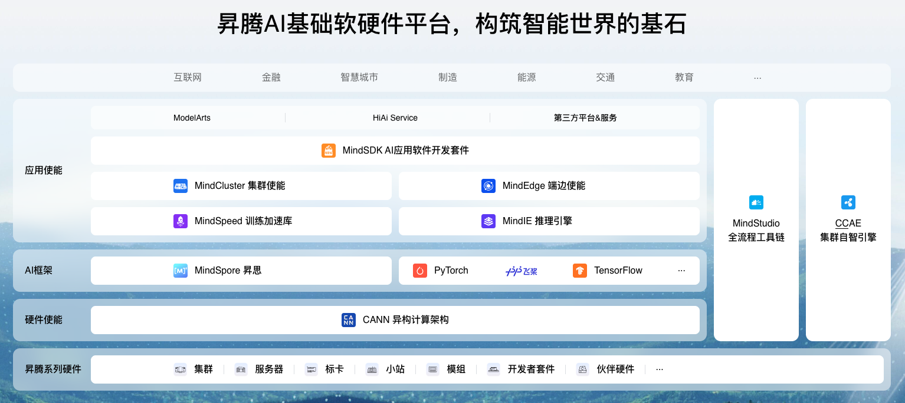
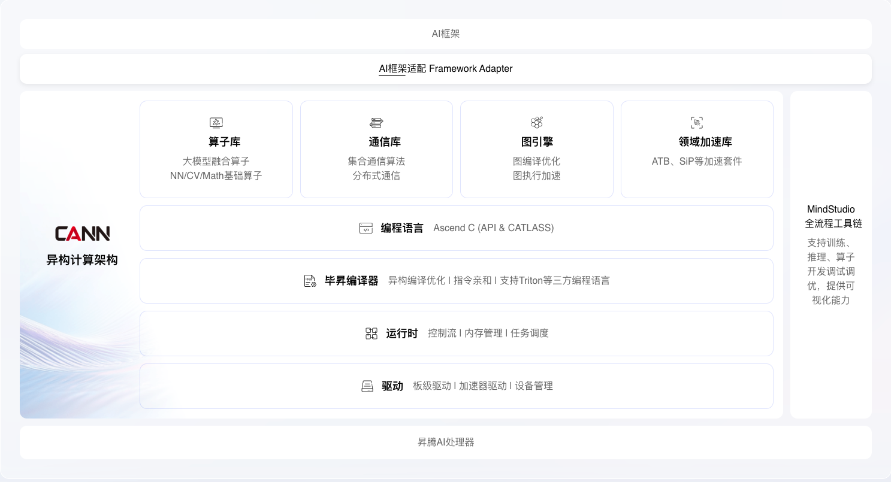
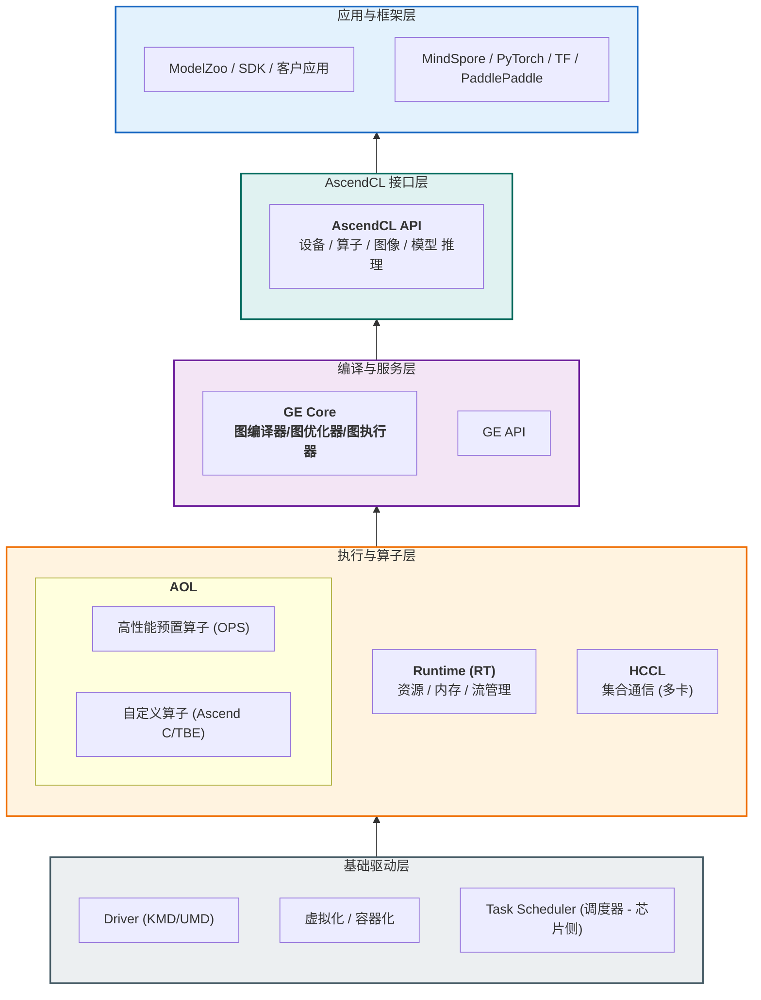
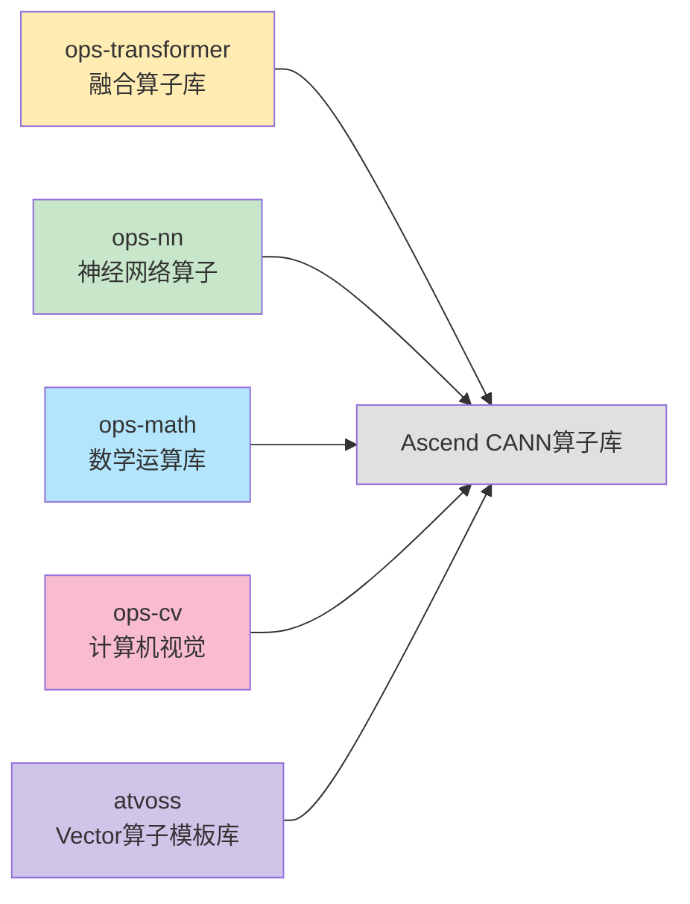
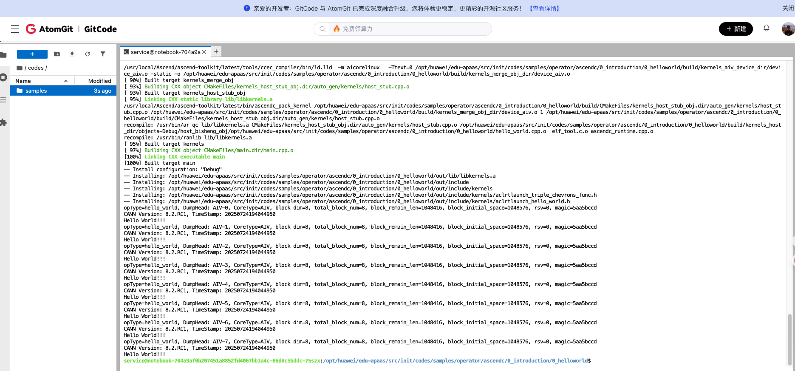
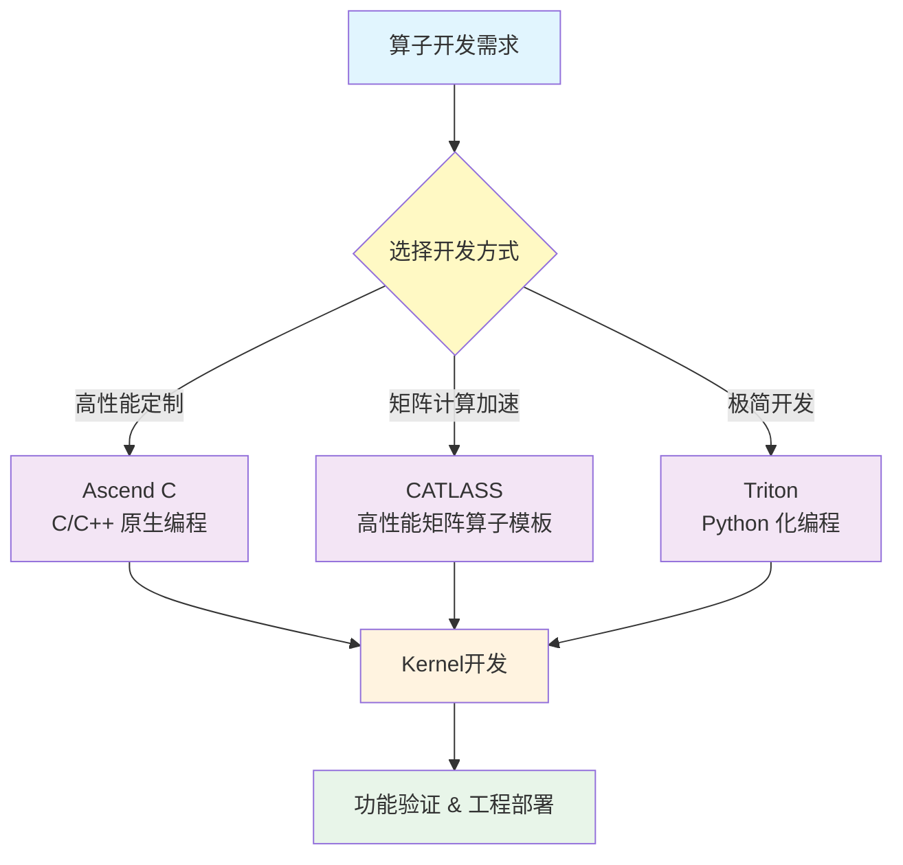
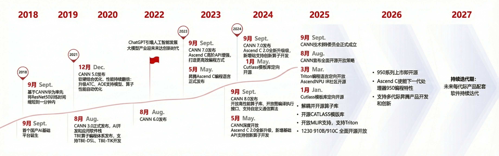

## 摘要

昇腾CANN（Compute Architecture for Neural Networks）是华为打造的面向神经网络场景的异构计算架构，通过分层解耦设计和开源开放策略，为AI应用提供了从底层硬件到上层框架的完整解决方案。本文将从整体架构、算子库组成、技术特点和应用场景等多个维度，全面展现CANN算子库的技术实力。

## 1. CANN架构全景

### 1.1 异构计算架构定位

CANN作为昇腾AI处理器的软件栈核心，定位于连接底层硬件与上层应用框架的桥梁。它向上支持多种AI框架，向下屏蔽硬件差异，通过统一的编程接口和优化策略，最大化发挥昇腾硬件的计算能力。



#### 核心价值主张
- **分层解耦**：清晰的架构分层，各层职责明确，便于扩展和维护
- **软硬协同**：深度适配昇腾硬件特性，实现最优性能
- **开源开放**：逐步开放核心代码，共建AI生态
- **一站服务**：提供从开发到部署的全流程支持



### 1.2 五层架构设计



-----

#### 应用与框架层 (Application & Framework)

这是开发者的**入口**，也是业务逻辑所在的地方。

  * [**主流框架适配**](https://www.hiascend.com/developer/software/ai-frameworks/pytorch)：支持 MindSpore、PyTorch、TensorFlow 等主流框架。通过提供 "Adapter"（如 `torch_npu`）插件，将上层的 Python 算子调用拦截并转换为 NPU 能够识别的指令。
  * [**ModelZoo**](https://www.hiascend.com/software/modelzoo)：官方提供的优选模型库，包含针对昇腾硬件优化过的 小模型时代的ResNet、BERT、YOLO 等经典网络、大模型时代的 Transformer、开源大模型如 GLM 系列、LLaMA 系列、GPT 系列 等。

#### 昇腾计算语言接口层 [(AscendCL - Ascend Computing Language)](https://www.hiascend.com/cann/ascend-c)

**这是架构中最关键的“门面”层。**

  * **定位**：它是 CANN 对外提供能力的**唯一标准接口**。无论上层是 PyTorch 还是 C++ 直接开发的应用，最终都会调用 AscendCL 接口。
  * **作用**：
      * **解耦**：屏蔽底层昇腾芯片（Ascend 310, 910 等）的硬件差异，实现“一次开发，多芯部署”。
      * **能力暴露**：提供模型加载与执行、算子加载与执行、内存管理（Malloc/Free）、媒体数据处理（JPEG/Video 编解码）等 C 语言 API。

#### 编译与服务层 (Service Layer / Graph Engine)

这是 CANN 的“**大脑**“，主要指 [**GE (Graph Engine)**](https://www.hiascend.com/cann/graph-engine)。

  * **核心任务**：计算图编译和运行的控制中心，提供图优化、图编译管理以及图执行控制等功能。GE通过统一的图开发接口提供多种AI框架的支持，不同AI框架的计算图可以实现到Ascend图的转换。
  * **关键能力**：
    1.  * **Ascend IR (Ascend Intermediate Representation，昇腾中间表示)**

      * **作用**：这是 GE 的“通用语言”。无论上层是 PyTorch、TensorFlow 还是 MindSpore，模型最终都会被统一转换为 Ascend IR 定义的计算图（Ascend Graph）。
      * **价值**：解耦了上层框架与底层硬件，框架只需对接 IR 即可。

    2. * **图构建 (Graph Construction)**

      * 将框架下发的计算操作组装成一张完整的图。支持用户通过 GE 提供的接口自定义图结构。

    3. * **图编译优化 (Graph Compilation & Optimization)**

      * **算子融合**：这是性能提升的关键（例如将卷积+激活函数合并），减少数据搬运。
      * **内存优化**：在编译阶段就规划好内存复用，减少运行时的内存碎片和开销。
      * **数据排布优化**：调整数据格式以适应 NPU 的 Cube/Vector 计算单元。

    4. * **图执行控制 (Graph Execution Control)**

      * 控制图的执行流程，管理输入输出数据的流转，将优化后的图下发给 Runtime 进行具体的任务调度。


#### 执行与算子层 (Execution & AOL)

这是 CANN 的"**肌肉**"和“**弹药库**“。

  * **Runtime (执行器)**：
      * 负责将编译好的模型或算子任务下发给硬件。
      * 管理 **Stream (流)**、**Event (事件)** 和 **Context (上下文)**。它类似于 GPU 的 CUDA Runtime，负责任务的排队和同步。
  * **[AOL (Ascend Operator Library，昇腾算子库)](https://www.hiascend.com/cann/aol)**：
      * **OPS (预置算子)**：官方提供的高度优化的算子库（如 MatMul, Softmax），针对昇腾架构做了极致优化。
      * **Ascend C / TBE**：这是算子开发工具。**Ascend C** 是当前主推的 C++ 类算子开发语言，允许开发者编写自定义算子来扩展 NPU 的能力。
  * **[HCCL (Huawei Collective Communication Library, 集合通信库)](https://www.hiascend.com/cann/hccl)**：
      * 负责多机多卡之间的高速通信（AllReduce, Broadcast 等），是大模型分布式训练的基础。

#### 基础驱动层 (Infrastructure / Driver)

这是 CANN 的“**地基**“，直接与硬件打交道。

  * **[Driver (驱动程序)](https://www.hiascend.com/cann/driver)**：包含用户态驱动 (UMD) 和内核态驱动 (KMD)。负责设备的初始化、固件加载、电源管理。
  * **TS (Task Scheduler)**：通常运行在 NPU 芯片内部的微控制器上，它从 Driver/Runtime 接收任务，并具体控制 AI Core（计算核心）去执行指令。
  * **虚拟化**：支持容器（Docker/K8s）和虚拟机的资源切分，实现云端的多租户共享。

-----

#### 数据流是如何穿过这五层的？

假设你在 PyTorch 中写了一行代码 `y = torch.matmul(a, b)` 并指定在 NPU 上运行：

1.  **L1**：PyTorch 的 NPU 插件 (`torch_npu`) 拦截到这个操作。
2.  **L2**：插件调用 **AscendCL** 的矩阵乘法接口。
3.  **L3**：(如果是图模式) **GE** 会构建一张图，看能不能把这个矩阵乘法和后面的加法**融合**，然后**编译**成指令。
4.  **L4**：**Runtime** 为这个操作分配 NPU 内存，建立一个执行流，从 **AOL** 中调出优化好的 MatMul 算子内核，放入任务队列。
5.  **L5**：**Driver** 将任务信号发送给硬件，NPU 芯片上的 **TS** 调度 **AI Core** 全力计算，结果通过同样的路径写回内存。

## 2. 算子库组织架构

### 2.1 五大核心模块

CANN算子库采用模块化设计，根据功能和应用场景划分为五个核心模块：



### 2.2 模块详细解析

#### ops-transformer - 大模型加速引擎
**定位**：CANN 提供的 Transformer 类大模型加速算子库，通过深度优化核心算子实现 NPU 上的极致性能。
**项目地址**：[ops-transformer](https://gitcode.com/cann/ops-transformer)

**核心算子列表**：
- **Attention 类**
  - **FlashAttention**：支持 FlashAttention-2 算法，包含定长与变长（VarLen）序列支持，适配 Chunked Prefill 与 Prefix Caching。
  - **PagedAttention**：支持 Page 机制的 KV Cache 管理，适配 vLLM 等推理框架。
  - **IncrementFlashAttention**：增量推理场景下的 Attention 优化。
- **MoE 类**
  - **GroupedMatmul (GMM)**：分组矩阵乘法，支持 W8A8/W4A4 量化及各种分组策略。
  - **MoE Routing**：高效的专家路由实现，支持 TopK 门控机制。
- **Normalization & Activation**
  - **RMSNorm / LayerNorm**：深度优化的归一化算子。
  - **SwiGLU / GeGLU**：高性能激活函数融合实现。
- **Embedding**
  - **RotaryEmbedding (RoPE)**：旋转位置编码优化实现。

**技术特点**：
- **量化支持**：全面支持 FP16/BF16 精度，实验性支持 W8A8/W4A4 及 KV Cache 量化。
- **动态能力**：原生支持动态 Shape 与变长序列（Variable Sequence Length）。
- **深度融合**：提供多级算子融合策略，显著降低内存带宽开销。
- **模型适配**：深度适配 DeepSeek-V3/R1、Qwen2.5、Llama3 等主流大模型架构。

#### ops-nn - 神经网络基础算子库
**定位**：CANN 提供的神经网络类基础计算算子库，实现深度学习网络在 NPU 上的加速计算。
**项目地址**：[ops-nn](https://gitcode.com/cann/ops-nn)

**核心算子类别**：
- **Activation (激活函数)**：包含 ReLU、GELU、Swish、Sigmoid 等常用激活函数的向量化实现。
- **Convolution (卷积)**：支持 1D/2D/3D 卷积及其转置卷积（Transpose），内置 Winograd 等多种加速算法。
- **Pooling (池化)**：提供 MaxPool、AvgPool、AdaptivePool 等多种池化操作。
- **Normalization (归一化)**：涵盖 BatchNorm、LayerNorm、GroupNorm、InstanceNorm 等归一化算子。
- **Loss (损失函数)**：支持 CrossEntropy、MSE、SmoothL1 等常见损失函数的计算。

**技术特点**：
- **高性能计算**：针对 NPU 架构深度优化，利用 Winograd 算法加速小卷积核计算。
- **多精度支持**：全面支持 FP16/BF16/FP32 等多种数据类型，满足不同场景精度需求。
- **算子融合**：支持 Conv+Add+Relu 等常见模式的算子融合，显著减少内存读写与中间结果开销。
- **动态能力**：支持动态 Shape 输入，灵活适配各类变长网络结构。

#### ops-math - 数学运算算子库
**定位**：CANN 提供的数学类基础计算算子库，为上层应用提供高性能、高精度的数学计算支撑。
**项目地址**：[ops-math](https://gitcode.com/cann/ops-math)

**核心算子类别**：
- **Elementary (初等运算)**：加减乘除、幂运算、取模、绝对值等基础数学操作。
- **Logic (逻辑运算)**：Equal、Greater、Less、LogicalAnd/Or/Not 等逻辑比较与布尔运算。
- **Transform (张量变换)**：Reshape、Transpose、Concat、Split、Slice 等张量维度与形状操作。
- **Statistics (统计运算)**：Reduce系列（Sum/Mean/Max/Min）、TopK、Sort、ArgMax/Min 等统计分析算子。
- **Advanced (高级数学)**：三角函数（Sin/Cos）、指数对数（Exp/Log）、误差函数（Erf）、Gamma 函数等科学计算算子。

**技术特点**：
- **标准遵循**：严格遵循 IEEE 754 标准，确保特殊值（NaN/Inf）处理的正确性与数值计算的稳定性。
- **广泛覆盖**：包含超过 140+ 个数学算子，覆盖从基础代数到复杂科学计算的完整谱系。
- **持续演进**：包含 30+ 个实验性算子，持续探索新算法与新硬件特性的结合优化。
- **极致性能**：针对 NPU 向量计算单元深度优化，提供业界领先的计算吞吐率。

#### ops-cv - 计算机视觉算子库
**定位**：专为计算机视觉任务设计，提供图像处理和目标检测相关的高性能算子。
**项目地址**：[ops-cv](https://gitcode.com/cann/ops-cv)

**核心算子类别**：
- **Image Processing (图像处理)**：包含 Resize、Crop、Padding、Rotate、Affine、WarpAffine 等图像几何变换与增强操作。
- **Feature Extraction (特征处理)**：提供 ROIAlign、ROIPooling、GridSample、DeformableConv2d 等高级特征提取与采样算子。
- **Detection (目标检测)**：支持 NMS (Non-Maximum Suppression)、IoU (Intersection over Union)、BoxCoder 等检测框处理算子。
- **Color Space (色彩空间)**：支持 RGB、YUV、HSV 等色彩空间转换操作。

**技术特点**：
- **算法丰富**：内置双线性 (Bilinear)、最近邻 (Nearest)、双三次 (Bicubic) 等多种插值算法，满足不同画质需求。
- **边界优化**：提供多种边界填充模式 (Constant, Reflect, Replicate)，有效处理图像边缘效应。
- **格式兼容**：全面支持 NHWC 与 NCHW 数据格式，灵活适配 OpenCV、PyTorch 等不同框架的数据布局。
- **极致加速**：利用 NPU 硬件加速图像处理流水线，显著提升数据预处理与后处理效率。

#### atvoss - 向量算子模板库
**定位**：基于 Ascend C 开发的 Vector 算子模板库，致力于为昇腾硬件上的 Vector 类融合算子提供极简、高效、高性能的编程方式。
**项目地址**：[atvoss](https://gitcode.com/cann/atvoss)

**架构设计**：采用分层解耦设计，封装通用计算模式，降低开发门槛。
- **Device 层**：负责多核任务分发与同步。
- **Kernel 层**：管理单核内的 Block 调度与内存分配。
- **Block 层**：封装三缓冲（Ping-Pong）流水线，实现数据搬运与计算的重叠。
- **Tile 层**：定义基本的计算与搬运单元。
- **Basic 层**：提供基础的数学与逻辑运算接口。

**核心技术**：
- **Expression Template (表达式模板)**：利用 C++ 模板元编程技术，实现算子逻辑的声明式表达，编译期自动生成高效代码。
- **Auto Pipeline (自动流水线)**：内置高效的三缓冲流水线机制，自动管理 Global Memory 到 Local Memory 的数据搬运与计算并行。
- **Hardware Optimization (硬件优化)**：针对 Ascend NPU 的 Vector 单元特性深度优化，充分利用指令集优势。

**价值主张**：
- **极简开发**：通过模板封装复杂的数据搬运与同步逻辑，开发者只需关注核心计算逻辑。
- **极致性能**：自动流水线与硬件优化确保生成的算子性能接近手写 Ascend C 代码。
- **灵活扩展**：分层架构设计便于功能扩展与定制，支持多种融合模式。

## 3. 统一开发范式

### 3.1 Ascend C 算子开发模式

CANN 引入了全新的算子开发语言——Ascend C。它原生支持 C/C++ 编程，采用了 SPMD（Single Program Multiple Data）并行编程范式，通过多层级 API 封装，让开发者能够以更低的门槛开发出极致性能的算子。

**核心优势**：
- **C/C++ 原生**：符合开发者的编程习惯，调试方便，学习成本低
- **自动流水线**：简化了复杂的流水线管理，开发者只需关注计算逻辑
- **多层级 API**：提供从高层封装到底层指令的灵活选择

```cpp
// Ascend C 算子示例：实现一个简单的加法算子
#include "kernel_operator.h"
using namespace AscendC;

extern "C" __global__ __aicore__ void add_custom(GM_ADDR x, GM_ADDR y, GM_ADDR z) {
    // 1. 初始化 Kernel 上下文
    TPipe pipe;
    // 创建 Queue 用于内存管理
    TQue<QuePosition::VECIN, 1> inQueueX, inQueueY;
    TQue<QuePosition::VECOUT, 1> outQueueZ;
    
    // 2. 分配临时 Buffer
    GlobalTensor<half> xGm, yGm, zGm;
    xGm.SetGlobalBuffer((__gm__ half*)x);
    yGm.SetGlobalBuffer((__gm__ half*)y);
    zGm.SetGlobalBuffer((__gm__ half*)z);
    
    // 3. 核心计算逻辑（简化示意）
    // CopyIn -> Compute -> CopyOut
    // Ascend C 提供了丰富的矢量计算 API，如 Add
    // Add(zLocal, xLocal, yLocal, dataSize);
}
```


### 3.2 算子开发方式

面向算子开发场景，CANN 提供多种开发方式，助力开发者低成本完成算子开发和模型调优部署：



- **[Ascend C](https://www.hiascend.com/cann/ascend-c)**：CANN 针对算子开发推出的编程语言，原生支持 C/C++ 标准规范，最大化匹配用户开发习惯。通过多层接口抽象、自动并行计算、孪生调试等关键技术，极大提高算子开发效率。
- **[CATLASS](https://gitcode.com/cann/catlass)**：CANN 提供的高性能矩阵乘及其相关融合类算子模板库，通过优质代码样例与模块化组件，加速矩阵类算子的定制开发。
- **[Triton](https://ascend.github.io/triton-ascend/)**：针对 Python 化编程需求，CANN 提供 Triton 语言支持（[Ascend Triton](https://gitcode.com/Ascend/triton-ascend)），大幅降低算子开发门槛，实现“写 Python，跑 NPU”。

**主要开发步骤**：
1.  **算子分析**：明确算子的功能、输入输出数据类型、Shape 及计算逻辑。
2.  **Kernel 开发**：根据选择的开发方式（Ascend C / CATLASS / Triton）实现核函数逻辑。
3.  **Host 开发**：实现 Tiling 策略（数据切分）和 Shape 推导逻辑，确保算子能适应不同输入规模。
4.  **功能验证**：利用 CPU 孪生调试或 NPU 上板验证，确保精度和性能达标。
5.  **工程部署**：将算子编译集成到 PyTorch、MindSpore 等框架中。

## 4. 性能优化策略

### 4.1 多层次优化体系

CANN 通过编译期、运行时及硬件特化三个层面的深度协同，实现极致性能：

#### 编译期优化 (Graph Compiler)
- **图级优化**：[GE (Graph Engine)](https://www.hiascend.com/zh/developer/techArticles/20240621-1) 自动进行算子融合（UB融合、L1融合等）、常量折叠、死代码消除，减少计算图节点数与内存搬运。
- **异构切分**：自动分析计算图，将子图智能切分至 CPU、NPU (Vector/Cube) 等不同计算单元执行，实现流水线并行。
- **内存优化**：通过生命周期分析复用内存，减少内存占用与碎片。

#### 运行时优化 (Runtime)
- **任务调度**：基于 [Runtime](https://www.hiascend.com/cann/runtime) 的高效调度机制，利用 Stream/Event 实现计算与通信的掩盖（Overlap），最大化硬件利用率。
- **动态分块 (Tiling)**：根据输入 Shape 动态计算最优分块策略，平衡 Cube/Vector 单元负载。
- **多级缓存**：智能管理 L1/L0/UB 缓存，提升数据局部性，减少 Global Memory 访问。

#### 硬件特化 (Hardware Affinity)
- **指令流水**：利用[毕昇编译器](https://www.hiascend.com/cann/bisheng)进行指令重排与流水线优化，掩盖指令延迟。
- **Cube/Vector 协同**：针对矩阵运算（Cube）与向量运算（Vector）的不同特性，生成特定的指令序列。
- **数据对齐**：强制数据在内存中按 32/64 字节对齐，利用 DMA 搬运带宽。

### 4.2 性能收益参考

> **注**：性能数据受具体芯片型号（910B/待发布的950等）、算子实现版本及模型配置影响，以下数据仅供参考趋势。

- **大模型核心算子**：[FlashAttention](https://gitcode.com/cann/ops-transformer) 通过 IO 感知与切分策略优化，相比传统 Attention 实现通常可获得 **数倍** 的性能提升。
- **矩阵运算**：GMM/MatMul 通过优化 Tiling 与流水线，配合 W8A8/W4A4 低比特量化，可显著提升吞吐率并降低显存带宽压力。
- **卷积/归一化**：通过 Winograd 算法及算子深度融合，显著减少中间结果读写，提升端到端计算效率。
- **整网性能**：得益于计算图优化与算子库的持续迭代，新版本 CANN 通常能在主流模型（如 Llama3, DeepSeek 等）上带来显著的端到端性能增益。

基于您提供的五张图片材料，CANN 的开源开放策略已经有了明确的时间表（到2027年）和详细的架构分层（从驱动到算子库）。

以下是优化后的内容，修正了原稿中模糊的时间节点，并补充了具体的开源组件和技术价值：

## 5. 开源开放策略

### 5.1 演进历程与规划



CANN 坚持“逐步开放、持续迭代”的策略，已明确了直至 2027 年的开源路线图：

* **起步与探索（2023年）**：8月正式宣布全面开源开放策略；9月发布 CANN 7.0，增强 Ascend C 高阶 API。
* **核心能力开放（2024年）**：
    * 1月-3月：Catlass 模板库定向开源，AscendNPU IR 社区开源，Triton 编程语言定向开放。
    * 9月：CANN 8.0 发布，开放高性能算子库、图编译器执行接口，并支持自定义通信算法。
* **全面解耦与深水区（2025年）**：
    * 解耦并开源算子库，开源 CATLASS 模板库。
    * 开放 MLIR 支持，支持 Triton。
    * 1230、910B/910C 等硬件全栈开源开放。
* **持续迭代（2026-2027年）**：
    * 2026年：950系列上市即开源，Ascend C 使能下一代处理器编程特性。
    * 2027年及未来：每代际产品配套软件持续迭代。

### 5.2 [开源全景架构](https://www.hiascend.com/cann/open-map)
CANN 的开源不再局限于单一组件，而是构建了从底层驱动到上层工具的全栈开源生态：

#### 5.2.1. 算子与加速库层（即取即用）
* **算子库**：涵盖 Transformer 库、NN 库、Math 库等基础算子。
* **通信库**：开放集合通信仓（HCCL）及分布式算法仓，支持 AllReduce、AllToAll 等算法及框架。
* **领域加速库**：提供 ATB、SiP 等加速能力。

#### 5.2.2. 编译与编程层（快速创新）
* **编程语言**：
    * **Ascend C**：提供基础/高阶 API，支持算子快速开发。
    * **三方框架对接**：支持 PyPTO、Triton 等语言，匹配开发者习惯，实现硬件无感。
* **编译器**：开放 AscendNPU IR（中间表示）仓及 Triton Ascend 仓，支持毕昇编译器优化及虚拟指令 PTO Instruction。
* **模板库**：CATLASS 算子模板库，实现模块化拼装与高效定制开发。

#### 5.2.3. 运行时与驱动层（极致性能）
* **Runtime**：开放 npu-runtime 仓，管理设备内存、任务与流。
* **驱动与指令**：通过 PTO Instruction 灵活管理流水排布，开放底层原子级能力，允许开发者自主调用底层资源。

### 5.3 价值与生态共建
通过开源开放，CANN 致力于构建繁荣的开发者社区与人才生态：

* **技术赋能**：
    * **降低门槛**：提供 1400+ 基础算子和 100+ 融合算子，开发者可“即取即用”。
    * **极致性能**：充分开放底层原子能力，释放硬件极限性能。
* **社区共建**：
    * **资产共享**：通过 GitCode 等平台汇聚 Modelers、vLLM、FlagTree 等三方生态资产。
    * **多元参与**：提供代码贡献、优化建议、社区治理等多种参与方式。
* **人才驱动**：
    * 通过 CANN 训练营、昇腾 AI 创新大赛、众智计划及学术基金项目，沉淀赋能资产，共建 AI 人才培养体系。


## 6. 技术特色与创新

### 6.1 核心创新点

#### 6.1.1. 软硬协同的异构计算架构
CANN 深度适配昇腾 AI 处理器的“达芬奇”架构，实现计算资源的极致调度：
* **多引擎协同**：智能调度 **AI Core**（矩阵/矢量计算）、**AI CPU**（复杂逻辑控制）与 **DVPP**（硬件图像/视频编解码），最大化硬件利用率。
* **多级存储优化**：利用片上超高速缓冲（L1/L0 Buffer/Unified Buffer）与片外高带宽内存（HBM）的流水线搬运，掩盖数据传输延迟。
* **集群通信加速 (HCCL)**：针对大模型分布式训练/推理，提供大规模集合通信库（HCCL），支持 Ring/Mesh 等拓扑算法，解决多卡/多机间的高速互联瓶颈。

#### 6.1.2. 全栈编译优化与图引擎
* **自动算子融合 (Auto Fusion)**：CANN 编译器自动识别计算图中可融合的算子序列（如 `npu_fused_infer_attention_score`），减少内存读写次数，显著提升 Transformer 类模型性能。
* **图模式下沉 (Graph Mode)**：通过 **ACL (Ascend Computing Language)** 将整图或子图下沉至 Device 端执行，大幅减少 Host-Device 交互开销。
* **动态图加速 (TorchAir)**：针对 PyTorch，提供 TorchAir 编译器，在保持动态图灵活性的同时，获得静态图的执行性能。

#### 6.1.3. 极简易用的算子开发 (Ascend C)
* **C++ 原生体验**：采用标准 C++ 语法，通过模板元编程屏蔽硬件差异，开发者无需了解底层汇编即可开发高性能算子。
* **多层级并行**：支持 Block（多核）与 Pipe（流水线）两级并行，自动管理内存同步与数据搬运。
* **孪生调试**：支持 CPU 侧模拟调试，大幅降低算子开发与除错门槛。

#### 6.1.4. 极致量化与大模型适配
* **多精度混合支持**：原生支持 FP16/BF16/FP32，并针对大模型场景提供 FP8、INT8（W8A8/W8A16）等低比特量化方案，平衡精度与吞吐。
* **推理加速库集成**：深度适配 **MindSpeed-LLM**、**vLLM-Ascend** 等框架，内置 PagedAttention、FlashAttention 等核心算子的 NPU 优化版本。

### 6.2 与其他主流框架的对比

| 维度 | CANN (Ascend) | CUDA (NVIDIA) | TensorRT (NVIDIA) |
| :--- | :--- | :--- | :--- |
| **定位** | 全栈 AI 异构计算架构 (训练+推理) | 通用并行计算平台 | 高性能深度学习推理 SDK |
| **硬件底座** | 昇腾 AI 处理器 (NPU) | NVIDIA GPU | NVIDIA GPU |
| **算子开发** | **Ascend C** (类 C++，自动流水线) | CUDA C++ (需手动管理内存/线程) | 不涉及 (主要通过 Plugin 扩展) |
| **编程范式** | 统一编程接口 (ACL) / 算子库 (AOL) | 核心驱动 + 基础库 (cuDNN/cuBLAS) | 核心是网络定义 API (Layer/Builder) |
| **优化侧重** | **大模型原生优化**、存算协同、图融合 | 通用性、极细粒度线程控制 | 极致推理延迟、低精度量化 |
| **生态兼容** | PyTorch (torch_npu), MindSpore | PyTorch, TF, JAX 等原生支持 | ONNX, TF-TRT, Torch-TRT |

### 6.3 关键技术优势总结

1.  **统一编程接口 (ACL)**：一套接口同时支持模型开发、算子调用与应用部署，实现“一次开发，全场景部署”。
2.  **高性能算子库 (AOL)**：内置 1400+ 高性能算子，覆盖主流 Transformer、CNN 结构，大模型场景下支持 Flash Attention 等关键算子的深度融合。
3.  **开放的生态**：通过 **Ascend Extension for PyTorch** 等插件无缝接入开源生态，支持 DeepSeek、HunyuanVideo 等 SOTA 模型实现“0-day”迁移。

## 7. 应用场景与案例

### 7.1 典型应用场景

#### 大语言模型训练与推理
- **场景**：DeepSeek、Qwen等千亿/万亿参数大模型
- **挑战**：超大计算量、KV Cache 显存占用、长序列推理
- **CANN优势**：
    - **Flash Attention 3**：极致的注意力计算加速
    - **MoE 深度优化**：高效的专家路由与计算
    - **vLLM 适配**：原生支持 Chunked Prefill、Prefix Caching、Mooncake 分布式缓存
    - **量化支持**：W4A4/W8A8 精度无损推理

#### 多模态推理
- **场景**：图文生成、视频理解
- **挑战**：多模态数据对齐、实时性要求高
- **CANN优势**：CV算子加速、动态shape支持

#### 科学计算
- **场景**：气象预测、药物发现
- **挑战**：精度要求高、计算复杂
- **CANN优势**：数学库完备、混合精度支持

### 7.2 案例实践

#### 案例一：[DeepSeek-V3.2-Exp支持0day推理部署](https://gitcode.com/cann/cann-recipes-infer/blob/master/models/deepseek-v3.2-exp/README.md)

基于Transformers库，设计亲和部署策略，结合NPU融合Kernel与多流并行优化，提升推理吞吐。

- 灵活量化支持：提供一键式脚本，支持将原始FP8权重转换为Bfloat16或Int8（W8A8C16/W8A8C8）格式 。    
- 大规模并行推理：适配多卡推理场景，Prefill与Decode阶段均支持扩展至32-128卡并行，有效应对长序列与高并发需求 。

#### 案例二：[DeepSeek-R1 RL训练优化实践](https://gitcode.com/cann/cann-recipes-train/blob/master/llm_rl/deepseek/README.md)

针对DeepSeek-R1模型，基于verl开源框架，配合MindSpeed-LLM与VLLM-Ascend，在Atlas A3 128卡集群上实现了RL训练的深度优化 。

- 高性能吞吐：在Prefill 1K/Decode 3K长度下，系统吞吐可达120 TPS/卡 。

- 长稳训练保障：通过优化训练重计算策略（4层调整为8层），确保了加载真实权重后的训练稳定性与性能提升 。


#### 案例三：[HunyuanVideo模型推理优化实践](https://gitcode.com/cann/cann-recipes-infer/blob/master/models/HunyuanVideo/README.md)

基于xDiT框架，结合Ulysses与RingAttention序列并行及TeaCache加速，实现高吞吐推理。

- 混合序列并行：同时支持Ulysses与Ring Attention两种序列并行方案，显著降低显存占用并提升推理速率，支持生成780x1280高分辨率视频 。

- 算子与算法加速：集成NPU npu_fused_infer_attention_score融合算子，并支持TeaCache加速方案（加速比可达1.6~2.1倍） 。

## 8. 发展趋势与展望

随着人工智能技术的快速迭代，CANN 架构正朝着更加开放、解耦和高效的方向演进，旨在通过全面的开源开放策略，构建繁荣的 AI 算力生态。

### 8.1 技术发展趋势
CANN 的技术演进主要聚焦于架构的分层解耦、算子编程的易用性提升以及对异构计算和第三方生态的深度支持：

架构分层解耦与独立发布 为了支持更灵活的开发与部署，CANN 正在实施架构的分层解耦。算子库、运行时（Runtime）和驱动（Driver）将实现解耦，支持独立发布和按需引入。图引擎等功能也将从 Runtime 中独立出来，这使得开发者可以根据特定场景灵活构建应用，同时保证底层的长期稳定运行。

算子编程体系的完备化与易用性 CANN 构建了多层次的算子开发体系。Ascend C 作为核心编程语言，通过优化 API 和工程工具，大幅提升了算子开发的易用性。同时，提供 CATLASS 高性能算子模板库，支持模块化拼装和高效定制开发，降低了高性能算子的开发门槛。

全面拥抱第三方生态与标准化 在框架和语言层面，CANN 致力于增强兼容性。它不仅支持 Triton 等第三方语言扩展，匹配开发者习惯，还通过开放 AscendNPU IR 和支持 MLIR，实现与业界主流编译技术的对接。

大模型与异构计算的深度使能 面向大模型时代，CANN 提供了融合算子库（如 FlashAttention）和通信库，专门针对大模型的并行计算进行加速。此外，通过毕昇编译器和异构编译优化技术，CANN 能够更好地释放昇腾 AI 处理器的澎湃算力。

### 8.2 生态发展路线
CANN 的生态发展制定了清晰的“三年计划”，从全面开源到支持下一代硬件，逐步深化技术开放与人才共建：

- 2025年：全面开源与标准建立 2025年是 CANN 全面开源的关键之年。已经在 9 月启动算子库的开源公测，支持开发者参考 Ascend C 代码实现创新。到 12 月 30 日，将实现 910B/910C 系列的全面开源开放，包括解耦算子库、CATLASS 模板库以及 Mind 系列工具链。此外，CANN 技术指导委员会已正式成立，以引领技术方向。

- 2026年：下一代硬件使能 随着硬件的迭代，CANN 将在 2026 年实现 950系列 处理器“上市即开源”。届时，Ascend C 将全面使能下一代处理器的编程特性，支持开发者第一时间基于新硬件进行高效开发。

- 2027年及未来：持续迭代与多代际支持 展望 2027 年，CANN 将持续支持多代际昇腾产品的开发与创新，确保软件栈随着未来每代际产品的推出而持续迭代，保护开发者的技术投资。

社区共建与人才培养 CANN 社区已托管至 [GitCode 平台](https://gitcode.com/cann/)，旨在打造更聚焦的访问体验。通过“智能基座”、CANN 训练营、昇腾 AI 创新大赛以及众智计划等活动，CANN 致力于构建“产学研用”全方位的人才培养体系，激发开发者的创新活力，共建根深叶茂的 AI 生态。


### 未来展望

随着AI技术的快速发展和应用场景的不断拓展，CANN算子库将持续演进，为开发者提供更强大的计算能力，推动AI技术的创新和应用。
加入CANN社区，通过社区合作，打造面向全场景的“AI异构计算平台”，为人工智能相关领域的研究者、开发者和工程师提供开发友好、运行高效、部署灵活的体验，共同繁荣人工智能软硬件应用生态。

各位开发者，尽情参与吧： 
- 加入CANN社区，与其他开发者分享经验、交流技术。
- 贡献算子代码，为CANN算子库贡献力量。
- 参与CANN项目的开发和维护，为AI计算生态贡献力量。

---

## 参考资源

- [昇腾社区](https://www.hiascend.com/)
- [CANN开源仓库](https://gitcode.com/cann)
- [Ascend开源仓库](https://gitcode.com/ascend)
- [昇腾文档](https://www.hiascend.com/document)
- [昇腾开发者](https://www.hiascend.com/developer)
