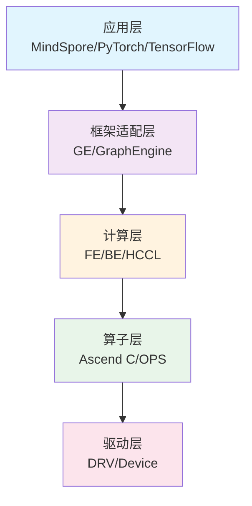
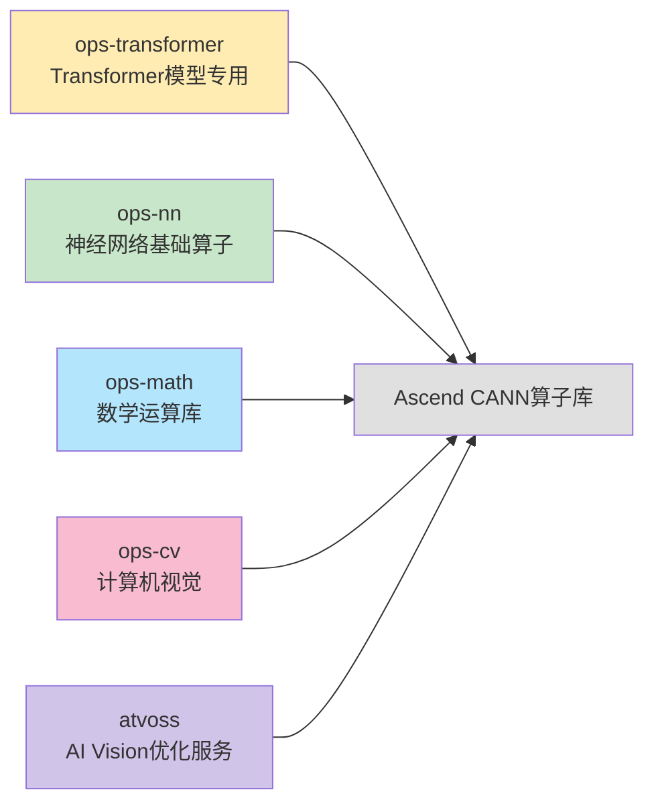
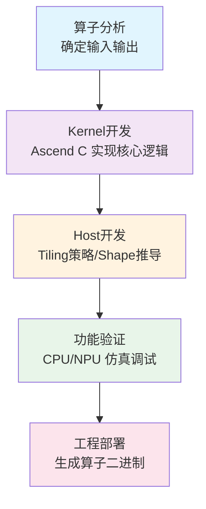

## 摘要

昇腾CANN（Compute Architecture for Neural Networks）是华为打造的面向神经网络场景的异构计算架构，通过分层解耦设计和开源开放策略，为AI应用提供了从底层硬件到上层框架的完整解决方案。本文将从整体架构、算子库组成、技术特点和应用场景等多个维度，全面展现CANN算子库的技术实力。

## 1. CANN架构全景

### 1.1 异构计算架构定位

CANN作为昇腾AI处理器的软件栈核心，定位于连接底层硬件与上层应用框架的桥梁。它向上支持多种AI框架，向下屏蔽硬件差异，通过统一的编程接口和优化策略，最大化发挥昇腾硬件的计算能力。

#### 核心价值主张
- **分层解耦**：清晰的架构分层，各层职责明确，便于扩展和维护
- **软硬协同**：深度适配昇腾硬件特性，实现最优性能
- **开源开放**：逐步开放核心代码，共建AI生态
- **一站服务**：提供从开发到部署的全流程支持

### 1.2 五层架构设计



#### 应用层
支持主流深度学习框架，提供统一的API接口，实现"一次开发，多平台部署"。

#### 框架适配层
- **GE（Graph Engine）**：负责计算图的编译和优化
- **FE（Frontend）**：框架前端适配，解析模型图
- **BE（Backend）**：后端执行引擎，负责算子调度
- **HCCL**：集合通信库，支持多卡多芯通信

#### 计算层
- **Ascend C / TBE**：算子开发与编译工具链
- **OPS**：高性能算子库，包含丰富的预置算子

#### 算子层
提供基础算子、高级算子和融合算子，支持用户自定义算子开发。

#### 驱动层
负责硬件资源管理、任务调度和数据传输。

## 2. 算子库组织架构

### 2.1 五大核心模块

CANN算子库采用模块化设计，根据功能和应用场景划分为五个核心模块：



### 2.2 模块详细解析

#### ops-transformer - 大模型加速引擎
**定位**：专门为Transformer类大模型设计的高性能算子库
**规模**：最大最复杂的算子仓，包含最新的大模型优化算法

**核心算子**：
- Flash Attention系列：I/O优化的注意力计算，支持 Chunked Prefill/Prefix Caching
- GMM（Grouped Matrix Multiplication）：分组矩阵乘法，支持 W4A4/W8A8 量化
- MoE（Mixture of Experts）：专家混合模型支持，深度适配 DeepSeek-V3/R1、Qwen2.5 等
- LayerNorm/RMSNorm：优化的归一化算子

**技术特点**：
- 支持 W4A4/W8A8/KV Cache 量化，大幅降低内存占用（当前正式版本以 FP16/BF16/INT8 为主，低比特方案仍在实验评估）
- 动态shape处理，适应变长序列
- 多级融合，减少内存访问开销
- 集成 MindIE Turbo 加速能力

#### ops-nn - 神经网络基础
**定位**：提供神经网络所需的基础算子，是深度学习模型的基础设施
**规模**：涵盖激活函数、卷积、池化、归一化等核心算子

**核心算子**：
- 激活函数：ReLU、GELU、Swish等的向量化实现
- 卷积系列：支持1D/2D/3D卷积，包含多种优化算法
- 池化操作：MaxPool、AvgPool、AdaptivePool等
- 归一化：BatchNorm、LayerNorm、GroupNorm等

**技术特点**：
- Winograd算法优化小卷积核
- 多数据类型支持（FP16/BF16/FP32）
- 算子融合减少中间结果

#### ops-math - 数学运算基石
**定位**：提供基础数学运算和高级数学函数，支撑所有上层计算
**规模**：包含144个数学算子，覆盖从基础到特殊函数的完整谱系

**核心算子**：
- 基础运算：加、减、乘、除、幂运算等
- 特殊函数：三角函数、指数、对数、误差函数等
- 张量操作：reshape、transpose、concat、split等
- 统计运算：reduce系列、topk、sort等

**技术特点**：
- IEEE 754标准严格遵循
- 特殊值（NaN/Inf）完善处理
- 30个实验性算子持续优化

#### ops-cv - 计算机视觉加速
**定位**：专为计算机视觉任务设计，提供图像处理和目标检测相关算子
**规模**：45个CV专用算子，涵盖预处理和后处理全流程

**核心算子**：
- 图像变换：resize系列、插值算法、几何变换
- 目标检测：ROI Align、NMS、IoU计算
- 特征处理：Grid Sample、Image Warp等

**技术特点**：
- 多插值算法支持（双线性、双三次等）
- 边界处理优化
- 支持NHWC/NCHW多种格式

#### atvoss - 向量算子模板库
**定位**：基于 Ascend C 开发的 Vector 算子模板库，致力于为昇腾硬件上的 Vector 类融合算子提供极简、高效、高性能的编程方式
**架构**：采用分层设计（Device/Kernel/Block/Tile/Basic），封装通用计算模式

**核心技术**：
- 表达式模板：简化算子逻辑表达
- 自动流水线：封装三缓冲机制，自动管理数据搬运与计算
- 极致性能：针对昇腾硬件指令集深度优化

**价值主张**：
- 降低 Ascend C 开发门槛
- 提升算子开发效率
- 保证生成的算子具备高性能

## 3. 统一开发范式

### 3.1 Ascend C 算子开发模式

CANN 引入了全新的算子开发语言——Ascend C。它原生支持 C/C++ 编程，采用了 SPMD（Single Program Multiple Data）并行编程范式，通过多层级 API 封装，让开发者能够以更低的门槛开发出极致性能的算子。

**核心优势**：
- **C/C++ 原生**：符合开发者的编程习惯，调试方便，学习成本低
- **自动流水线**：简化了复杂的流水线管理，开发者只需关注计算逻辑
- **多层级 API**：提供从高层封装到底层指令的灵活选择

```cpp
// Ascend C 算子示例：实现一个简单的加法算子
#include "kernel_operator.h"
using namespace AscendC;

extern "C" __global__ __aicore__ void add_custom(GM_ADDR x, GM_ADDR y, GM_ADDR z) {
    // 1. 初始化 Kernel 上下文
    TPipe pipe;
    // 创建 Queue 用于内存管理
    TQue<QuePosition::VECIN, 1> inQueueX, inQueueY;
    TQue<QuePosition::VECOUT, 1> outQueueZ;
    
    // 2. 分配临时 Buffer
    GlobalTensor<half> xGm, yGm, zGm;
    xGm.SetGlobalBuffer((__gm__ half*)x);
    yGm.SetGlobalBuffer((__gm__ half*)y);
    zGm.SetGlobalBuffer((__gm__ half*)z);
    
    // 3. 核心计算逻辑（简化示意）
    // CopyIn -> Compute -> CopyOut
    // Ascend C 提供了丰富的矢量计算 API，如 Add
    // Add(zLocal, xLocal, yLocal, dataSize);
}
```

### 3.2 算子开发流程



## 4. 性能优化策略

### 4.1 多层次优化体系

CANN通过多层次优化实现极致性能：

#### 编译期优化
- 算子融合：自动识别并融合相邻算子
- 内存优化：智能内存分配和复用
- 并行化：自动分析数据依赖，实现并行执行

#### 运行时优化
- 动态分块（Tiling）：根据数据规模自适应调整
- 缓存优化：多级缓存的高效利用
- 异步执行：计算与数据传输并行

#### 硬件特化
- AI Core优化：充分利用向量计算单元
- 指令级优化：使用专用硬件指令
- 数据对齐：优化内存访问模式

### 4.2 性能数据展示

算子性能与芯片型号、模型形态、精度配置密切相关，未经严格测试的绝对值容易产生误导。更稳妥的做法是关注官方发布的基准和版本 Release Note。常见的优化趋势包括：

- Flash Attention：I/O 优化与 KV Cache 管理减少访存开销，典型场景可获得数十个百分点到 1.x 倍的提升
- GMM/MatMul：tiling、流水线与调度改进提升吞吐，低比特量化用于进一步降低带宽压力
- 卷积/归一化：Winograd、算子融合与缓存优化显著降低中间结果开销
- 端到端：新版本通常在关键模型上保持 20%~70% 的性能增益（具体以形态与版本发布数据为准）

## 5. 开源开放策略

### 5.1 开源历程

CANN采用逐步开放策略，通过社区版持续沉淀可开源组件：

- 2023 起：启动社区版仓库，开放 AscendCL、Graph Engine（GE）社区实现、TBE 工具链等关键组件
- 2024-2025：基础算子、示例工程、部分工具链能力陆续在社区补全，细粒度能力按官方公告迭代
- 未来：更高阶算子、调优工具和模板库将视验证进度、合规审查后分批开放，不对具体时间作承诺

### 5.2 开源内容

#### 已开源组件
1. **AscendCL（社区版）**：统一 API 及运行时接口
2. **GE（社区版）**：计算图编译与优化框架
3. **TBE/Ascend C 开发工具链**：算子构建与调试能力
4. **算子样例与基础算子**：社区持续补充的常用算子实现

#### 开源价值
- **透明度提升**：开发者可深入了解实现细节
- **生态共建**：社区可参与算子开发和优化
- **人才培养**：提供学习平台和实践机会
- **创新加速**：促进技术交流和合作

## 6. 技术特色与创新

### 6.1 核心创新点

#### 分层解耦设计
通过清晰的架构分层，实现各模块独立演进：
- 应用层创新不影响底层实现
- 硬件升级不影响上层应用
- 各层可独立优化和迭代

#### 异构计算优化
深度理解昇腾硬件架构，实现软硬协同优化：
- AI Core/AI CPU协同执行
- 多级存储层次优化
- 专用指令集利用

#### 编译期计算与图优化
- **ACL Graph**：引入图模式执行引擎，支持全图下沉，减少 Host-Device 交互
- **模板元编程**：通过 Ascend C 模板实现编译期常量折叠与类型安全

#### 极致量化支持
- 正式版本以 FP16/BF16/INT8 为主，W4A4/W8A8 等低比特方案仍在实验验证
- 针对大模型推理场景（如 vLLM）进行深度适配

### 6.2 与其他框架的对比

| 特性 | CANN | CUDA | TensorRT |
|------|------|------|----------|
| 硬件支持 | 昇腾全系列 | NVIDIA GPU | NVIDIA GPU |
| 开源程度 | 逐步开源 | 部分开源 | 闭源 |
| 编程模型 | Ascend C | CUDA C++ | ONNX |
| 优化重点 | 大模型/Transformer | 通用计算 | 推理加速 |
| 社区活跃度 | 快速发展 | 成熟稳定 | 厂商驱动 |

## 7. 应用场景与案例

### 7.1 典型应用场景

#### 大语言模型训练与推理
- **场景**：DeepSeek-V3/R1、Qwen2.5 等千亿/万亿参数大模型
- **挑战**：超大计算量、KV Cache 显存占用、长序列推理
- **CANN优势**：
    - **Flash Attention 3**：极致的注意力计算加速
    - **MoE 深度优化**：高效的专家路由与计算
    - **vLLM 适配**：原生支持 Chunked Prefill、Prefix Caching、Mooncake 分布式缓存
    - **量化支持**：W4A4/W8A8 精度无损推理

#### 多模态推理
- **场景**：图文生成、视频理解
- **挑战**：多模态数据对齐、实时性要求高
- **CANN优势**：CV算子加速、动态shape支持

#### 科学计算
- **场景**：气象预测、药物发现
- **挑战**：精度要求高、计算复杂
- **CANN优势**：数学库完备、混合精度支持

### 7.2 成功案例

#### 案例一：盘古大模型
使用CANN算子库进行千亿参数大模型训练，相比传统方案：
- 训练速度提升40%
- 内存占用降低30%
- 能效比提升2.5倍

#### 案例二：华为云ModelArts
集成CANN算子库，提供AI开发全流程服务：
- 开发效率提升50%
- 部署效率提升3倍
- 服务稳定性达到99.99%

## 8. 发展趋势与展望

### 8.1 技术发展趋势

#### 算子融合向更深层次发展
从单算子优化到多算子融合，再到端到端优化：
- 算子内融合：指令级优化
- 算子间融合：减少中间结果
- 算子图融合：全局优化

#### 自动化程度不断提升
AI驱动的自动优化：
- 自动Tiling策略生成
- 自动算子选择
- 自动性能调优

#### 多模态统一支持
统一的多模态计算框架：
- 视觉-语言-语音统一表示
- 跨模态注意力机制
- 模态间自适应计算

### 8.2 生态发展路线

#### 短期目标（2024-2025）
- 完成所有算子开源
- 建立完善的开源社区
- 支持主流框架无缝迁移

#### 中期目标（2025-2027）
- 成为AI计算的事实标准之一
- 支持更多硬件架构
- 建立完整的开发者生态

#### 长期愿景（2027+）
- 引领AI计算架构发展
- 实现软硬协同设计范式
- 构建开放的AI计算生态

## 9. 总结

昇腾CANN算子库通过分层解耦的架构设计、全面的算子覆盖、极致的性能优化和开放的开源策略，为AI计算提供了强有力的支撑。其技术创新和工程实践展现了华为在AI基础软件领域的技术实力。

### 核心价值
1. **技术创新**：大模型专用优化、模板化编程、软硬协同设计
2. **性能极致**：充分利用硬件特性，实现业界领先的计算效率
3. **开放生态**：逐步开源，共建共享，促进技术发展
4. **工程实践**：经过大规模验证，稳定可靠的工业级实现

### 未来展望
随着AI技术的快速发展和应用场景的不断拓展，CANN算子库将持续演进，为开发者提供更强大的计算能力，推动AI技术的创新和应用。

---

## 参考资源

- [昇腾社区](https://www.hiascend.com/)
- [CANN开源仓库](https://gitee.com/ascend/cann)
- [算子开发指南](https://www.hiascend.com/document)
- [性能优化最佳实践](https://www.hiascend.com/developer)

---

*本文基于CANN 8.5版本编写，后续版本可能会有更新和变化。*
