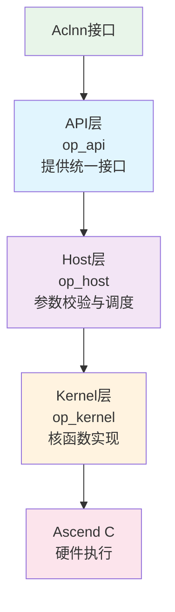
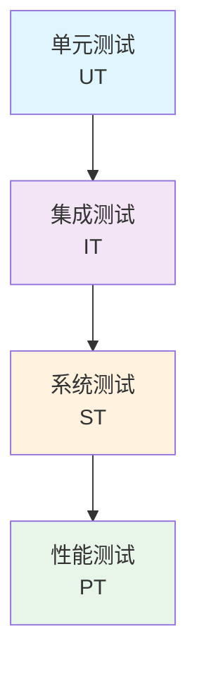

## 摘要

随着AI技术的快速发展，如何高效开发AI算子成为关键技术挑战。CANN通过Ascend C编程语言和统一的开发架构，为开发者提供了从底层硬件到上层应用的完整解决方案。本文将深入解析CANN算子开发的通用架构、编程范式、工程实践和质量保证体系，帮助开发者掌握高性能算子开发的核心技术。

## 1. Ascend C编程语言

### 1.1 设计理念

Ascend C是CANN专门为算子开发场景推出的编程语言，具有以下核心特点：

- **原生C/C++支持**：完全兼容C/C++标准规范，开发者无需学习新的编程范式
- **多层接口抽象**：从底层硬件到高层API的多层次抽象
- **自动并行计算**：编译器自动分析并行性，生成优化的并行代码
- **孪生调试**：支持CPU模拟调试，提升开发效率

### 1.2 编程模型

#### 核函数编程范式

Ascend C 推荐使用基于类的算子开发方式，将算子的 Init（初始化）和 Process（处理逻辑）解耦：

```cpp
// Ascend C核函数示例：向量加法
#include "kernel_operator.h"
using namespace AscendC;

class VectorAdd {
public:
    __aicore__ inline VectorAdd() {}
    
    // 初始化函数：完成内存初始化和Tiling参数解析
    __aicore__ inline void Init(GM_ADDR x, GM_ADDR y, GM_ADDR z, uint32_t totalLength, uint32_t tileNum) {
        // 参数计算
        ASSERT(AscendC::GetBlockNum() != 0 && "block dim can not be zero!");
        this->blockLength = totalLength / AscendC::GetBlockNum();
        this->tileNum = tileNum;
        this->tileLength = this->blockLength / tileNum / BUFFER_NUM;

        // 获取当前核的全局内存起始地址
        xGm.SetGlobalBuffer((__gm__ half*)x + blockLength * AscendC::GetBlockIdx(), blockLength);
        yGm.SetGlobalBuffer((__gm__ half*)y + blockLength * AscendC::GetBlockIdx(), blockLength);
        zGm.SetGlobalBuffer((__gm__ half*)z + blockLength * AscendC::GetBlockIdx(), blockLength);

        // 初始化Pipe和Queue
        pipe.InitBuffer(inQueueX, BUFFER_NUM, tileLength * sizeof(half));
        pipe.InitBuffer(inQueueY, BUFFER_NUM, tileLength * sizeof(half));
        pipe.InitBuffer(outQueueZ, BUFFER_NUM, tileLength * sizeof(half));
    }

    // 核心处理函数：实现流水线逻辑
    __aicore__ inline void Process() {
        int32_t loopCount = tileNum * BUFFER_NUM;
        for (int32_t i = 0; i < loopCount; i++) {
            CopyIn(i);
            Compute(i);
            CopyOut(i);
        }
    }

private:
    __aicore__ inline void CopyIn(int32_t progress) {
        LocalTensor<half> xLocal = inQueueX.AllocTensor<half>();
        LocalTensor<half> yLocal = inQueueY.AllocTensor<half>();
        DataCopy(xLocal, xGm[progress * tileLength], tileLength);
        DataCopy(yLocal, yGm[progress * tileLength], tileLength);
        inQueueX.EnQue(xLocal);
        inQueueY.EnQue(yLocal);
    }

    __aicore__ inline void Compute(int32_t progress) {
        LocalTensor<half> xLocal = inQueueX.DeQue<half>();
        LocalTensor<half> yLocal = inQueueY.DeQue<half>();
        LocalTensor<half> zLocal = outQueueZ.AllocTensor<half>();
        Add(zLocal, xLocal, yLocal, tileLength);
        outQueueZ.EnQue(zLocal);
        inQueueX.FreeTensor(xLocal);
        inQueueY.FreeTensor(yLocal);
    }

    __aicore__ inline void CopyOut(int32_t progress) {
        LocalTensor<half> zLocal = outQueueZ.DeQue<half>();
        DataCopy(zGm[progress * tileLength], zLocal, tileLength);
        outQueueZ.FreeTensor(zLocal);
    }

private:
    TPipe pipe;
    TQue<QuePosition::VECIN, BUFFER_NUM> inQueueX, inQueueY;
    TQue<QuePosition::VECOUT, BUFFER_NUM> outQueueZ;
    GlobalTensor<half> xGm, yGm, zGm;
    uint32_t blockLength;
    uint32_t tileNum;
    uint32_t tileLength;
    static constexpr int32_t BUFFER_NUM = 2;
};

// 核函数入口
extern "C" __global__ __aicore__ void vector_add(GM_ADDR x, GM_ADDR y, GM_ADDR z, GM_ADDR workspace, GM_ADDR tiling) {
    GET_TILING_DATA(tilingData, tiling);
    VectorAdd op;
    op.Init(x, y, z, tilingData.totalLength, tilingData.tileNum);
    op.Process();
}
```

#### 关键编程元素

1.  **类模板设计**
    *   `Init`：负责环境初始化，包括全局内存地址偏移计算、Pipe/Queue 初始化。
    *   `Process`：负责流水线调度，通常包含 `CopyIn` -> `Compute` -> `CopyOut` 三阶段。

2.  **多级内存管理**
    *   `GlobalTensor`：对应 Global Memory（DDR/HBM），用于核间数据传输。
    *   `LocalTensor`：对应 Local Memory（UB），用于核内计算。
    *   `TPipe` 与 `TQue`：实现内存资源的自动管理和数据流转。

3.  **流水线并行**
    *   通过 `AllocTensor`/`EnQue`/`DeQue`/`FreeTensor` 机制，实现数据搬运与计算的流水线并行，掩盖通信延迟。

## 2. 统一的分层架构模式

### 2.1 三层开发架构

CANN算子开发采用清晰的三层架构，每层职责明确：



#### API层（op_api）
**职责**：提供标准化的ACLNN接口，隔离框架差异

```cpp
// API层接口示例
aclnnStatus aclnnAdd(const aclTensor* a,
                    const aclTensor* b,
                    aclTensor* c,
                    aclOpExecutor** executor);
```

**特点**：
- 统一的接口规范
- 框架无关的抽象
- 类型安全的参数传递

#### Host层（op_host）
**职责**：实现算子 Tiling 逻辑，包括 Shape 推导、Tiling 参数计算等。

```cpp
// Host层实现示例
#include "add_example_tiling.h"
#include "register/op_def_registry.h"
#include "tiling/platform/platform_ascendc.h"

namespace optiling {

// Tiling计算函数
static ge::graphStatus TilingFunc(gert::TilingContext* context) {
    AddExampleTilingData tiling;
    uint32_t totalLength = context->GetInputTensor(0)->GetShapeSize();
    
    // 获取平台信息（核数、UB大小）
    auto ascendcPlatform = platform_ascendc::PlatformAscendC(context->GetPlatformInfo());
    uint64_t ubSize;
    ascendcPlatform.GetCoreMemSize(platform_ascendc::CoreMemType::UB, ubSize);
    uint32_t coreNum = ascendcPlatform.GetCoreNumAiv();

    // 简单分块逻辑
    tiling.set_totalLength(totalLength);
    tiling.set_tileNum(coreNum);

    // 序列化Tiling数据
    tiling.SaveToBuffer(context->GetRawTilingData()->GetData(), 
                       context->GetRawTilingData()->GetCapacity());
    context->GetRawTilingData()->SetDataSize(tiling.GetDataSize());
    
    return ge::GRAPH_SUCCESS;
}
} // namespace optiling

// 注册Tiling函数
IMPL_OP_OPTILING(AddExample).Tiling(optiling::TilingFunc);
```

#### Kernel层（op_kernel）
**职责**：使用Ascend C实现具体的计算逻辑，参考 1.2 节的类模板实现。

### 2.2 通用开发模式

#### 标准算子开发流程

1.  **算子原型定义** (`op_host/add_example_def.cpp`)
    ```cpp
    #include "register/op_def_registry.h"
    namespace ops {
        class AddExample : public OpDef {
        public:
            explicit AddExample(const char* name) : OpDef(name) {
                this->Input("x")
                    .ParamType(REQUIRED)
                    .DataType({ge::DT_FLOAT16})
                    .Format({ge::FORMAT_ND});
                this->Input("y")
                    .ParamType(REQUIRED)
                    .DataType({ge::DT_FLOAT16})
                    .Format({ge::FORMAT_ND});
                this->Output("z")
                    .ParamType(REQUIRED)
                    .DataType({ge::DT_FLOAT16})
                    .Format({ge::FORMAT_ND});
                this->AICore().AddConfig("ascend910b");
            }
        };
        OP_ADD(AddExample);
    }
    ```

2.  **Tiling 数据定义** (`op_kernel/add_example_tiling_data.h`)
    ```cpp
    #include "tiling/tiling_api.h"
    TILING_DATA_FIELD_DEF(AddExampleTilingData, tc,
        TILING_DATA_FIELD(uint32_t, totalLength),
        TILING_DATA_FIELD(uint32_t, tileNum)
    );
    ```

3.  **Kernel 实现** (`op_kernel/add_example.cpp`)
    ```cpp
    extern "C" __global__ __aicore__ void add_example(GM_ADDR x, GM_ADDR y, GM_ADDR z, GM_ADDR workspace, GM_ADDR tiling) {
        GET_TILING_DATA(tilingData, tiling);
        // ... Init & Process
    }
    ```

## 3. Tiling机制与内存管理

### 3.1 Tiling 定义与注册

在 Ascend C 开发中，Tiling 策略的传递依赖于 `TilingData` 结构体。开发者需要在 Host 侧计算好分块参数，填入该结构体，并序列化到 Workspace 或 Tiling Buffer 中，Kernel 侧再反序列化读取。

#### Tiling 注册宏
使用 `IMPL_OP_OPTILING` 宏将 Tiling 函数注册到 GE（Graph Engine）：

```cpp
IMPL_OP_OPTILING(OpName).Tiling(TilingFunc);
```

#### Tiling Key
对于不同的输入 Shape 或数据类型，可能需要执行不同的 Kernel 逻辑。CANN 提供了 Tiling Key 机制：
1.  **Host 侧**：根据输入特征生成 `tilingKey`，存入 TilingData。
2.  **Kernel 侧**：读取 `tilingKey`，通过 `if constexpr` 分支选择不同的实现模板。

### 3.2 多级内存管理

#### 内存层次结构

```mermaid
graph LR
    A[Global Memory<br/>DDR/HBM] --> B[L1 Cache]
    B --> C[Local Memory<br/>UB (Unified Buffer)]
    C --> D[L0 Buffer<br/>Cube Unit]

    style A fill:#ffecb3
    style B fill:#c8e6c9
    style C fill:#b3e5fc
    style D fill:#f8bbd0
```

#### 基于 TPipe 的内存管理
Ascend C 提供了 `TPipe` 类来管理 UB 内存，无需开发者手动计算偏移量。

```cpp
// 内存管理示例
class MemoryManager {
public:
    __aicore__ inline void Init(uint32_t len) {
        // InitBuffer 自动从 UB 池中划分内存给 Queue
        // len 为每个 Buffer 的字节大小，BUFFER_NUM 为 Buffer 个数
        pipe.InitBuffer(inQueueX, BUFFER_NUM, len);
        pipe.InitBuffer(outQueueZ, BUFFER_NUM, len);
    }

    __aicore__ inline void AllocAndFree() {
        // 从 Queue 中申请 Tensor，自动处理读写依赖和内存复用
        LocalTensor<half> xLocal = inQueueX.AllocTensor<half>();
        
        // ... 使用 xLocal 进行计算 ...

        // 释放 Tensor，归还内存到 Queue
        inQueueX.FreeTensor(xLocal);
    }

private:
    TPipe pipe;
    TQue<QuePosition::VECIN, BUFFER_NUM> inQueueX;
    TQue<QuePosition::VECOUT, BUFFER_NUM> outQueueZ;
};
```

### 3.3 动态Tiling策略

```cpp
// 动态Tiling计算示例
static ge::graphStatus TilingFunc(gert::TilingContext* context) {
    auto ascendcPlatform = platform_ascendc::PlatformAscendC(context->GetPlatformInfo());
    uint64_t ubSize;
    ascendcPlatform.GetCoreMemSize(platform_ascendc::CoreMemType::UB, ubSize);
    uint32_t coreNum = ascendcPlatform.GetCoreNumAiv();

    uint32_t totalLength = context->GetInputTensor(0)->GetShapeSize();
    uint32_t totalBytes = totalLength * sizeof(float);
    
    // 策略：尽量填满 UB，减少搬运次数
    // 双缓冲需要除以 2
    uint32_t maxTileBytes = ubSize / 2; 
    
    // ... 计算 tileNum 和 tileLength ...
    
    return ge::GRAPH_SUCCESS;
}
```

## 4. 编译器优化技术

### 4.1 自动并行化

Ascend C编译器提供强大的自动并行化能力：

```cpp
// 示例：矩阵乘法的自动并行化
template<typename T>
class MatMulKernel {
public:
    __aicore__ void operator()(const T* A, const T* B, T* C,
                              int M, int N, int K) {
        // 编译器自动识别并行性
        for (int i = 0; i < M; ++i) {
            for (int j = 0; j < N; ++j) {
                T sum = 0;
                for (int k = 0; k < K; ++k) {
                    sum += A[i * K + k] * B[k * N + j];
                }
                C[i * N + j] = sum;
            }
        }
        // 编译器将自动：
        // 1. 循环展开
        // 2. 向量化
        // 3. 多核并行
        // 4. 内存访问优化
    }
};
```

### 4.2 内存访问优化

```cpp
// 数据局部性优化示例
class DataLocalityOptimization {
private:
    // 预取优化
    template<typename T>
    void PrefetchData(const T* src, size_t size) {
        // 编译器自动插入预取指令
        // 减少缓存miss
        for (size_t i = 0; i < size; i += 64 / sizeof(T)) {
            __builtin_prefetch(src + i, 0, 3); // 预取到L1
        }
    }

    // 数据重组优化
    template<typename T>
    void ReorganizeData(T* src, size_t count) {
        // 编译器自动优化数据布局
        // 提高缓存命中率
        // 使用向量化加载存储
    }
};
```

### 4.3 算子融合优化

```cpp
// 算子融合示例：Add + ReLU
class AddReLUFusion {
public:
    __aicore__ void operator()(const float* a, const float* b, float* c,
                              size_t size) {
        // 融合计算，减少中间结果存储
        for (size_t i = 0; i < size; ++i) {
            float sum = a[i] + b[i];
            c[i] = sum > 0 ? sum : 0;  // ReLU激活
        }

        // 优化效果：
        // 1. 减少一次内存写入
        // 2. 减少一次内存读取
        // 3. 提高数据局部性
    }
};
```

## 5. 四层测试架构

### 5.1 测试体系概述

CANN建立了完整的四层测试架构，确保算子质量：



### 5.2 测试实现示例

#### 单元测试（op_host_ut）

```cpp
// Host层单元测试
class AddHostTest : public testing::Test {
protected:
    void SetUp() override {
        // 准备测试数据
        a_shape_ = {1024, 1024};
        b_shape_ = {1024, 1024};
        c_shape_ = {1024, 1024};

        a_data_ = GenerateRandomData(a_shape_);
        b_data_ = GenerateRandomData(b_shape_);
    }

    void TestShapeInference() {
        // 测试形状推断
        aclTensor* a = CreateTensor(a_shape_, a_data_);
        aclTensor* b = CreateTensor(b_shape_, b_data_);
        aclTensor* c = nullptr;

        // 执行形状推断
        auto status = aclnnInferShapeAdd(a, b, &c);
        EXPECT_EQ(status, ACLNN_SUCCESS);

        // 验证输出形状
        EXPECT_EQ(c->GetShape(), a_shape_);
    }

    void TestParameterValidation() {
        // 测试参数校验
        // null指针测试
        EXPECT_FALSE(AddHost::ValidateParams(nullptr, nullptr, nullptr));

        // 形状不匹配测试
        std::vector<int64_t> wrong_shape = {512, 1024};
        aclTensor* a = CreateTensor(a_shape_, a_data_);
        aclTensor* b = CreateTensor(wrong_shape, b_data_);
        aclTensor* c = CreateTensor(c_shape_, {});

        EXPECT_FALSE(AddHost::ValidateParams(a, b, c));
    }
};
```

#### API测试（op_api_ut）

```cpp
// API层测试
class AddApiTest : public testing::Test {
public:
    void TestApiInterface() {
        // 准备输入输出
        aclTensor* inputs[2];
        aclTensor* outputs[1];
        PrepareTensors(inputs, outputs);

        // 创建执行器
        aclOpExecutor* executor = nullptr;
        auto status = aclnnCreateExecutor(&executor, nullptr, 0);
        EXPECT_EQ(status, ACLNN_SUCCESS);

        // 执行计算
        status = aclnnExecuteAdd(executor);
        EXPECT_EQ(status, ACLNN_SUCCESS);

        // 验证结果
        VerifyResult(outputs[0]);

        // 清理资源
        aclnnDestroyExecutor(executor);
    }
};
```

#### Kernel测试（op_kernel_ut）

Ascend C 提供了 `ICPU_RUN_KF` 宏，支持在 CPU 侧模拟执行 Kernel 函数，方便进行逻辑调试。

```cpp
// Kernel层测试
class AddKernelTest : public testing::Test {
public:
    void TestKernelCorrectness() {
        // 准备测试数据
        const size_t N = 1024;
        const uint32_t tileNum = 8;
        std::vector<half> a(N), b(N), expected(N), actual(N);
        
        // 生成测试数据
        // ... (数据生成逻辑) ...

        // 准备Tiling数据
        AddExampleTilingData tilingData;
        tilingData.totalLength = N;
        tilingData.tileNum = tileNum;
        
        // 申请Workspace等内存
        uint8_t* x = (uint8_t*)AscendC::GmAlloc(N * sizeof(half));
        uint8_t* y = (uint8_t*)AscendC::GmAlloc(N * sizeof(half));
        uint8_t* z = (uint8_t*)AscendC::GmAlloc(N * sizeof(half));
        uint8_t* workspace = (uint8_t*)AscendC::GmAlloc(16 * 1024 * 1024);
        uint8_t* tiling = (uint8_t*)AscendC::GmAlloc(sizeof(AddExampleTilingData));
        
        // 拷贝数据到模拟的 Global Memory
        // ... (memcpy 逻辑) ...
        memcpy(tiling, &tilingData, sizeof(AddExampleTilingData));

        // 设置上下文
        ICPU_SET_TILING_KEY(0);
        AscendC::SetKernelMode(KernelMode::AIV_MODE);

        // 执行Kernel
        ICPU_RUN_KF(vector_add, tileNum /* blockDim */, x, y, z, workspace, tiling);

        // 验证结果
        // ... (验证逻辑) ...
        
        // 释放资源
        AscendC::GmFree(x);
        AscendC::GmFree(y);
        AscendC::GmFree(z);
        AscendC::GmFree(workspace);
        AscendC::GmFree(tiling);
    }
};
```

### 5.3 自动化测试生成

```python
# Python脚本：自动生成测试用例
import numpy as np

def generate_test_cases():
    """生成各种形状和数据类型的测试用例"""

    # 测试形状
    test_shapes = [
        [1],
        [16],
        [1024],
        [16, 16],
        [64, 64],
        [256, 256],
        [1, 32, 32],
        [3, 224, 224],
        [4, 64, 64, 64]
    ]

    # 测试数据类型
    test_dtypes = ['float32', 'float16', 'int32', 'int8']

    # 生成测试代码
    for shape in test_shapes:
        for dtype in test_dtypes:
            # 生成随机数据
            a = np.random.randn(*shape).astype(dtype)
            b = np.random.randn(*shape).astype(dtype)
            expected = a + b

            # 生成测试函数
            test_name = f"TestAdd_{dtype}_{shape_to_str(shape)}"
            generate_test_function(test_name, a, b, expected)

def shape_to_str(shape):
    """将形状转换为字符串"""
    return 'x'.join(map(str, shape))
```

## 6. 错误处理与调试

### 6.1 统一的错误处理机制

```cpp
// 错误处理宏定义
#define OP_CHECK(condition, retval, message) \
    do { \
        if (!(condition)) { \
            OP_LOGE("operator_name", "%s: %s", __FUNCTION__, message); \
            return retval; \
        } \
    } while(0)

#define OP_LOGI(fmt, ...) \
    printf("[INFO] %s: " fmt "\n", __FUNCTION__, ##__VA_ARGS__)

#define OP_LOGE(fmt, ...) \
    printf("[ERROR] %s: " fmt "\n", __FUNCTION__, ##__VA_ARGS__)

// 使用示例
class ErrorHandler {
public:
    static bool SafeAllocate(void** ptr, size_t size) {
        OP_CHECK(size > 0, false, "Invalid size parameter");

        *ptr = malloc(size);
        OP_CHECK(*ptr != nullptr, false, "Memory allocation failed");

        return true;
    }

    static bool CheckTensor(const aclTensor* tensor, const char* name) {
        OP_CHECK(tensor != nullptr, false,
                strFormat("%s is null", name).c_str());
        OP_CHECK(tensor->GetMemorySize() > 0, false,
                strFormat("%s has invalid memory size", name).c_str());

        return true;
    }
};
```

### 6.2 孪生调试技术

```cpp
// CPU模拟调试示例
#ifdef DEBUG_MODE
class TwinDebug {
private:
    std::map<void*, void*> host_device_map_;

public:
    // 模拟设备内存分配
    void* SimulateMalloc(size_t size) {
        void* host_ptr = malloc(size);
        void* device_ptr = reinterpret_cast<void*>(next_device_addr_);
        host_device_map_[device_ptr] = host_ptr;
        next_device_addr_ += size;
        return device_ptr;
    }

    // 模拟数据传输
    void SimulateMemcpy(void* dst, const void* src, size_t size) {
        auto it = host_device_map_.find(dst);
        if (it != host_device_map_.end()) {
            // 设备内存，传输到host
            memcpy(it->second,
                   host_device_map_.at(const_cast<void*>(src)),
                   size);
        }
    }

    // 在CPU上执行核函数
    template<typename Func>
    void SimulateKernel(Func func, void** params) {
        // 将设备内存映射到host内存
        MapDeviceToHost(params);

        // 在CPU上执行
        func(params);

        // 验证结果
        ValidateResult(params);
    }
};

// 使用孪生调试
void TestAddKernel() {
    TwinDebug debugger;

    // 在模拟环境下执行
    debugger.SimulateKernel(add_kernel, params);
}
#endif
```

## 7. 性能优化最佳实践

### 7.1 性能分析工具

```cpp
// 性能分析辅助类
class Profiler {
private:
    std::map<std::string, uint64_t> start_times_;
    std::map<std::string, uint64_t> total_times_;

public:
    void Start(const std::string& name) {
        start_times_[name] = GetCycles();
    }

    void End(const std::string& name) {
        uint64_t end_time = GetCycles();
        total_times_[name] += (end_time - start_times_[name]);
    }

    void Report() {
        for (const auto& entry : total_times_) {
            printf("%s: %llu cycles\n",
                   entry.first.c_str(), entry.second);
        }
    }
};

// 使用示例
class OptimizedAdd {
public:
    void Execute() {
        Profiler profiler;

        profiler.Start("data_transfer");
        // 数据传输
        profiler.End("data_transfer");

        profiler.Start("computation");
        // 计算执行
        profiler.End("computation");

        profiler.Start("result_writeback");
        // 结果写回
        profiler.End("result_writeback");

        profiler.Report();
    }
};
```

### 7.2 优化checklist

```markdown
## 算子性能优化检查表

### 数据类型优化
- [ ] 使用最小精度满足需求
- [ ] 避免不必要的类型转换
- [ ] 利用硬件低精度加速

### 内存访问优化
- [ ] 保证32字节对齐访问
- [ ] 最大化数据重用
- [ ] 使用双缓冲隐藏延迟
- [ ] 预取数据减少缓存miss

### 计算优化
- [ ] 利用SIMD指令向量化
- [ ] 避免分支预测失败
- [ ] 循环展开减少开销
- [ ] 算子融合减少中间结果

### 并行优化
- [ ] 合理分配数据到各核心
- [ ] 避免负载不均衡
- [ ] 最小化同步开销
- [ ] 使用异步执行
```

## 8. 总结

CANN算子开发通用架构通过以下关键技术，为开发者提供了高效、可靠的开发体验：

### 核心优势

1. **统一开发范式**
   - Ascend C编程语言，无缝衔接C/C++
   - 标准化的三层架构
   - 通用的开发模式

2. **自动化优化**
   - 编译器自动并行化
   - 智能内存管理
   - 动态Tiling策略

3. **完善的质量保证**
   - 四层测试架构
   - 孪生调试技术
   - 统一的错误处理

4. **强大的工程实践**
   - 模块化设计
   - 代码复用
   - 性能分析工具

### 发展趋势

1. **更高层次的抽象**：简化算子开发，降低门槛
2. **更智能的优化**：AI驱动的自动调优
3. **更完善的生态**：丰富的工具链和社区支持

通过掌握CANN算子开发的通用架构和工程实践，开发者可以高效地开发出高性能的AI算子，充分发挥昇腾硬件的计算潜力，推动AI技术的创新和应用。

---

## 参考资源

- [Ascend C开发指南](https://www.hiascend.com/document/detail/zh/CANNCommunityEdition/850alpha001/opdevg/Ascendcopdevg/atlas_ascendc_10_0001.html)
- [算子开发最佳实践](https://www.hiascend.com/developer)
- [开源代码仓库](https://gitee.com/ascend/cann)
- [社区技术支持](https://www.hiascend.com/community)

---

*本文基于CANN 8.5版本编写，部分功能可能随版本更新而变化。*
