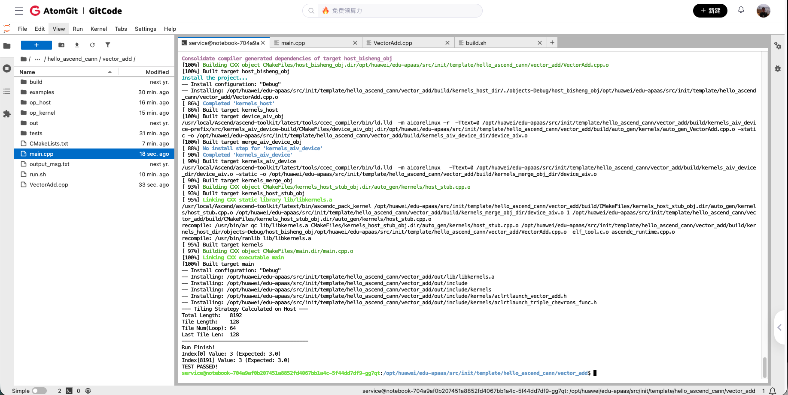
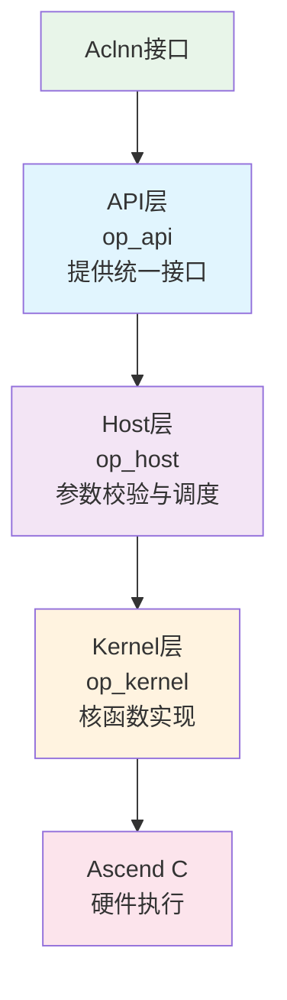
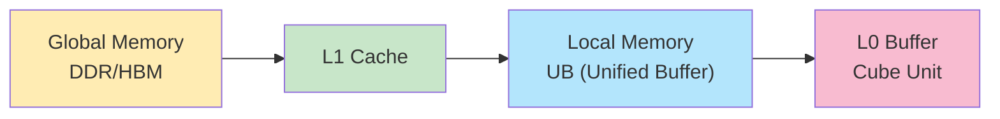

## 摘要

随着AI技术的快速发展，如何高效开发AI算子成为关键技术挑战。CANN通过Ascend C编程语言和统一的开发架构，为开发者提供了从底层硬件到上层应用的完整解决方案。本文将深入解析CANN算子开发的通用架构、编程范式、工程实践和质量保证体系，帮助开发者掌握高性能算子开发的核心技术。

## 1. Ascend C编程语言

### 1.1 设计理念

Ascend C是CANN专门为算子开发场景推出的编程语言，具有以下核心特点：

- **原生C/C++支持**：完全兼容C/C++标准规范，开发者无需学习新的编程范式
- **多层接口抽象**：从底层硬件到高层API的多层次抽象
- **自动并行计算**：编译器自动分析并行性，生成优化的并行代码
- **孪生调试**：支持CPU模拟调试，提升开发效率

### 1.2 编程模型

#### 核函数编程范式

Ascend C 推荐使用基于类的算子开发方式，将算子的 Init（初始化）和 Process（处理逻辑）解耦。 我们以 Ascend C 实现向量加法为例：

```cpp
/**
 * Ascend C 向量加法核函数实现
 * * 核心特性：
 * 1.流水线并行 (Pipeline Parallelism): CopyIn -> Compute -> CopyOut
 * 2.双缓冲 (Double Buffer): 使用两个缓冲区掩盖数据搬运延迟
 * 3.Host-Device Tiling: 切分策略在 Host 端计算，Kernel 端直接执行，减少标量计算开销
 * 4.动态尾块处理: 支持非 32Byte 对齐或非标准块大小的数据长度
 */

#include "kernel_operator.h"

using namespace AscendC;

// -------------------------------------------------------------------------
// 1. Tiling 数据结构定义
// -------------------------------------------------------------------------
// 定义 Tiling 结构体，用于从 Host 端接收计算好的切分参数
// 【注意】结构体的内存布局（成员顺序、类型）必须与 Host 端代码完全一致
struct TilingData {
    uint32_t totalLength;      // 总数据量 (仅用于参考或边界检查)
    uint32_t tileNum;          // 总循环次数 (Block 内需要切分多少次)
    uint32_t tileLength;       // 标准切分长度 (UB 缓冲区的最大分配大小)
    uint32_t lastTileLength;   // 最后一次搬运的长度 (用于处理除不尽的余数/尾块)
    uint32_t startOffset;      // 当前核处理数据的全局起始偏移 (支持多核非均匀切分)
};

// Tiling 解析辅助函数
// 将 Global Memory (显存) 上的 tiling 数据拷贝到 Local 变量中供 Kernel 使用
__aicore__ inline void InitTilingData(GM_ADDR tiling, TilingData* tilingData) {
    __gm__ uint32_t* tilingGM = (__gm__ uint32_t*)tiling;
    tilingData->totalLength    = tilingGM[0];
    tilingData->tileNum        = tilingGM[1];
    tilingData->tileLength     = tilingGM[2];
    tilingData->lastTileLength = tilingGM[3];
    tilingData->startOffset    = tilingGM[4];
}

// -------------------------------------------------------------------------
// 2. 算子类实现
// -------------------------------------------------------------------------
class VectorAdd {
public:
    __aicore__ inline VectorAdd() {}

    /**
     * 初始化函数 (Init)
     * 职责：解析参数，设置内存地址，分配片上内存 (Pipe/Queue)
     */
    __aicore__ inline void Init(GM_ADDR x, GM_ADDR y, GM_ADDR z, TilingData* tData) {
        // 保存调度所需的关键参数
        this->tileNum = tData->tileNum;
        this->tileLength = tData->tileLength;
        this->lastTileLength = tData->lastTileLength;

        // [内存地址设置]
        // 使用 Host 端传来的 startOffset 设置 GlobalTensor 的起始地址
        // 相比于在 Kernel 内用 GetBlockIdx 计算，这种方式更灵活，支持不均匀切分
        xGm.SetGlobalBuffer((__gm__ half*)x + tData->startOffset, tData->totalLength);
        yGm.SetGlobalBuffer((__gm__ half*)y + tData->startOffset, tData->totalLength);
        zGm.SetGlobalBuffer((__gm__ half*)z + tData->startOffset, tData->totalLength);

        // [管道初始化]
        // BUFFER_NUM = 2 开启双缓冲
        // allocSize 必须按照最大可能的块大小 (tileLength) 进行分配
        // 即使处理尾块时用不完这么多，也要按最大值预留
        pipe.InitBuffer(inQueueX, BUFFER_NUM, this->tileLength * sizeof(half));
        pipe.InitBuffer(inQueueY, BUFFER_NUM, this->tileLength * sizeof(half));
        pipe.InitBuffer(outQueueZ, BUFFER_NUM, this->tileLength * sizeof(half));
    }

    /**
     * 处理函数 (Process)
     * 职责：控制流水线循环调度
     */
    __aicore__ inline void Process() {
        // 循环处理每一个数据块 (Tile)
        for (int32_t i = 0; i < tileNum; i++) {
            // [尾块处理核心逻辑]
            // 如果是最后一次循环 (i == tileNum - 1)，使用 lastTileLength
            // 否则使用标准的 tileLength
            uint32_t currentLen = (i == tileNum - 1) ? lastTileLength : tileLength;

            // 依次启动流水线的三个阶段
            CopyIn(i, currentLen);
            Compute(i, currentLen);
            CopyOut(i, currentLen);
        }
    }

private:
    /**
     * 阶段 1: CopyIn (搬入)
     * 职责：GM (Global Memory) -> UB (Unified Buffer)
     */
    __aicore__ inline void CopyIn(int32_t progress, uint32_t length) {
        // 1. 从队列申请空闲 Tensor (如果队列满则阻塞)
        LocalTensor<half> xLocal = inQueueX.AllocTensor<half>();
        LocalTensor<half> yLocal = inQueueY.AllocTensor<half>();

        // 2. 执行数据搬运 (DMA)
        // [偏移计算]: progress * tileLength (始终按标准块长跳跃)
        // [搬运长度]: length (如果是尾块，只搬运剩余部分)
        DataCopy(xLocal, xGm[progress * tileLength], length);
        DataCopy(yLocal, yGm[progress * tileLength], length);

        // 3. 入队，通知 Compute 阶段数据已准备好
        inQueueX.EnQue(xLocal);
        inQueueY.EnQue(yLocal);
    }

    /**
     * 阶段 2: Compute (计算)
     * 职责：UB -> UB (利用 Vector Unit 进行计算)
     */
    __aicore__ inline void Compute(int32_t progress, uint32_t length) {
        // 1. 出队，获取输入数据 (如果队列空则阻塞)
        LocalTensor<half> xLocal = inQueueX.DeQue<half>();
        LocalTensor<half> yLocal = inQueueY.DeQue<half>();
        
        // 2. 申请输出 Tensor
        LocalTensor<half> zLocal = outQueueZ.AllocTensor<half>();

        // 3. 执行向量加法
        // 只计算 length 长度的数据，避免计算无效数据
        Add(zLocal, xLocal, yLocal, length);

        // 4. 结果入队，通知 CopyOut 阶段
        outQueueZ.EnQue(zLocal);
        
        // 5. 释放输入 Tensor (实现双缓冲的关键，释放后 CopyIn 可复用这块内存)
        inQueueX.FreeTensor(xLocal);
        inQueueY.FreeTensor(yLocal);
    }

    /**
     * 阶段 3: CopyOut (搬出)
     * 职责：UB -> GM
     */
    __aicore__ inline void CopyOut(int32_t progress, uint32_t length) {
        // 1. 出队，获取计算结果
        LocalTensor<half> zLocal = outQueueZ.DeQue<half>();

        // 2. 将结果搬回 Global Memory
        // 同样注意偏移量是 progress * tileLength，长度是 length
        DataCopy(zGm[progress * tileLength], zLocal, length);

        // 3. 释放输出 Tensor
        outQueueZ.FreeTensor(zLocal);
    }

private:
    // [双缓冲配置]
    // 必须在 TQue 定义之前声明。2 代表队列深度为 2，允许 ping-pong 操作
    static constexpr int32_t BUFFER_NUM = 2;

    // 内存管理对象
    TPipe pipe;
    TQue<QuePosition::VECIN, BUFFER_NUM> inQueueX, inQueueY; // 输入队列
    TQue<QuePosition::VECOUT, BUFFER_NUM> outQueueZ;         // 输出队列
    
    // 全局内存对象 (类似指针)
    GlobalTensor<half> xGm, yGm, zGm;

    // 成员变量
    uint32_t tileNum;        // 循环次数
    uint32_t tileLength;     // 标准块长
    uint32_t lastTileLength; // 尾块长
};

// -------------------------------------------------------------------------
// 3. 核函数入口
// -------------------------------------------------------------------------
extern "C" __global__ __aicore__ void vector_add(GM_ADDR x, GM_ADDR y, GM_ADDR z, GM_ADDR workspace, GM_ADDR tiling) {
    // 1. 解析 Host 传入的 Tiling 参数
    // 数据存放在 Scalar Buffer (栈) 上
    TilingData tilingData;
    InitTilingData(tiling, &tilingData);

    // 2. 创建算子实例
    VectorAdd op;
    
    // 3. 初始化并传入完整的 Tiling 结构体
    op.Init(x, y, z, &tilingData);
    
    // 4. 执行算子逻辑
    op.Process();
}
```
详细代码见 `src/assets/codes/ch01/VectorAdd`



#### 关键编程元素

1. 算子类封装与生命周期 (Operator Class Encapsulation & Lifecycle)
    * Init (资源与参数绑定)：负责算子实例的初始化。核心职责从“计算”转变为“解析”——解析 Host 端传入的精确 TilingData（含 startOffset、lastTileLength），并基于此完成 Global Memory 的地址映射和 TPipe/TQue 的片上内存分配。

    * Process (流水线编排)：负责计算任务的调度与执行。通过循环迭代，根据当前切分块的类型（标准块或尾块）动态计算数据长度，驱动 CopyIn、Compute、CopyOut 三阶段流水线有序运行。

2. 分层内存抽象与管理 (Hierarchical Memory Abstraction)
    * GlobalTensor (外部存储抽象)：映射 Device 侧的 Global Memory（HBM/DDR），作为数据的输入源和输出目的地，支持通过偏移量 (offset) 实现多核间的并行数据切分。

    * LocalTensor (片上存储抽象)：映射 AI Core 内部的 Local Memory（Unified Buffer），是向量计算单元（Vector Unit）唯一能直接访问的高速存储，用于存放计算过程中的临时数据。

    * TPipe/TQue (智能化内存调度)：TPipe 统一管理片上内存池，TQue 通过队列机制实现缓冲区的自动分配与回收，是连接 DMA 搬运与 Vector 计算的桥梁。

3. 异步流水线与双缓冲机制 (Asynchronous Pipeline & Double Buffering)
    * 指令级并行：利用 AllocTensor / EnQue / DeQue / FreeTensor 这一套标准队列原语，实现MTE (数据搬运单元) 与 Vector (向量计算单元) 的独立运行。

    * 双缓冲 (Double Buffering)：通过设置 BUFFER_NUM = 2，允许 TQue 中同时存在“正在计算的数据块”和“正在搬运的数据块”。当 Vector 单元在计算第 i 块数据时，MTE 单元可以并行搬运第 i+1 块数据，从而完美掩盖昂贵的 Memory Access Latency（访存延迟）。

## 2. 统一的分层架构模式

### 2.1 三层开发架构

CANN算子开发采用清晰的三层架构，每层职责明确：



#### API层（op_api）
**职责**：提供标准化的ACLNN接口，隔离框架差异

```cpp
// API层接口示例
aclnnStatus aclnnAdd(const aclTensor* a,
                    const aclTensor* b,
                    aclTensor* c,
                    aclOpExecutor** executor);
```

**特点**：
- 统一的接口规范
- 框架无关的抽象
- 类型安全的参数传递

#### Host层（op_host）
**职责**：实现算子 Tiling 逻辑，包括 Shape 推导、Tiling 参数计算等。

```cpp
// Host层实现示例
#include "add_example_tiling.h"
#include "register/op_def_registry.h"
#include "tiling/platform/platform_ascendc.h"

namespace optiling {

// Tiling计算函数
static ge::graphStatus TilingFunc(gert::TilingContext* context) {
    AddExampleTilingData tiling;
    uint32_t totalLength = context->GetInputTensor(0)->GetShapeSize();
    
    // 获取平台信息（核数、UB大小）
    auto ascendcPlatform = platform_ascendc::PlatformAscendC(context->GetPlatformInfo());
    uint64_t ubSize;
    ascendcPlatform.GetCoreMemSize(platform_ascendc::CoreMemType::UB, ubSize);
    uint32_t coreNum = ascendcPlatform.GetCoreNumAiv();

    // 简单分块逻辑
    tiling.set_totalLength(totalLength);
    tiling.set_tileNum(coreNum);

    // 序列化Tiling数据
    tiling.SaveToBuffer(context->GetRawTilingData()->GetData(), 
                       context->GetRawTilingData()->GetCapacity());
    context->GetRawTilingData()->SetDataSize(tiling.GetDataSize());
    
    return ge::GRAPH_SUCCESS;
}
} // namespace optiling

// 注册Tiling函数
IMPL_OP_OPTILING(AddExample).Tiling(optiling::TilingFunc);
```

#### Kernel层（op_kernel）
**职责**：使用Ascend C实现具体的计算逻辑，Device 侧核函数实现，包含 `.cpp` 入口和 `.h` 逻辑实现，以及 Tiling 数据结构定义。

### 2.2 通用开发模式

使用 [`build.sh`](https://gitcode.com/cann/ops-math/blob/master/build.sh) 脚本创建的算子工程包含以下关键目录：

```text
${op_name}                              
├── examples                            # 算子调用示例 (aclnn/API调用)
│   └── test_aclnn_${op_name}.cpp       
├── op_host                             # Host侧实现
│   ├── ${op_name}_def.cpp              # 算子原型注册 (Input/Output/Attr)
│   ├── ${op_name}_infershape.cpp       # Output Shape 推导逻辑
│   └── ${op_name}_tiling.cpp           # Tiling 策略计算 (计算BlockDim, TileSize)
├── op_kernel                           # Device侧 Kernel 实现
│   ├── ${op_name}_tiling_key.h         # 多种算法分支选择 Key
│   ├── ${op_name}_tiling_data.h        # Tiling 数据结构定义
│   ├── ${op_name}.cpp                  # Kernel 入口函数
│   └── ${op_name}.h                    # Kernel 类实现
└── CMakeLists.txt                      # 构建脚本
```

#### 标准算子开发流程

1.  **算子原型定义** (`op_host/add_example_def.cpp`)
    ```cpp
    #include "register/op_def_registry.h"
    namespace ops {
        class AddExample : public OpDef {
        public:
            explicit AddExample(const char* name) : OpDef(name) {
                this->Input("x")
                    .ParamType(REQUIRED)
                    .DataType({ge::DT_FLOAT16})
                    .Format({ge::FORMAT_ND});
                this->Input("y")
                    .ParamType(REQUIRED)
                    .DataType({ge::DT_FLOAT16})
                    .Format({ge::FORMAT_ND});
                this->Output("z")
                    .ParamType(REQUIRED)
                    .DataType({ge::DT_FLOAT16})
                    .Format({ge::FORMAT_ND});
                this->AICore().AddConfig("ascend910b");
            }
        };
        OP_ADD(AddExample);
    }
    ```

2.  **Tiling 数据定义** (`op_kernel/add_example_tiling_data.h`)
    ```cpp
    #include "tiling/tiling_api.h"
    TILING_DATA_FIELD_DEF(AddExampleTilingData, tc,
        TILING_DATA_FIELD(uint32_t, totalLength),
        TILING_DATA_FIELD(uint32_t, tileNum)
    );
    ```

3.  **Kernel 实现** (`op_kernel/add_example.cpp`)
    ```cpp
    extern "C" __global__ __aicore__ void add_example(GM_ADDR x, GM_ADDR y, GM_ADDR z, GM_ADDR workspace, GM_ADDR tiling) {
        GET_TILING_DATA(tilingData, tiling);
        // ... Init & Process
    }
    ```

## 3. Tiling机制与内存管理

### 3.1 Tiling 定义与注册

由于 AI Core 的片上内存（Unified Buffer, UB）有限，无法一次性加载大 Shape 数据。Tiling 策略负责在 Host 侧计算如何将大数据切分为小块（Tile），并将这些参数传递给 Device。在 Ascend C 开发中，Tiling 策略的传递依赖于 `TilingData` 结构体。开发者需要在 Host 侧计算好分块参数，填入该结构体，并序列化到 Workspace 或 Tiling Buffer 中，Kernel 侧再反序列化读取。

#### Tiling 注册宏
使用 `IMPL_OP_OPTILING` 宏将 Tiling 函数注册到 GE（Graph Engine）：

```cpp
IMPL_OP_OPTILING(OpName).Tiling(TilingFunc);
```

#### Tiling Key
对于不同的输入 Shape 或数据类型，可能需要执行不同的 Kernel 逻辑。CANN 提供了 Tiling Key 机制：
1.  **Host 侧**：根据输入特征生成 `tilingKey`，存入 TilingData。
2.  **Kernel 侧**：读取 `tilingKey`，通过 `if constexpr` 分支选择不同的实现模板。

### 3.2 Tiling 实现流程

1.  **定义数据结构 (`op_kernel/*_tiling_data.h`)**：
    使用宏定义传输结构体，确保 Host/Device 内存布局一致。

    ```cpp
    // op_kernel/add_example_tiling_data.h
    struct AddExampleTilingData {
        int64_t totalLength;
        int64_t tileNum;
    };
    ```

2.  **Host 侧计算 (`op_host/*_tiling.cpp`)**：
    根据输入 Shape 和硬件信息（如 CoreNum, UB Size）计算切分参数。

    ```cpp
    static ge::graphStatus TilingFunc(gert::TilingContext* context) {
        // 1. 获取输入信息
        auto inputShape = context->GetInputShape(0)->GetStorageShape();
        int64_t totalLength = inputShape.GetShapeSize();
        
        // 2. 简单策略：按核数平均分
        auto platformInfo = context->GetPlatformInfo();
        auto ascendcPlatform = platform_ascendc::PlatformAscendC(platformInfo);
        uint32_t coreNum = ascendcPlatform.GetCoreNumAiv();
        
        // 3. 设置TilingData
        AddExampleTilingData* tiling = context->GetTilingData<AddExampleTilingData>();
        tiling->totalLength = totalLength;
        tiling->tileNum = 8; // 示例值

        return ge::GRAPH_SUCCESS;
    }
    // 注册 Tiling 函数
    IMPL_OP_OPTILING(AddExample).Tiling(TilingFunc);
    ```

3.  **Device 侧获取 (`op_kernel/*.cpp`)**：
    在核函数入口通过宏获取数据。

    ```cpp
    GET_TILING_DATA_WITH_STRUCT(AddExampleTilingData, tilingData, tiling);
    ```


### 3.3 多级内存管理

#### 内存层次结构



#### 基于 TPipe 的内存管理
Ascend C 提供了 `TPipe` 类来管理 UB 内存，无需开发者手动计算偏移量。

```cpp
// 内存管理示例
class MemoryManager {
public:
    __aicore__ inline void Init(uint32_t len) {
        // InitBuffer 自动从 UB 池中划分内存给 Queue
        // len 为每个 Buffer 的字节大小，BUFFER_NUM 为 Buffer 个数
        pipe.InitBuffer(inQueueX, BUFFER_NUM, len);
        pipe.InitBuffer(outQueueZ, BUFFER_NUM, len);
    }

    __aicore__ inline void AllocAndFree() {
        // 从 Queue 中申请 Tensor，自动处理读写依赖和内存复用
        LocalTensor<half> xLocal = inQueueX.AllocTensor<half>();
        
        // ... 使用 xLocal 进行计算 ...

        // 释放 Tensor，归还内存到 Queue
        inQueueX.FreeTensor(xLocal);
    }

private:
    TPipe pipe;
    TQue<QuePosition::VECIN, BUFFER_NUM> inQueueX;
    TQue<QuePosition::VECOUT, BUFFER_NUM> outQueueZ;
};
```

### 3.4 动态Tiling策略

```cpp
// 动态Tiling计算示例
static ge::graphStatus TilingFunc(gert::TilingContext* context) {
    auto ascendcPlatform = platform_ascendc::PlatformAscendC(context->GetPlatformInfo());
    uint64_t ubSize;
    ascendcPlatform.GetCoreMemSize(platform_ascendc::CoreMemType::UB, ubSize);
    uint32_t coreNum = ascendcPlatform.GetCoreNumAiv();

    uint32_t totalLength = context->GetInputTensor(0)->GetShapeSize();
    uint32_t totalBytes = totalLength * sizeof(float);
    
    // 策略：尽量填满 UB，减少搬运次数
    // 双缓冲需要除以 2
    uint32_t maxTileBytes = ubSize / 2; 
    
    // ... 计算 tileNum 和 tileLength ...
    
    return ge::GRAPH_SUCCESS;
}
```

## 4\. 调试与性能调优工程实践

### 4.1 算子功能调试

在算子逻辑开发阶段，推荐使用以下工具进行定位：

  * **PRINTF 打印**：
    支持在 Device 侧打印标量数据（Scalar），用于跟踪逻辑分支和 Tiling 参数正确性。
    ```cpp
    AscendC::PRINTF("BlockLength is %llu\n", blockLength_);
    ```
  * **DumpTensor**：
    支持打印 Tensor 的具体数值，用于检查计算精度。可指定打印的元素范围。
    ```cpp
    // 打印 UB 中的 Tensor 数据
    DumpTensor(zLocal, 0, 128); 
    ```
  * **msDebug (单步调试)**：
    对于卡死、越界等复杂问题，使用 `msDebug` 工具进行指令级单步调试。

### 4.2 性能分析 (Profiling)

算子开发完成后，使用 `msProf` 工具分析性能瓶颈（Bound）：

1.  **采集数据**：
    ```bash
    msprof op ./test_aclnn_add_example
    ```
2.  **分析指标**：
    重点关注 `ArithmeticUtilization` 文件，查看 **Cube**（矩阵计算）和 **Vector**（向量计算）指令的耗时占比。如果 `Task Duration` 过长且搬运占比高，可能需要优化 Tiling 策略或增加 `BUFFER_NUM` 以更好地掩盖通信延迟。

## 5\. 编译与验证全流程

### 5.1 编译算子包

CANN 提供了统一的 `build.sh` 脚本来编译自定义算子包。

  * **编译命令**：
    ```bash
    # 编译指定算子 (如 add_example)
    bash build.sh --pkg --soc=ascend910b --vendor_name=custom --ops=add_example
    ```
  * **产物**：
    生成 `cann-ops-math-custom_linux-aarch64.run`，安装后算子库会被部署到 `${ASCEND_HOME_PATH}/vendors` 目录。

### 5.2 验证方式

  * **UT (单元测试)**：
    使用 `googletest` 框架，针对 `op_host` (Tiling) 和 `op_kernel` (Kernel逻辑) 分别编写测试用例。可通过 CPU 侧模拟运行 Kernel 逻辑。
    ```bash
    bash build.sh -u --ophost --ops=add_example  # 运行Host侧UT
    ```
  * **aclnn 调用验证**：
    编写 C++ 应用调用生成的 `aclnn` 接口，在真实 NPU 上验证端到端功能。需配置 `CMakeLists.txt` 链接 `libcust_opapi.so`。

通过掌握CANN算子开发的通用架构和工程实践，开发者可以高效地开发出高性能的AI算子，充分发挥昇腾硬件的计算潜力，推动AI技术的创新和应用。

---

## 参考资源

- [Ascend C开发指南](https://www.hiascend.com/document/detail/zh/CANNCommunityEdition/850alpha001/opdevg/Ascendcopdevg/atlas_ascendc_10_0001.html)
- [算子开发最佳实践](https://www.hiascend.com/developer)
- [开源代码仓库](https://gitcode.com/cann/cann)
- [社区技术支持](https://www.hiascend.com/community)

---

*本文基于CANN 8.5版本编写，部分功能可能随版本更新而变化。*
