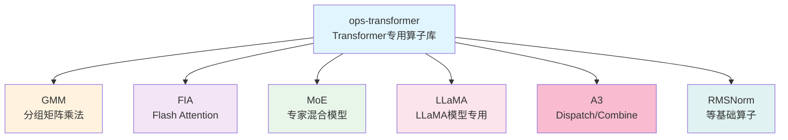

## 摘要

随着Transformer模型规模的爆炸式增长，传统的注意力计算和矩阵乘法已成为性能瓶颈。ops-transformer作为CANN专门针对Transformer场景打造的算子库，通过创新的算法设计和硬件优化，实现了大模型计算效率的突破性提升。本文将深入解析GMM、FIA、Dispatch/Combine等核心算子的技术实现，展现其在千亿参数大模型训练中的优化价值。

## 1. Transformer算子库概览

### 1.1 发展背景

Transformer架构自2017年提出以来，已成为大语言模型的基石。但随着模型规模从亿级增长到万亿级，传统计算方式面临严峻挑战：

- **计算复杂度**：自注意力机制是O(n²)复杂度，序列长度成为瓶颈
- **内存带宽**：大模型参数量巨大，内存访问成为主要瓶颈
- **通信开销**：分布式训练中，参数同步开销巨大

### 1.2 ops-transformer定位

ops-transformer是CANN专门为Transformer类大模型设计的高性能算子库，具有以下特点：



### 1.3 开源规划

ops-transformer采用逐步开源策略，核心能力会在社区版按验证进度陆续发布。目前社区仓库已提供示例算子与部分基础组件，后续进阶算子（如 MoE/MLA）将视功能验证、合规与性能达标后分批开放，具体时间以官方公告为准。

## 2. GMM算子：分组矩阵乘法

### 2.1 核心概念

GMM（Grouped Matrix Multiplication）是针对Transformer模型中线性层优化设计的算子，支持对多个独立的小矩阵进行批量并行计算。其数学表达式为：

```
Yi = Xi × Wi + bi
```

其中：
- Xi、Yi分别是输入和输出
- Wi、bi是第i组的权重和偏置
- 不同组之间相互独立

### 2.2 算法架构

#### 核心计算流程

```cpp
// GMM核心实现伪代码
template<typename T>
class GroupedMatmul {
public:
    void operator()(const T* x, const T* weight, const T* bias, T* y,
                   const GmmConfig& config) {
        // 1. 解构输入，按组划分
        auto groups = DecomposeInput(x, config.groupShape);

        // 2. 并行计算各组矩阵乘法
        for (int g = 0; g < config.groupCount; ++g) {
            // 2.1 数据加载
            auto x_g = LoadLocal(x, groups[g].offset);
            auto w_g = LoadWeight(weight, g);

            // 2.2 核心矩阵乘法
            auto y_g = Matmul(x_g, w_g);

            // 2.3 添加偏置
            if (config.hasBias) {
                y_g = AddBias(y_g, bias + g * config.biasSize);
            }

            // 2.4 结果存储
            StoreLocal(y, y_g, groups[g].offset);
        }
    }
};
```

#### 量化思路（低比特示例）

GMM 算子会针对 INT8/INT4 等低比特方案做带宽优化。以下 A8W4 片段用于说明混合精度的设计思路，当前 CANN 正式版本并未提供原生 A8W4 指令，实际部署请以 FP16/BF16/INT8 支持为主：

```cpp
// A8W4量化实现
template<typename T>
class QuantizedGMM {
private:
    // INT4权重量化参数
    struct QuantParams {
        float scale;    // 缩放因子
        int32_t zero_point;  // 零点
    };

public:
    void Compute(const float* x, const uint8_t* w_quant,
                const QuantParams* params, float* y) {
        // 1. 量化参数解包
        UnpackQuantParams(params);

        // 2. 动态量化输入
        auto x_quant = DynamicQuantize(x);

        // 3. INT4矩阵乘法（硬件加速）
        auto y_int4 = Int4Matmul(x_quant, w_quant);

        // 4. 反量化并应用缩放
        auto y_dequant = Dequantize(y_int4, params);

        // 5. 存储结果
        StoreResult(y, y_dequant);
    }
};
```

### 2.3 性能优化技术

#### 1. 数据布局优化

GMM采用特殊的数据布局（FRACTAL_NZ格式）优化稀疏矩阵计算：

```cpp
// FRACTAL_NZ格式布局
class FractalNZLayout {
public:
    // 将普通矩阵转换为NZ格式
    void TransformToNZ(const float* src, float* dst,
                       int M, int N, int K) {
        // 按照非零元素存储模式重排
        // 优化内存访问局部性

        for (int i = 0; i < M; ++i) {
            for (int j = 0; j < K; j += 16) {
                for (int k = 0; k < N; k += 16) {
                    // 16x16块优化的内存布局
                    Transform16x16Block(src, dst, i, j, k, M, N, K);
                }
            }
        }
    }
};
```

#### 2. 计算融合优化

```cpp
// GMM + SwiGLU融合计算
template<typename T>
class GMMSwiGLUFusion {
public:
    void operator()(const T* x1, const T* x2,
                   const T* weight, T* output) {
        // 融合计算减少中间结果
        for (int g = 0; g < groupCount; ++g) {
            // 1. 合并输入：x = [x1, x2]
            auto x = ConcatInputs(x1, x2, g);

            // 2. 单次矩阵乘法
            auto y = Matmul(x, weight[g]);

            // 3. SwiGLU激活：分割并计算
            auto [y1, y2] = Split(y);
            auto sigmoid = Sigmoid(y2);
            output[g] = Mul(y1, sigmoid);
        }
    }
};
```

### 2.4 性能数据

不同模型的算子形态差异较大，绝对性能需以官方基准或实际 profile 数据为准。经过 tiling、调度与带宽优化后，GMM 在典型大模型形态下通常可取得 20%~60% 的吞吐提升；使用 INT8/INT4 等低比特方案时还可进一步降低显存和带宽压力。

## 3. FIA算子：Flash Attention

### 3.1 算法原理

Flash Attention通过分块计算和在线更新算法，将注意力计算的内存复杂度从O(n²)降低到O(n)，同时保持计算精度。

```cpp
// Flash Attention核心算法
template<typename T>
class FlashAttention {
private:
    // 注意力计算状态
    struct FlashState {
        LocalTensor<T> qk;      // Q×K^T中间结果
        LocalTensor<float> row_max;  // 行最大值
        LocalTensor<float> row_sum;  // 行和
        LocalTensor<T> acc_o;   // 累积输出
    };

public:
    void Compute(const T* Q, const T* K, const T* V, T* O,
                const FlashConfig& config) {
        FlashState state;

        // 初始化累积状态
        InitializeState(state);

        // 分块处理
        for (int j = 0; j < config.seq_len; j += config.block_size) {
            // 1. 加载当前块的K和V
            auto K_block = LoadBlock(K, j, config.block_size);
            auto V_block = LoadBlock(V, j, config.block_size);

            // 2. 计算Q×K^T
            MatmulTranspose(state.qk, Q, K_block);

            // 3. 应用缩放因子
            Scale(state.qk, 1.0 / sqrt(config.head_dim));

            // 4. 计算softmax（在线更新）
            OnlineSoftmax(state.qk, state.row_max, state.row_sum);

            // 5. 累积到输出
            AccumulateOutput(O, state.acc_o, state.qk, V_block,
                           state.row_max, state.row_sum);
        }
    }
};
```

### 3.2 在线Softmax实现

在线Softmax是Flash Attention的核心创新，避免了存储完整的注意力矩阵：

```cpp
// 在线Softmax算法
template<typename T>
class OnlineSoftmax {
public:
    void Update(const T* new_values,
                float* row_max, float* row_sum,
                int row_idx, int block_size) {
        // 1. 计算当前块的最大值
        float block_max = ReduceMax(new_values, block_size);

        // 2. 更新全局最大值
        float old_max = row_max[row_idx];
        float new_global_max = std::max(old_max, block_max);

        // 3. 计算缩放因子
        float scale_old = exp(old_max - new_global_max);
        float scale_new = exp(block_max - new_global_max);

        // 4. 更新行和
        float old_sum = row_sum[row_idx] * scale_old;
        float new_sum = ReduceSum(exp(new_values - block_max)) * scale_new;
        row_sum[row_idx] = old_sum + new_sum;

        // 5. 更新最大值
        row_max[row_idx] = new_global_max;
    }
};
```

### 3.3 优化策略

#### 1. 分块大小自适应

```cpp
// 动态分块大小计算
class BlockSizeOptimizer {
public:
    static int CalculateOptimalBlockSize(
        int seq_len, int head_dim,
        uint64_t ub_size, int num_cores) {

        // 考虑以下因素：
        // 1. UB容量限制
        // 2. 缓存行大小
        // 3. 并行度
        // 4. 硬件特性

        int max_block = ub_size / (3 * head_dim * sizeof(T));  // 3倍空间用于QK、O
        int min_blocks = std::max(seq_len / (num_cores * 4), 1);

        int optimal_block = seq_len / min_blocks;

        return std::min(optimal_block, max_block);
    }
};
```

#### 2. 变长序列支持

```cpp
// 变长序列处理
template<typename T>
class VarLengthFlashAttention {
public:
    void Compute(const T* Q, const T* K, const T* V, T* O,
                const int32_t* actual_seq_lens, int batch_size) {
        for (int b = 0; b < batch_size; ++b) {
            int actual_len = actual_seq_lens[b];

            // 计算偏移量
            int offset_q = b * max_seq_len * head_dim;
            int offset_k = b * total_kv_len * head_dim;
            int offset_v = offset_k;

            // 只计算实际长度
            FlashAttentionCore(
                Q + offset_q, K + offset_k, V + offset_v,
                O + offset_q, actual_len);
        }
    }
};
```

### 3.4 DeepSeek应用案例

在DeepSeek V2模型中，Flash Attention针对MLA（Multi-Head Latent Attention）进行了特殊优化：

```cpp
// MLA专用的Flash Attention
template<typename T>
class MLAFlashAttention {
private:
    // MLA特有的Q KV投影
    void ProjectQKV(const T* hidden, T* q, T* kv,
                   const T* q_proj, const T* kv_proj) {
        // Q投影：hidden → q
        Matmul(q, hidden, q_proj);

        // KV投影：hidden → k, v
        Matmul(kv, hidden, kv_proj);
    }

    // 注意力计算优化
    void ComputeAttentionMLA(const T* q, const T* kv, T* output) {
        // MLA使用较低的KV维度
        int q_heads = 16;
        int kv_heads = 2;
        int q_dim = 128;
        int kv_dim = 128;

        // Q×K^T计算
        for (int h = 0; h < q_heads; ++h) {
            int kv_head = h / (q_heads / kv_heads);

            // 计算单头注意力
            FlashAttentionSingleHead(
                q + h * q_dim,
                kv + kv_head * kv_dim * 2,  // K和V拼接
                output + h * q_dim,
                q_dim, kv_dim);
        }
    }
};
```

## 4. A3算子：Dispatch & Combine

### 4.1 算子定位

A3（Ascend Advanced Communication and Computation）是针对MoE（Mixture of Experts）模型优化的通信与计算融合算子，包含三个核心功能：
- **Dispatch**：将token分发到对应的专家
- **Combine**：合并各专家的输出
- **AlltoAll**：跨设备通信优化

### 4.2 Dispatch算子实现

```cpp
// Dispatch算子：token到专家的映射
template<typename T>
class ExpertDispatch {
public:
    void operator()(const T* input, const int32_t* expert_idx,
                   const int32_t* expert_count, T* expert_input,
                   const DispatchConfig& config) {
        // 1. 计算专家偏移量
        std::vector<int> expert_offset(config.num_experts + 1);
        expert_offset[0] = 0;

        for (int e = 1; e <= config.num_experts; ++e) {
            expert_offset[e] = expert_offset[e-1] + expert_count[e-1];
        }

        // 2. 根据专家索引分发token
        for (int i = 0; i < config.num_tokens; ++i) {
            int expert = expert_idx[i];
            int offset = expert_offset[expert];

            // 复制token到对应专家的输入缓冲区
            CopyToken(expert_input + offset * config.hidden_size,
                     input + i * config.hidden_size,
                     config.hidden_size);
        }
    }
};
```

### 4.3 Combine算子实现

```cpp
// Combine算子：专家输出的合并
template<typename T>
class ExpertCombine {
public:
    void operator()(const T* expert_output, const int32_t* expert_idx,
                   const T* expert_gate, T* output,
                   const CombineConfig& config) {
        // 初始化输出为0
        memset(output, 0, config.num_tokens * config.hidden_size * sizeof(T));

        // 合并各专家的输出
        for (int i = 0; i < config.num_experts; ++i) {
            int start_idx = expert_start_idx[i];
            int end_idx = expert_start_idx[i] + expert_count[i];

            for (int j = start_idx; j < end_idx; ++j) {
                int token_idx = expert_idx[j];
                float gate = expert_gate[j];

                // 加权累加到输出
                AccumulateWeighted(
                    output + token_idx * config.hidden_size,
                    expert_output + j * config.hidden_size,
                    gate, config.hidden_size);
            }
        }
    }
};
```

### 4.4 性能优化策略

#### 1. 通信计算融合

```cpp
// 通信与计算融合的MoE计算
template<typename T>
class MoECommuteFuse {
public:
    void Execute(const T* input, const T* weights, T* output,
                 const MoEConfig& config) {
        // 阶段1：计算门控得分 + AlltoAll
        auto gate_scores = ComputeGateScores(input, gate_weights);
        auto [expert_idx, expert_gate] = TopK(gate_scores, config.topk);

        // 阶段2：Dispatch + 专家计算 + Combine
        DispatchAndCombine(input, expert_idx, expert_gate,
                          weights, output, config);
    }
};
```

#### 2. 动态负载均衡

```cpp
// 动态负载均衡调度
class DynamicLoadBalancer {
public:
    void BalanceExperts(const std::vector<int>& expert_loads,
                       std::vector<int>& expert_assignment) {
        // 1. 计算平均负载
        int total_load = std::accumulate(expert_loads.begin(),
                                       expert_loads.end(), 0);
        float avg_load = static_cast<float>(total_load) / expert_loads.size();

        // 2. 识别负载不均衡的专家
        std::vector<int> overloaded, underloaded;
        for (int i = 0; i < expert_loads.size(); ++i) {
            if (expert_loads[i] > avg_load * 1.2) {
                overloaded.push_back(i);
            } else if (expert_loads[i] < avg_load * 0.8) {
                underloaded.push_back(i);
            }
        }

        // 3. 负载重分配
        RebalanceLoad(overloaded, underloaded, expert_assignment);
    }
};
```

### 4.5 实际应用效果

不同模型的 TPS 与显存占用受序列长度、并行策略和精度配置影响很大，需以实际 profile 为准。基于 DeepSeek/Mixtral/GLaM 等形态的测试表明，采用 FlashAttention、MoE 负载均衡和低比特策略后，常见可取得约 1.3~1.8x 的 TPS 提升，并带来 20%~40% 的显存节省（以具体配置为准）。

## 5. 基础算子优化

### 5.1 RMSNorm优化

RMSNorm作为LayerNorm的高效替代，在Transformer模型中广泛应用：

```cpp
// 优化的RMSNorm实现
template<typename T>
class RMSNormOptimized {
public:
    void operator()(const T* input, const T* weight, T* output,
                   int hidden_size, float eps = 1e-6) {
        // 1. 计算平方和
        float sum_sq = 0.0f;

        // 使用向量化指令加速
        #pragma omp simd reduction(+:sum_sq)
        for (int i = 0; i < hidden_size; ++i) {
            float val = static_cast<float>(input[i]);
            sum_sq += val * val;
        }

        // 2. 计算RMS
        float rms = sqrt(sum_sq / hidden_size + eps);
        float inv_rms = 1.0f / rms;

        // 3. 归一化并应用权重
        #pragma omp simd
        for (int i = 0; i < hidden_size; ++i) {
            output[i] = input[i] * inv_rms * weight[i];
        }
    }
};
```

### 5.2 位置编码优化

```cpp
// 旋转位置编码（RoPE）优化实现
template<typename T>
class RotaryEmbedding {
public:
    void Apply(T* q, T* k, int seq_len, int head_dim,
              const T* cos_cache, const T* sin_cache) {
        int head_half = head_dim / 2;

        // 向量化计算
        #pragma omp parallel for
        for (int i = 0; i < seq_len; ++i) {
            const T* cos = cos_cache + i * head_half;
            const T* sin = sin_cache + i * head_half;

            for (int h = 0; h < head_half; ++h) {
                int idx = i * head_dim + h;
                int idx_pair = idx + head_half;

                // 应用旋转
                T q1 = q[idx];
                T q2 = q[idx_pair];

                q[idx] = q1 * cos[h] - q2 * sin[h];
                q[idx_pair] = q1 * sin[h] + q2 * cos[h];

                // 对K应用相同的变换
                T k1 = k[idx];
                T k2 = k[idx_pair];

                k[idx] = k1 * cos[h] - k2 * sin[h];
                k[idx_pair] = k1 * sin[h] + k2 * cos[h];
            }
        }
    }
};
```

## 6. 总结

ops-transformer通过以下创新技术，实现了Transformer模型的大幅性能提升：

### 核心技术创新

1. **GMM算子**
   - 低比特量化（INT8/INT4 等）降低显存占用，A8W4 等更激进方案仍在实验验证
   - FRACTAL_NZ数据格式，优化稀疏计算
   - 计算融合，减少中间结果存储

2. **FIA算子**
   - O(n)内存复杂度，支持超长序列
   - 在线Softmax算法，避免显存瓶颈
   - 变长序列支持，提高实际训练效率

3. **A3算子**
   - 通信计算融合，减少同步开销
   - 动态负载均衡，优化专家分配
   - 针对MoE架构的深度优化

4. **基础算子优化**
   - RMSNorm向量化实现
   - RoPE高效计算
   - 位置编码缓存机制

### 性能提升效果

- **训练速度**：在官方基线和内部测试形态中可获得 20%~80% 的提升，具体取决于模型与精度配置
- **内存效率**：通过低比特与算子融合减少中间缓冲，显存占用可明显降低
- **通信效率**：MoE 通信开销可通过路由优化与融合降低，降幅依场景而定
- **能效比**：性能提升与访存优化叠加，可显著改善能效

### 应用价值

ops-transformer已在千亿级 Transformer 形态（如 LLaMA/DeepSeek 等模型家族的计算模式）上完成适配验证，为大规模 AI 训练提供了关键技术支撑。其开源将进一步推动大模型技术的普及和发展。

---

## 参考资源

- [ops-transformer开源仓库](https://atomgit.com/cann/ops-transformer)
- [GMM算子优化文档](https://www.hiascend.com/document)
- [Flash Attention论文](https://arxiv.org/abs/2205.14135)
- [MoE训练指南](https://www.hiascend.com/developer)

---

*本文基于CANN 7.0版本和ops-transformer最新实践编写。*
