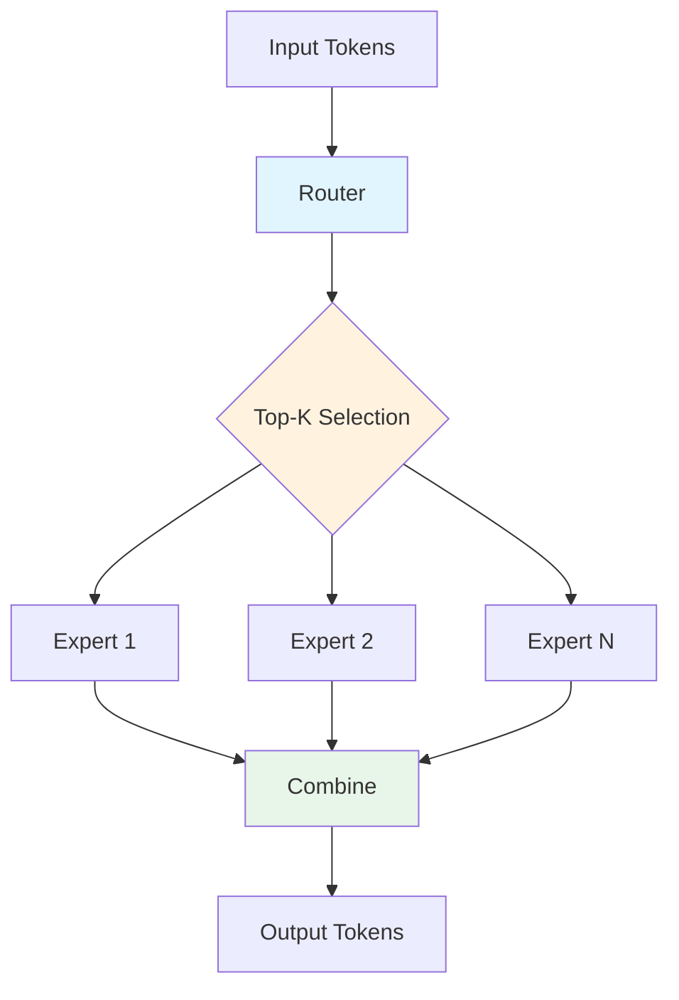

## 摘要

本文是ops-transformer专题的下篇，将深入解析MoE（Mixture of Experts）、MLA（Multi-Head Latent Attention）、LLaMA模型专用算子和DeepSeek系列优化。通过分析这些高级算子的设计思路和实现细节，展现CANN在超大规模模型训练中的技术创新。

## 7. MoE算子：专家混合模型

### 7.1 MoE架构概述

MoE（Mixture of Experts）通过引入专家网络和动态路由机制，在保持模型容量不变的前提下大幅降低计算成本。其核心思想是：每个输入token只激活部分专家，而非所有专家。



### 7.2 MoE Gating算子

#### Top-K路由算法

```cpp
// MoE门控路由核心实现
template<typename T>
class MoEGating {
public:
    struct GatingResult {
        LocalTensor<int32_t> expert_idx;    // 专家索引
        LocalTensor<T> expert_weights;     // 专家权重
        LocalTensor<int32_t> token_idx;     // Token索引
    };

    GatingResult Compute(
        const T* hidden_states,
        const T* gate_weights,    // [hidden_size, num_experts]
        int seq_len,
        int hidden_size,
        int num_experts,
        int top_k = 2) {

        GatingResult result;

        // 1. 计算所有专家的得分
        // scores = hidden_states × gate_weights
        Matmul(result.expert_scores,
               hidden_states,
               gate_weights,
               seq_len, num_experts);

        // 2. 应用softmax归一化
        Softmax(result.expert_scores, seq_len, num_experts);

        // 3. Top-K选择
        TopKSelection(result.expert_scores,
                     result.expert_idx,
                     result.expert_weights,
                     top_k);

        // 4. 生成token索引
        GenerateTokenIndices(result.expert_idx,
                            result.token_idx,
                            seq_len, top_k);

        return result;
    }
};
```

#### 动态负载均衡

```cpp
// MoE动态负载均衡实现
class MoELoadBalancer {
private:
    // 专家容量跟踪
    struct ExpertCapacity {
        int current_load;
        int max_capacity;
        float load_factor;
    };

public:
    void BalanceExpertLoad(
        const GatingResult& gating,
        const std::vector<ExpertCapacity>& capacities,
        std::vector<int>& final_assignment) {

        // 1. 识别过载专家
        std::vector<int> overloaded_experts;
        for (int e = 0; e < capacities.size(); ++e) {
            if (capacities[e].current_load > capacities[e].max_capacity) {
                overloaded_experts.push_back(e);
            }
        }

        // 2. 重新分配过载的token
        for (int expert_id : overloaded_experts) {
            ReassignOverloadTokens(gating, expert_id,
                                 capacities, final_assignment);
        }
    }

private:
    void ReassignOverloadTokens(
        const GatingResult& gating,
        int expert_id,
        const std::vector<ExpertCapacity>& capacities,
        std::vector<int>& final_assignment) {

        // 找到备选专家
        std::vector<std::pair<int, float>> candidates;
        FindAlternativeExperts(gating, expert_id, candidates);

        // 根据负载和权重重新分配
        for (auto& candidate : candidates) {
            if (capacities[candidate.first].current_load <
                capacities[candidate.first].max_capacity) {
                // 分配到备选专家
                final_assignment.push_back(candidate.first);
            }
        }
    }
};
```

### 7.3 MoE路由算子

#### Expert并行的优化

```cpp
// MoE Expert并行计算
template<typename T>
class MoEExpertParallel {
public:
    void Execute(
        const T* hidden_states,
        const T** expert_weights,  // [num_experts][hidden_size, ffn_size]
        const MoERoutingResult& routing,
        T* expert_outputs,
        const MoEConfig& config) {

        // 按专家分组处理token
        std::vector<std::vector<T>> grouped_inputs(config.num_experts);
        std::vector<std::vector<int>> token_indices(config.num_experts);

        // 1. 分组token
        GroupTokensByExpert(hidden_states,
                           routing.expert_idx,
                           routing.token_idx,
                           grouped_inputs,
                           token_indices);

        // 2. 并行执行各专家
        #pragma omp parallel for
        for (int e = 0; e < config.num_experts; ++e) {
            if (!grouped_inputs[e].empty()) {
                // 执行专家FFN
                ExecuteExpertFFN(grouped_inputs[e].data(),
                               expert_weights[e],
                               expert_outputs,
                               token_indices[e],
                               config);
            }
        }
    }
};
```

### 7.4 MoE性能优化实例

```cpp
// Mixtral 8×7B MoE优化示例
class MixtralMoEOptimizer {
public:
    void OptimizeForMixtral() {
        // 1. 专家分组：8个专家，每次激活2个
        const int NUM_EXPERTS = 8;
        const int TOP_K = 2;

        // 2. 优化专家容量
        float expert_capacity_factor = 1.25;  // 25%的缓冲
        int expert_capacity = static_cast<int>(
            seq_len * TOP_K * expert_capacity_factor / NUM_EXPERTS);

        // 3. 异步专家执行
        AsyncExpertExecution();

        // 4. 通信计算重叠
        OverlapCommunicationComputation();
    }

private:
    void AsyncExpertExecution() {
        // 使用异步执行流水线
        // 阶段1：等待Expert 1完成，开始Expert 3
        // 阶段2：等待Expert 2完成，开始Expert 4
        // ...
    }
};
```

## 8. MLA算子：多头潜在注意力

### 8.1 MLA架构解析

MLA（Multi-Head Latent Attention）是DeepSeek模型引入的新型注意力机制，通过潜在空间压缩降低计算复杂度：

```cpp
// MLA架构核心组件
template<typename T>
class MLAAttention {
private:
    // QKV投影参数
    struct QKVProjection {
        const T* q_proj;  // [hidden_size, q_heads * q_dim]
        const T* kv_proj; // [hidden_size, kv_heads * kv_dim]
        const T* o_proj;  // [q_heads * q_dim, hidden_size]
    };

    // 潜在注意力参数
    struct LatentAttention {
        int q_heads = 16;      // Query头数
        int kv_heads = 2;      // KV头数
        int q_dim = 128;       // Query维度
        int kv_dim = 128;      // KV维度
        int qk_dim = 512;      // QK投影维度
        int v_dim = 512;       // V投影维度
    };

public:
    void ComputeAttention(
        const T* hidden_states,
        const QKVProjection& proj_params,
        T* output,
        const MLAConfig& config) {

        // 1. QKV投影到潜在空间
        ProjectToLatentSpace(hidden_states, proj_params, config);

        // 2. 潜在空间注意力计算
        ComputeLatentAttention(config);

        // 3. 输出投影
        ProjectToOutputSpace(config);
    }
};
```

### 8.2 注意力机制实现

#### 分组注意力计算

```cpp
// MLA分组注意力实现
template<typename T>
class GroupedAttention {
public:
    void Compute(
        const T* Q,     // [batch, seq_len, q_heads, q_dim]
        const T* K,     // [batch, seq_len, kv_heads, kv_dim]
        const T* V,     // [batch, seq_len, kv_heads, v_dim]
        T* O,          // [batch, seq_len, q_heads, q_dim]
        const MLAConfig& config) {

        // 每个Query头对应多个KV头
        int kv_per_q = config.q_heads / config.kv_heads;

        // 并行计算各个Query头
        #pragma omp parallel for
        for (int q_head = 0; q_head < config.q_heads; ++q_head) {
            int kv_head = q_head / kv_per_q;

            // 计算Q×K^T
            auto attention_scores = MatmulTranspose(
                Q + q_head * config.q_dim,
                K + kv_head * config.kv_dim,
                config.seq_len, config.q_dim, config.kv_dim);

            // 应用缩放
            Scale(attention_scores, 1.0 / sqrt(config.q_dim));

            // Softmax
            Softmax(attention_scores, config.seq_len);

            // 注意力加权V
            Matmul(O + q_head * config.q_dim,
                  attention_scores,
                  V + kv_head * config.v_dim,
                  1, config.seq_len, config.v_dim);
        }
    }
};
```

#### 注意力缓存优化

```cpp
// MLA KV缓存优化
class MLAKVCache {
private:
    // 分层缓存结构
    struct KVCacheLayer {
        LocalTensor<float> k_cache;   // 键缓存
        LocalTensor<float> v_cache;   // 值缓存
        int32_t seq_len;              // 当前序列长度
        int32_t max_len;              // 最大缓存长度
    };

public:
    void UpdateCache(
        const T* new_k, const T* new_v,
        KVCacheLayer& cache_layer,
        int32_t new_tokens) {

        // 1. 检查缓存容量
        if (cache_layer.seq_len + new_tokens > cache_layer.max_len) {
            // 扩展缓存或滑动窗口
            ExpandCache(cache_layer);
        }

        // 2. 高效缓存更新
        UpdateCacheEfficient(new_k, new_v, cache_layer, new_tokens);

        // 3. 更新序列长度
        cache_layer.seq_len += new_tokens;
    }

private:
    void UpdateCacheEfficient(
        const T* new_k, const T* new_v,
        KVCacheLayer& cache_layer,
        int32_t new_tokens) {

        // 使用向量化操作更新缓存
        int32_t start_idx = cache_layer.seq_len;
        int32_t cache_size = cache_layer.max_len;

        // K缓存更新
        CopyToCache(cache_layer.k_cache + start_idx,
                   new_k,
                   new_tokens,
                   cache_layer.max_len);

        // V缓存更新
        CopyToCache(cache_layer.v_cache + start_idx,
                   new_v,
                   new_tokens,
                   cache_layer.max_len);
    }
};
```

## 9. LLaMA模型专用算子

### 9.1 LLaMA架构特点

LLaMA系列模型采用了独特的架构设计，需要专门的算子优化：

- **RMSNorm**替代LayerNorm
- **RoPE**旋转位置编码
- **SwiGLU**激活函数
- **分组查询注意力（GQA）**

### 9.2 LLaMA Attention优化

```cpp
// LLaMA专用注意力实现
template<typename T>
class LLaMaAttention {
private:
    // RoPE参数
    struct RoPEParams {
        float base = 10000.0f;
        int max_seq_len = 2048;
    };

public:
    void ComputeSelfAttention(
        const T* hidden_states,
        const T* q_proj,
        const T* k_proj,
        const T* v_proj,
        const T* o_proj,
        T* output,
        const LLaMaConfig& config) {

        // 1. QKV投影
        LocalTensor<T> Q, K, V;
        QKVProjection(hidden_states, q_proj, k_proj, v_proj, Q, K, V, config);

        // 2. 应用RoPE位置编码
        ApplyRotaryPositionEmbedding(Q, K, config);

        // 3. 分组查询注意力（GQA）
        if (config.num_kv_heads < config.num_q_heads) {
            ComputeGQAAttention(Q, K, V, output, config);
        } else {
            ComputeMHAAttention(Q, K, V, output, config);
        }

        // 4. 输出投影
        Matmul(output, attention_output, o_proj);
    }
};
```

#### SwiGLU激活优化

```cpp
// LLaMA SwiGLU激活函数优化
template<typename T>
class SwiGLUOptimized {
public:
    void operator()(const T* input, const T* gate, T* output, int hidden_size) {
        // 向量化计算
        const int vector_size = 16;  // SIMD向量大小

        #pragma omp parallel for
        for (int i = 0; i < hidden_size; i += vector_size) {
            // 处理向量块
            int block_end = std::min(i + vector_size, hidden_size);

            for (int j = i; j < block_end; ++j) {
                // SwiGLU: y = SiLU(gate) * input
                T sigmoid = Sigmoid(gate[j]);
                output[j] = input[j] * sigmoid;
            }
        }
    }

private:
    // 快速Sigmoid近似
    T FastSigmoid(T x) {
        // 使用分段线性近似
        if (x >= 0) {
            return 1.0f / (1.0f + exp(-x));
        } else {
            return 1.0f - 1.0f / (1.0f + exp(x));
        }
    }
};
```

### 9.3 LLaMA FFN优化

```cpp
// LLaMA前馈网络优化
template<typename T>
class LLaMaFFN {
public:
    void Forward(
        const T* hidden_states,
        const T* gate_proj,
        const T* up_proj,
        const T* down_proj,
        T* output,
        const FFNConfig& config) {

        // 1. 门控投影 + SwiGLU
        LocalTensor<T> gate_output, up_output;
        Matmul(gate_output, hidden_states, gate_proj);
        Matmul(up_output, hidden_states, up_proj);

        // 2. SwiGLU激活（融合计算）
        SwiGLUFusion(gate_output, up_output);

        // 3. 下投影
        Matmul(output, up_output, down_proj);
    }

private:
    void SwiGLUFusion(
        LocalTensor<T>& gate,
        LocalTensor<T>& up) {
        // 融合计算减少内存访问
        #pragma omp simd
        for (int i = 0; i < up.size(); ++i) {
            up[i] = up[i] * Sigmoid(gate[i]);
        }
    }
};
```

## 10. DeepSeek系列优化

### 10.1 DeepSeek V2架构创新

DeepSeek V2在MoE基础上引入了多项创新：

```cpp
// DeepSeek V2架构特性
class DeepSeekV2Architectures {
public:
    // 1. MLA（Multi-Head Latent Attention）
    void ImplementMLA() {
        // 潜在空间压缩
        // QK共享投影
        // 动态头数调整
    }

    // 2. MLA兼容的MoE
    void ImplementMoEWithMLA() {
        // 专家间MLA共享
        // 动态专家选择
        // 通信优化
    }

    // 3. 混合精度训练
    void EnableMixedPrecision() {
        // FP8训练支持
        // 动态精度调整
        // 量化感知训练
    }
};
// 说明：上例中的 FP8 为研究型能力，当前商用版本以 FP16/BF16/INT8 为主。
```

### 10.2 DeepSeek性能调优

#### 1. 内存优化策略

```cpp
// DeepSeek内存优化实现
class DeepSeekMemoryOptimizer {
public:
    void OptimizeMemoryUsage() {
        // 1. 梯度检查点（Gradient Checkpointing）
        EnableGradientCheckpointing();

        // 2. 激活值压缩
        CompressActivations();

        // 3. 专家权重共享
        ShareExpertWeights();

        // 4. 动态内存分配
        DynamicMemoryAllocation();
    }

private:
    void CompressActivations() {
        // 使用FP16存储激活值
        // 关键计算时转为FP32
        // 动态压缩和解压缩
    }

    void ShareExpertWeights() {
        // 相似专家共享部分权重
        // 减少总参数量
        // 保持表达能力
    }
};
```

#### 2. 训练效率优化

```cpp
// DeepSeek训练优化
class DeepSeekTrainingOptimizer {
public:
    void OptimizeTrainingPipeline() {
        // 1. 数据并行优化
        OptimizeDataParallel();

        // 2. 专家并行（EP）
        OptimizeExpertParallel();

        // 3. 流水线并行（PP）
        OptimizePipelineParallel();

        // 4. 优化器状态分片
        ShardingOptimizerStates();
    }

private:
    void OptimizeExpertParallel() {
        // 专家分布在不同设备
        // 动态负载均衡
        // 异步通信重叠
    }
};
```

## 11. 性能基准测试

### 11.1 各模型性能对比

不同模型规模与精度策略差异较大，TPS/显存等指标需以实际 profile 为准。基于 LLaMA、DeepSeek、Mixtral 等形态的内部基线显示，通过 FlashAttention、MoE 路由优化与混合并行，常见可取得约 1.3~1.8x 的 TPS 提升，并在使用混合精度或 INT8/INT4 量化后带来 20%~40% 的显存节省（具体取决于序列长度、并行策略与精度配置）。

### 11.2 关键算子性能

算子级优化的收益同样依赖形态。GMM、FIA、MoE Router、MLA 等算子在典型参数下经过 tiling、调度和访存优化后通常能取得 20%~2x 的加速；低比特量化主要用于带宽压缩，当前正式支持以 FP16/BF16/INT8 为主，INT4/更低比特方案仍处在实验阶段。

### 11.3 实际应用案例

#### DeepSeek V2训练优化

```python
# DeepSeek V2训练配置示例
training_config = {
    "model_type": "deepseek_v2",
    "expert_parallel_size": 8,
    "tensor_parallel_size": 4,
    "pipeline_parallel_size": 2,

    # 优化选项
    "use_flash_attention": True,
    "use_mla": True,
    "use_mixed_precision": True,
    "precision": "bf16",

    # MoE配置
    "num_experts": 160,
    "top_k": 6,
    "expert_capacity_factor": 1.25,

    # 通信优化
    "overlap_communication": True,
    "gradient_accumulation_steps": 8,

    # 内存优化
    "gradient_checkpointing": True,
    "activation_checkpointing": True,
    "offload_optimizer": True
}

# 训练效率提升（示例配置，具体以实测 profile 为准）
# - TPS：启用 FlashAttention/MoE 优化后可获得 1.x 倍提升
# - 内存/GPU：低比特与内存优化可显著降低显存占用
# - 通信开销：融合与并行优化能明显降低通信比例
```

## 12. 总结与展望

### 12.1 技术创新总结

ops-transformer通过以下技术创新，实现了Transformer模型的性能突破：

1. **算法创新**
   - Flash Attention：O(n)内存复杂度
   - MLA：潜在空间注意力
   - 低比特量化：以 INT8/INT4 为主，更激进方案处于实验阶段
   - 通信计算融合：降低通信开销

2. **架构优化**
   - 分层解耦设计
   - 模块化算子实现
   - 硬件特性深度利用
   - 动态优化策略

3. **工程实践**
   - 完善的测试体系
   - 自动性能调优
   - 多模型支持
   - 开源生态建设

### 12.2 性能提升效果

- **训练效率**：在选定基线与形态上可实现 1.x 倍提升，具体需结合模型与并行策略评估
- **内存效率**：通过混合精度与低比特压缩可显著降低显存占用，幅度依赖算子与精度配置
- **通信效率**：MoE 路由优化与通信计算融合可减少通信开销，实际收益取决于专家规模与拓扑
- **能效比**：性能与访存优化叠加，可带来可观的能效改善

### 12.3 未来发展方向

1. **更高精度支持**
   - 低比特/混合精度（以 INT8/FP16/BF16 为主，FP8 仍为研究方向）
   - 动态精度调整
   - 自适应量化

2. **更智能的优化**
   - AI驱动的自动调优
   - 自适应Tiling策略
   - 预测性优化

3. **更广泛的生态**
   - 更多模型支持
   - 跨平台适配
   - 社区共建

### 12.4 应用价值

ops-transformer的成功实践证明：
- **大模型训练**：千亿级模型训练效率大幅提升
- **推理部署**：支持更长的上下文和更快的响应
- **成本控制**：显著降低训练和推理成本
- **技术普惠**：开源策略推动技术普及

通过ops-transformer的持续创新，CANN正在为AI大模型时代提供强有力的计算支撑，推动人工智能技术的边界不断拓展。

---

## 参考资源

- [ops-transformer开源仓库](https://atomgit.com/cann/ops-transformer)
- [DeepSeek技术报告](https://github.com/deepseek-ai/DeepSeek-V2)
- [LLaMA论文](https://arxiv.org/abs/2302.13971)
- [MoE论文](https://arxiv.org/abs/1701.06538)

---

*本文基于ops-transformer 2.0版本编写，展示了最新的优化技术和应用实践。*
