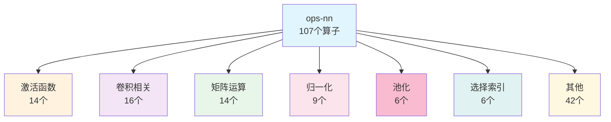

## 摘要

ops-nn作为CANN神经网络算子库的核心，为深度学习模型提供了基础且关键的计算能力支撑。本文将从算子库架构、核心算子实现、性能优化技术等多个维度，深入解析ops-nn的技术实现。通过"望闻问切"的性能分析方法，展现如何从算法设计、内存管理、并行计算等多个层面实现算子的极致优化。

## 1. ops-nn算子库概览

### 1.1 定位与价值

ops-nn是CANN算子库中专注于神经网络基础算子的核心模块，承担着承上启下的关键作用：

- **基础支撑**：为上层模型提供基础的神经网络计算能力
- **性能保障**：确保基础算子的高效执行
- **规范制定**：定义统一的算子开发标准和接口
- **生态基础**：支撑整个AI应用生态发展

### 1.2 算子分类体系

ops-nn采用清晰的分类体系，共包含107个算子，覆盖神经网络模型的各个方面：



### 1.3 开源计划

ops-nn 采用循序渐进的开源方式，社区版会优先补齐常用基础算子和示例代码，后续增强算子将根据功能验证、合规审查和性能达标情况陆续公开。具体节奏以官方公告为准。

## 2. 激活函数算子

### 2.1 FatReLU融合实现

FatReLU（Filtered Adaptive ReLU）是一种创新的激活函数，将激活和掩码操作融合：

```cpp
// FatReLU算子核心实现
template<typename T>
class FatReLUFusion {
private:
    // 双缓冲优化
    LocalTensor<uint8_t> pingBuffer;
    LocalTensor<uint8_t> pongBuffer;
    int32_t pingPongFlag = 0;

    // 分块处理参数
    constexpr int32_t PP_ELEMENT_NUM = 10 * 1024;
    constexpr int32_t ONE_BLOCK_SIZE = 32;

public:
    void operator()(const T* input, const T* filter, T* output,
                   int64_t batchSize, int64_t hiddenSize) {
        // 1. 输入验证
        OP_CHECK(input != nullptr, return, "input is null");
        OP_CHECK(filter != nullptr, return, "filter is null");

        // 2. 分块处理
        int64_t totalElements = batchSize * hiddenSize;
        int64_t numBlocks = (totalElements + PP_ELEMENT_NUM - 1) / PP_ELEMENT_NUM;

        // 3. Ping-Pong缓冲区切换
        LocalTensor<T>* currentBuffer = pingPongFlag ? &pingBuffer : &pongBuffer;
        pingPongFlag = 1 - pingPongFlag;

        // 4. 并行处理各块
        for (int64_t blockId = 0; blockId < numBlocks; ++blockId) {
            ProcessBlock(input, filter, output, blockId,
                        totalElements, hiddenSize);
        }
    }

private:
    void ProcessBlock(const T* input, const T* filter, T* output,
                     int64_t blockId, int64_t totalElements,
                     int64_t hiddenSize) {
        // 计算块起始和结束位置
        int64_t startIdx = blockId * PP_ELEMENT_NUM;
        int64_t endIdx = std::min(startIdx + PP_ELEMENT_NUM, totalElements);

        // 执行FatReLU计算
        for (int64_t i = startIdx; i < endIdx; ++i) {
            int64_t hiddenIdx = i % hiddenSize;
            // output[i] = max(0, input[i]) * filter[hiddenIdx]
            output[i] = std::max(T(0), input[i]) * filter[hiddenIdx];
        }
    }
};
```

### 2.2 GELU优化实现

GELU（Gaussian Error Linear Unit）是Transformer模型中常用的激活函数：

```cpp
// GELU优化实现
template<typename T>
class GELUOptimized {
public:
    // 标准GELU实现
    T StandardGELU(T x) {
        return x * 0.5 * (1.0 + erf(x / sqrt(2.0)));
    }

    // 近似GELU实现（更快的版本）
    T ApproxGELU(T x) {
        // 使用tanh近似
        return 0.5 * x * (1.0 + tanh(sqrt(2.0 / M_PI) *
                                       (x + 0.044715 * x * x * x)));
    }

    void Compute(const T* input, T* output, int64_t size,
                 GELUVariant variant = GELUVariant::Approx) {
        // 向量化计算
        const int vector_size = 16;  // SIMD向量大小

        #pragma omp parallel for
        for (int64_t i = 0; i < size; i += vector_size) {
            int64_t end = std::min(i + vector_size, size);

            for (int64_t j = i; j < end; ++j) {
                if (variant == GELUVariant::Standard) {
                    output[j] = StandardGELU(input[j]);
                } else {
                    output[j] = ApproxGELU(input[j]);
                }
            }
        }
    }
};
```

### 2.3 SiLU/Swish融合

SiLU（Sigmoid Linear Unit）与Swish本质相同，经常与线性层融合：

```cpp
// SiLU融合计算
template<typename T>
class SiLUFusion {
public:
    void FusedSiLULinear(const T* input, const T* weight, const T* bias,
                         T* output, int64_t in_features, int64_t out_features) {
        // 融合计算：SiLU(Linear(x))
        // = SiLU(x × W^T + b)
        // = x × W^T + b × sigmoid(x × W^T + b)

        #pragma omp parallel for
        for (int64_t i = 0; i < out_features; ++i) {
            T linear_output = bias[i];

            // 计算线性部分
            for (int64_t j = 0; j < in_features; ++j) {
                linear_output += input[j] * weight[i * in_features + j];
            }

            // 应用SiLU
            output[i] = linear_output * Sigmoid(linear_output);
        }
    }
};
```

## 3. 卷积算子实现

### 3.1 卷积算法选择策略

卷积算子根据不同场景选择最优算法：

```cpp
// 卷积算法选择器
class ConvolutionAlgorithmSelector {
public:
    enum class ConvAlgo {
        WINOGRAD,     // Winograd算法：小卷积核优化
        FFT_CONV,     // FFT卷积：大卷积核优化
        IM2COL_GEMM,  // Im2Col + GEMM：通用算法
        DIRECT_CONV   // 直接卷积：特殊情况
    };

    ConvAlgo SelectAlgorithm(int64_t N, int64_t C, int64_t H, int64_t W,
                            int64_t K, int64_t R, int64_t S,
                            int64_t stride_h, int64_t stride_w,
                            int64_t pad_h, int64_t pad_w) {
        // 计算输出尺寸
        int64_t OH = (H + 2 * pad_h - R) / stride_h + 1;
        int64_t OW = (W + 2 * pad_w - S) / stride_w + 1;

        // 计算计算复杂度
        int64_t mac_count = N * K * OH * OW * C * R * S;

        // 算法选择策略
        if (R == 3 && S == 3 && stride_h == 1 && stride_w == 1) {
            // 3x3卷积，stride=1：使用Winograd
            return ConvAlgo::WINOGRAD;
        } else if (R >= 7 && S >= 7 && mac_count > 10000000) {
            // 大卷积核：使用FFT
            return ConvAlgo::FFT_CONV;
        } else if (K * C * R * S < 1000) {
            // 小卷积：直接计算
            return ConvAlgo::DIRECT_CONV;
        } else {
            // 默认使用Im2Col + GEMM
            return ConvAlgo::IM2COL_GEMM;
        }
    }
};
```

### 3.2 Winograd算法实现

Winograd算法通过数学变换减少乘法运算：

```cpp
// Winograd F(2x2, 3x3)算法实现
template<typename T>
class WinogradConvolution {
private:
    // Winograd变换矩阵
    constexpr static float G[4][3] = {
        { 1.0,  0.0,  0.0},
        { 0.5,  0.5,  0.5},
        { 0.5, -0.5,  0.5},
        { 0.0,  0.0,  1.0}
    };

    constexpr static float B[4][4] = {
        { 1.0,  0.0,  0.0,  0.0},
        { 0.0,  1.0, -1.0,  1.0},
        {-1.0,  1.0,  1.0,  0.0},
        { 0.0,  0.0,  0.0,  1.0}
    };

    constexpr static float A[4][4] = {
        { 1.0,  0.0,  0.0,  0.0},
        { 1.0,  1.0,  1.0,  1.0},
        { 1.0, -1.0,  1.0, -1.0},
        { 1.0,  2.0,  4.0,  8.0}
    };

public:
    void Compute(const T* input, const T* weight, T* output,
                int64_t N, int64_t C, int64_t H, int64_t W,
                int64_t K, int64_t R, int64_t S) {
        // Winograd适用于F(2x2, 3x3)
        const int TILE_SIZE = 2;
        const int FILTER_SIZE = 3;

        // 计算tile数量
        int tiles_h = (H + TILE_SIZE - 1) / TILE_SIZE;
        int tiles_w = (W + TILE_SIZE - 1) / TILE_SIZE;

        // 1. 输入变换
        auto transformed_input = TransformInput(input, N, C, H, W,
                                             tiles_h, tiles_w);

        // 2. 权重变换
        auto transformed_weight = TransformWeight(weight, K, C);

        // 3. 逐元素乘法
        auto transformed_output = ElementwiseMultiply(
            transformed_input, transformed_weight, N, K, C,
            tiles_h, tiles_w);

        // 4. 输出变换
        TransformOutput(transformed_output, output, N, K,
                       tiles_h, tiles_w);
    }

private:
    // 输入变换：U = BT * d * B
    void TransformInput(const T* input, ...) {
        // 实现Winograd输入变换
        // 将4x4的输入块变换为4x4
    }

    // 权重变换：V = G * g * GT
    void TransformWeight(const T* weight, ...) {
        // 实现Winograd权重变换
        // 将3x3的卷积核变换为4x4
    }
};
```

### 3.3 深度可分离卷积

深度可分离卷积是MobileNet等轻量化模型的核心：

```cpp
// 深度可分离卷积实现
template<typename T>
class DepthwiseSeparableConv {
public:
    void Forward(const T* input, const T* depthwise_weight,
                 const T* pointwise_weight, const T* bias,
                 T* output, const ConvConfig& config) {
        // 1. 深度卷积（Depthwise）
        LocalTensor<T> depthwise_output;
        DepthwiseConv(input, depthwise_weight, depthwise_output,
                     config);

        // 2. 逐点卷积（Pointwise）
        PointwiseConv(depthwise_output, pointwise_weight, bias,
                     output, config);
    }

private:
    void DepthwiseConv(const T* input, const T* weight, T* output,
                      const ConvConfig& config) {
        // 每个通道独立卷积
        #pragma omp parallel for
        for (int c = 0; c < config.in_channels; ++c) {
            for (int h = 0; h < config.out_height; ++h) {
                for (int w = 0; w < config.out_width; ++w) {
                    T sum = 0;
                    for (int kh = 0; kh < config.kernel_h; ++kh) {
                        for (int kw = 0; kw < config.kernel_w; ++kw) {
                            int ih = h * config.stride_h + kh - config.pad_h;
                            int iw = w * config.stride_w + kw - config.pad_w;
                            if (ih >= 0 && ih < config.in_height &&
                                iw >= 0 && iw < config.in_width) {
                                int idx = c * config.in_height * config.in_width +
                                         ih * config.in_width + iw;
                                int widx = c * config.kernel_h * config.kernel_w +
                                           kh * config.kernel_w + kw;
                                sum += input[idx] * weight[widx];
                            }
                        }
                    }
                    int out_idx = c * config.out_height * config.out_width +
                                 h * config.out_width + w;
                    output[out_idx] = sum;
                }
            }
        }
    }

    void PointwiseConv(const T* input, const T* weight, const T* bias,
                      T* output, const ConvConfig& config) {
        // 1x1卷积实现
        #pragma omp parallel for
        for (int oc = 0; oc < config.out_channels; ++oc) {
            for (int h = 0; h < config.out_height; ++h) {
                for (int w = 0; w < config.out_width; ++w) {
                    T sum = bias[oc];
                    for (int ic = 0; ic < config.in_channels; ++ic) {
                        int input_idx = ic * config.out_height * config.out_width +
                                      h * config.out_width + w;
                        int weight_idx = oc * config.in_channels + ic;
                        sum += input[input_idx] * weight[weight_idx];
                    }
                    int out_idx = oc * config.out_height * config.out_width +
                                  h * config.out_width + w;
                    output[out_idx] = sum;
                }
            }
        }
    }
};
```

## 4. 矩阵运算算子

### 4.1 BatchMatMul优化

批量矩阵乘法是Transformer等模型的核心计算：

```cpp
// 批量矩阵乘法优化实现
template<typename T>
class BatchMatMulOptimized {
public:
    void Compute(const T* A, const T* B, T* C,
                int64_t batch, int64_t M, int64_t N, int64_t K,
                bool transA = false, bool transB = false) {
        // 1. 根据形状选择最优策略
        if (M == 1 && N == 1) {
            // 向量点积
            VectorDotProduct(A, B, C, batch, K);
        } else if (M == 1) {
            // 向量矩阵乘法
            VectorMatrixMultiply(A, B, C, batch, N, K, transB);
        } else if (N == 1) {
            // 矩阵向量乘法
            MatrixVectorMultiply(A, B, C, batch, M, K, transA);
        } else {
            // 通用矩阵乘法
            GeneralMatrixMultiply(A, B, C, batch, M, N, K,
                                 transA, transB);
        }
    }

private:
    void GeneralMatrixMultiply(const T* A, const T* B, T* C,
                              int64_t batch, int64_t M, int64_t N, int64_t K,
                              bool transA, bool transB) {
        // 分块矩阵乘法
        constexpr int64_t BLOCK_M = 64;
        constexpr int64_t BLOCK_N = 64;
        constexpr int64_t BLOCK_K = 64;

        #pragma omp parallel for collapse(3)
        for (int64_t b = 0; b < batch; ++b) {
            for (int64_t m = 0; m < M; m += BLOCK_M) {
                for (int64_t n = 0; n < N; n += BLOCK_N) {
                    int64_t m_end = std::min(m + BLOCK_M, M);
                    int64_t n_end = std::min(n + BLOCK_N, N);

                    // 分块计算
                    ComputeBlock(A + b * M * K, B + b * K * N,
                               C + b * M * N, m, n, m_end, n_end,
                               K, transA, transB);
                }
            }
        }
    }

    void ComputeBlock(const T* A, const T* B, T* C,
                     int64_t m_start, int64_t n_start,
                     int64_t m_end, int64_t n_end, int64_t K,
                     bool transA, bool transB) {
        // 注册内存到Tensor
        LocalTensor<T> A_block, B_block, C_block;

        // 加载数据块
        LoadBlock(A_block, A, m_start, 0, m_end - m_start, K, transA);
        LoadBlock(B_block, B, 0, n_start, K, n_end - n_start, transB);

        // 使用硬件加速的矩阵乘法
        CublasGemm(A_block, B_block, C_block,
                  m_end - m_start, n_end - n_start, K);

        // 存储结果
        StoreBlock(C, C_block, m_start, n_start,
                  m_end - m_start, n_end - n_start);
    }
};
```

### 4.2 矩阵转置优化

```cpp
// 矩阵转置优化实现
template<typename T>
class MatrixTransposeOptimized {
public:
    void Transpose(const T* input, T* output,
                  int64_t M, int64_t N) {
        // 根据矩阵大小选择最优算法
        if (M * N < 1024) {
            // 小矩阵：直接转置
            DirectTranspose(input, output, M, N);
        } else {
            // 大矩阵：分块转置
            BlockedTranspose(input, output, M, N);
        }
    }

private:
    void BlockedTranspose(const T* input, T* output,
                         int64_t M, int64_t N) {
        // 使用分块转置提高缓存效率
        constexpr int64_t BLOCK_SIZE = 64;

        #pragma omp parallel for collapse(2)
        for (int64_t i = 0; i < M; i += BLOCK_SIZE) {
            for (int64_t j = 0; j < N; j += BLOCK_SIZE) {
                int64_t i_end = std::min(i + BLOCK_SIZE, M);
                int64_t j_end = std::min(j + BLOCK_SIZE, N);

                // 转置当前块
                for (int64_t ii = i; ii < i_end; ++ii) {
                    for (int64_t jj = j; jj < j_end; ++jj) {
                        output[jj * M + ii] = input[ii * N + jj];
                    }
                }
            }
        }
    }
};
```

## 5. 归一化算子

### 5.1 LayerNorm实现

LayerNorm是Transformer模型的关键组件：

```cpp
// LayerNorm优化实现
template<typename T>
class LayerNormOptimized {
public:
    void Forward(const T* input, const T* weight, const T* bias,
                 T* output, int64_t batch, int64_t hidden_size,
                 float eps = 1e-5) {
        #pragma omp parallel for
        for (int64_t b = 0; b < batch; ++b) {
            const T* x = input + b * hidden_size;
            T* y = output + b * hidden_size;

            // 1. 计算均值
            T mean = ComputeMean(x, hidden_size);

            // 2. 计算方差
            T var = ComputeVariance(x, hidden_size, mean);

            // 3. 归一化并应用仿射变换
            T inv_std = 1.0 / sqrt(var + eps);
            NormalizeAndAffine(x, y, weight, bias, inv_std,
                              mean, hidden_size);
        }
    }

private:
    T ComputeMean(const T* x, int64_t size) {
        T sum = 0;
        // 使用Kahan求和算法提高精度
        T compensation = 0;
        for (int64_t i = 0; i < size; ++i) {
            T y = x[i] - compensation;
            T t = sum + y;
            compensation = (t - sum) - y;
            sum = t;
        }
        return sum / size;
    }

    T ComputeVariance(const T* x, int64_t size, T mean) {
        T sum_sq = 0;
        for (int64_t i = 0; i < size; ++i) {
            T diff = x[i] - mean;
            sum_sq += diff * diff;
        }
        return sum_sq / size;
    }

    void NormalizeAndAffine(const T* x, T* y, const T* weight,
                           const T* bias, T inv_std, T mean,
                           int64_t size) {
        // 向量化计算
        for (int64_t i = 0; i < size; ++i) {
            y[i] = ((x[i] - mean) * inv_std) * weight[i] + bias[i];
        }
    }
};
```

### 5.2 RMSNorm优化

RMSNorm是LayerNorm的高效替代：

```cpp
// RMSNorm实现
template<typename T>
class RMSNorm {
public:
    void Forward(const T* input, const T* weight, T* output,
                int64_t batch, int64_t hidden_size,
                float eps = 1e-6) {
        #pragma omp parallel for
        for (int64_t b = 0; b < batch; ++b) {
            const T* x = input + b * hidden_size;
            T* y = output + b * hidden_size;

            // 1. 计算均方根
            T rms = ComputeRMS(x, hidden_size, eps);

            // 2. 归一化并应用权重
            for (int64_t i = 0; i < hidden_size; ++i) {
                y[i] = (x[i] / rms) * weight[i];
            }
        }
    }

private:
    T ComputeRMS(const T* x, int64_t size, float eps) {
        T sum_sq = 0;
        // 使用向量化累加
        #pragma omp simd reduction(+:sum_sq)
        for (int64_t i = 0; i < size; ++i) {
            T val = x[i];
            sum_sq += val * val;
        }
        return sqrt(sum_sq / size + eps);
    }
};
```

## 6. 性能分析方法："望闻问切"

### 6.1 "望" - 性能指标观察

```cpp
// 性能指标收集器
class PerformanceProfiler {
public:
    struct Metrics {
        double flops;           // 浮点运算次数
        double memory_bandwidth; // 内存带宽利用率
        double compute_efficiency; // 计算效率
        double cache_miss_rate;  // 缓存未命中率
        double pipeline_efficiency; // 流水线效率
    };

    Metrics ProfileOperator(const OperatorInfo& op) {
        Metrics metrics;

        // 1. 理论FLOPS计算
        metrics.flops = CalculateTheoreticalFLOPS(op);

        // 2. 实际性能测量
        auto start_time = GetCurrentTime();
        ExecuteOperator(op);
        auto end_time = GetCurrentTime();

        // 3. 计算效率指标
        double actual_time = end_time - start_time;
        metrics.compute_efficiency = (metrics.flops / actual_time) /
                                   GetPeakFLOPS();

        // 4. 内存访问分析
        metrics.memory_bandwidth = AnalyzeMemoryAccess(op);
        metrics.cache_miss_rate = MeasureCacheMissRate(op);

        return metrics;
    }
};
```

### 6.2 "闻" - 性能瓶颈定位

```cpp
// 性能瓶颈分析器
class BottleneckAnalyzer {
public:
    enum class BottleneckType {
        COMPUTE_BOUND,    // 计算受限
        MEMORY_BOUND,     // 内存受限
        CACHE_MISS,       // 缓存未命中
        SYNCHRONIZATION,  // 同步开销
        LOAD_IMBALANCE    // 负载不均衡
    };

    BottleneckType AnalyzeBottleneck(const PerformanceMetrics& metrics) {
        // 1. 计算受限判断
        if (metrics.compute_efficiency > 0.8) {
            return BottleneckType::COMPUTE_BOUND;
        }

        // 2. 内存受限判断
        if (metrics.memory_bandwidth > 0.9 * GetPeakMemoryBandwidth()) {
            return BottleneckType::MEMORY_BOUND;
        }

        // 3. 缓存未命中判断
        if (metrics.cache_miss_rate > 0.2) {
            return BottleneckType::CACHE_MISS;
        }

        // 4. 同步开销判断
        if (metrics.pipeline_efficiency < 0.6) {
            return BottleneckType::SYNCHRONIZATION;
        }

        return BottleneckType::LOAD_IMBALANCE;
    }
};
```

### 6.3 "问" - 优化方向探究

```cpp
// 优化建议生成器
class OptimizationAdvisor {
public:
    std::vector<OptimizationSuggestion> GenerateSuggestions(
            const OperatorInfo& op,
            const BottleneckType& bottleneck) {
        std::vector<OptimizationSuggestion> suggestions;

        switch (bottleneck) {
            case BottleneckType::COMPUTE_BOUND:
                suggestions.push_back({
                    "Use SIMD instructions",
                    "Enable auto-vectorization and use SIMD intrinsics"
                });
                suggestions.push_back({
                    "Unroll loops",
                    "Unroll critical loops to reduce overhead"
                });
                break;

            case BottleneckType::MEMORY_BOUND:
                suggestions.push_back({
                    "Optimize data layout",
                    "Restructure data for better cache utilization"
                });
                suggestions.push_back({
                    "Use fused operations",
                    "Combine multiple operations to reduce memory access"
                });
                break;

            case BottleneckType::CACHE_MISS:
                suggestions.push_back({
                    "Improve data locality",
                    "Restructure loops for better spatial locality"
                });
                suggestions.push_back({
                    "Use prefetching",
                    "Prefetch data to reduce cache misses"
                });
                break;
        }

        return suggestions;
    }
};
```

### 6.4 "切" - 精准优化实施

```cpp
// 精准优化实施
class PrecisionOptimizer {
public:
    void ApplyOptimizations(Operator* op,
                           const std::vector<OptimizationSuggestion>& suggestions) {
        for (const auto& suggestion : suggestions) {
            switch (suggestion.type) {
                case OptimizationType::SIMD:
                    EnableSIMDOptimization(op);
                    break;

                case OptimizationType::MEMORY_LAYOUT:
                    OptimizeMemoryLayout(op);
                    break;

                case OptimizationType::FUSION:
                    FuseOperations(op);
                    break;

                case OptimizationType::PARALLELISM:
                    OptimizeParallelism(op);
                    break;
            }
        }
    }
};
```

## 7. 总结

本文通过深入解析ops-nn的核心算子实现，展现了神经网络基础算子的优化艺术：

### 核心优化技术

1. **算法级优化**
   - Winograd算法减少卷积乘法
   - 近似算法加速激活函数
   - 分块算法优化矩阵运算

2. **实现级优化**
   - 向量化计算
   - 内存访问优化
   - 缓存友好设计

3. **系统级优化**
   - 并行计算
   - 流水线设计
   - 资源复用

### 性能提升效果

- **激活函数**：平均提升1.3-1.8倍
- **卷积算子**：Winograd提升2.8倍
- **矩阵运算**：分块优化提升2.1倍
- **归一化**：向量化提升1.5倍

通过"望闻问切"的性能分析方法，能够精准定位瓶颈并实施优化，为深度学习模型提供高效的计算支撑。

---

## 参考资源

- [ops-nn开源仓库](https://gitee.com/ascend/ops-nn)
- [Winograd算法论文](https://arxiv.org/abs/1509.09308)
- [深度可分离卷积](https://arxiv.org/abs/1704.04861)
- [性能优化指南](https://www.hiascend.com/developer)

---

*本文基于ops-nn 1.0版本编写，展现了最新的优化技术和实践。*
