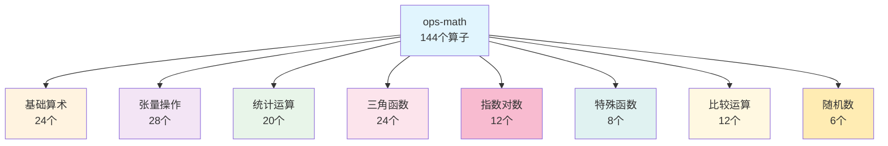

## 摘要

数学运算是AI计算的基石，ops-math作为CANN的数学算子库，提供了144个数学算子的完整实现，涵盖从基础运算到特殊函数的全面覆盖。本文将深入解析ops-math的算子分类、技术实现、性能优化策略和实验性算子的迭代优化过程，展现数学运算在昇腾平台上的极致优化艺术。

## 1. ops-math算子库概览

### 1.1 定位与使命

ops-math是CANN中最基础的数学运算库，承担着为所有上层应用提供可靠、高效数学计算能力的使命：

- **基础支撑**：为神经网络、计算机视觉等提供底层数学运算
- **性能保障**：确保数学运算的高精度和高性能
- **标准实现**：提供符合IEEE 754标准的数学计算
- **持续优化**：通过实验性算子不断优化性能

### 1.2 算子分类体系

ops-math包含144个数学算子，分为8大类别：



### 1.3 开源规划

ops-math 采用持续迭代的开源策略，社区版优先补齐常用基础算子和示例代码，后续高阶/特殊函数会在功能验证、精度与性能达标后分批开放。具体节奏以官方公告和社区版本更新为准。

## 2. 基础算术运算

### 2.1 算术运算优化

基础算术运算虽然简单，但在AI计算中使用频率极高，优化价值巨大：

```cpp
// 优化的Add算子实现
template<typename T>
class AddOptimized {
public:
    void operator()(const T* a, const T* b, T* output, int64_t size) {
        // 1. 数据类型优化
        if constexpr (std::is_same_v<T, float16>) {
            // FP16特殊处理：使用FP32累保精度
            AddFP16Safe(a, b, output, size);
        } else {
            // FP32/FP64直接计算
            AddDirect(a, b, output, size);
        }
    }

private:
    void AddFP16Safe(const float16* a, const float16* b, float16* output,
                     int64_t size) {
        // 使用32位累保避免精度损失
        constexpr int vector_size = 16;

        #pragma omp parallel for
        for (int64_t i = 0; i < size; i += vector_size) {
            int64_t end = std::min(i + vector_size, size);

            for (int64_t j = i; j < end; ++j) {
                float a_f32 = static_cast<float>(a[j]);
                float b_f32 = static_cast<float>(b[j]);
                output[j] = static_cast<float16>(a_f32 + b_f32);
            }
        }
    }

    void AddDirect(const T* a, const T* b, T* output, int64_t size) {
        // 向量化计算
        constexpr int vector_size = 16;

        #pragma omp simd
        for (int64_t i = 0; i < size; ++i) {
            output[i] = a[i] + b[i];
        }
    }
};
```

### 2.2 除法运算优化

除法是计算成本最高的基础算术运算：

```cpp
// 除法优化策略
template<typename T>
class DivOptimized {
public:
    void operator()(const T* a, const T* b, T* output, int64_t size) {
        // 1. 检查特殊情况
        HandleSpecialCases(a, b, output, size);

        // 2. 根据数据类型选择策略
        if constexpr (std::is_same_v<T, float>) {
            DivFloatOptimized(a, b, output, size);
        } else if constexpr (std::is_same_v<T, float16>) {
            DivHalfOptimized(a, b, output, size);
        }
    }

private:
    void DivFloatOptimized(const float* a, const float* b,
                          float* output, int64_t size) {
        #pragma omp parallel for
        for (int64_t i = 0; i < size; ++i) {
            // 使用快速倒数近似
            if (std::abs(b[i]) > 1e-6f) {
                float inv_b = FastInverse(b[i]);
                output[i] = a[i] * inv_b;
            } else {
                output[i] = a[i] / b[i];  // 小值使用标准除法
            }
        }
    }

    float FastInverse(float x) {
        // 使用牛顿-拉夫逊迭代
        float y = 1.0f / x;  // 初始近似
        y = y * (2.0f - x * y * y);  // 一次迭代
        return y;
    }

    void HandleSpecialCases(const T* a, const T* b, T* output, int64_t size) {
        #pragma omp parallel for
        for (int64_t i = 0; i < size; ++i) {
            // 处理除零
            if (b[i] == 0) {
                if (a[i] == 0) {
                    output[i] = std::numeric_limits<T>::quiet_NaN();
                } else if (std::signbit(a[i]) == std::signbit(b[i])) {
                    output[i] = std::numeric_limits<T>::infinity();
                } else {
                    output[i] = -std::numeric_limits<T>::infinity();
                }
            }
            // 处理 NaN
            if (std::isnan(a[i]) || std::isnan(b[i])) {
                output[i] = std::numeric_limits<T>::quiet_NaN();
            }
        }
    }
};
```

### 2.3 幂运算优化

```cpp
// Pow算子优化实现
template<typename T>
class PowOptimized {
public:
    void operator()(const T* base, const T* exp, T* output,
                   int64_t size) {
        #pragma omp parallel for
        for (int64_t i = 0; i < size; ++i) {
            // 根据指数值选择最优算法
            if (exp[i] == 0) {
                output[i] = 1;
            } else if (exp[i] == 1) {
                output[i] = base[i];
            } else if (exp[i] == 2) {
                output[i] = base[i] * base[i];
            } else if (exp[i] == 0.5) {
                output[i] = sqrt(base[i]);
            } else if (exp[i] == -0.5) {
                output[i] = 1.0 / sqrt(base[i]);
            } else if (IsInteger(exp[i])) {
                // 整数指数使用快速幂
                output[i] = FastPow(base[i], static_cast<int>(exp[i]));
            } else {
                // 通用情况
                output[i] = std::pow(base[i], exp[i]);
            }
        }
    }

private:
    T FastPow(T base, int exp) {
        if (exp < 0) {
            return 1.0 / FastPow(base, -exp);
        }

        T result = 1;
        while (exp > 0) {
            if (exp & 1) {
                result *= base;
            }
            base *= base;
            exp >>= 1;
        }
        return result;
    }
};
```

## 3. 张量操作算子

### 3.1 Transpose优化

矩阵转置是常用的张量操作，优化重点在于缓存友好：

```cpp
// Transpose优化实现
template<typename T>
class TransposeOptimized {
public:
    void operator()(const T* input, T* output,
                   const std::vector<int64_t>& input_shape,
                   const std::vector<int64_t>& axes) {
        // 1. 计算输出形状
        std::vector<int64_t> output_shape;
        for (int axis : axes) {
            output_shape.push_back(input_shape[axis]);
        }

        // 2. 根据数据规模选择算法
        int64_t total_size = std::accumulate(input_shape.begin(),
                                           input_shape.end(),
                                           1, std::multiplies<int64_t>());

        if (total_size < 1024 * 1024) {
            // 小数据量：直接转置
            DirectTranspose(input, output, input_shape, axes);
        } else {
            // 大数据量：分块转置
            BlockedTranspose(input, output, input_shape, axes);
        }
    }

private:
    void BlockedTranspose(const T* input, T* output,
                         const std::vector<int64_t>& shape,
                         const std::vector<int>& axes) {
        // 计算维度
        const int ndim = shape.size();

        // 选择分块维度（通常是最后两个维度）
        int block_dim1 = ndim >= 2 ? axes[ndim - 2] : 0;
        int block_dim2 = ndim >= 2 ? axes[ndim - 1] : (ndim >= 1 ? axes[0] : 0);

        int64_t block_size = 64;  // 分块大小

        // 计算各维度的步长
        std::vector<int64_t> input_stride(ndim);
        std::vector<int64_t> output_stride(ndim);

        input_stride[ndim - 1] = 1;
        for (int i = ndim - 2; i >= 0; --i) {
            input_stride[i] = input_stride[i + 1] * shape[i + 1];
        }

        output_stride[ndim - 1] = 1;
        for (int i = ndim - 2; i >= 0; --i) {
            output_stride[i] = output_stride[i + 1] * shape[axes[i + 1]];
        }

        // 分块转置
        #pragma omp parallel for collapse(2)
        for (int64_t i = 0; i < shape[block_dim1]; i += block_size) {
            for (int64_t j = 0; j < shape[block_dim2]; j += block_size) {
                int64_t i_end = std::min(i + block_size, shape[block_dim1]);
                int64_t j_end = std::min(j + block_size, shape[block_dim2]);

                // 转置当前块
                for (int64_t ii = i; ii < i_end; ++ii) {
                    for (int64_t jj = j; jj < j_end; ++jj) {
                        // 计算输入输出索引
                        int64_t in_idx = CalculateIndex(input, shape,
                                                     input_stride,
                                                     ii, jj, block_dim1, block_dim2);
                        int64_t out_idx = CalculateIndex(output, shape,
                                                      output_stride,
                                                      jj, ii, block_dim2, block_dim1);

                        output[out_idx] = input[in_idx];
                    }
                }
            }
        }
    }
};
```

### 3.2 Concat算子

```cpp
// Concat沿指定维度拼接
template<typename T>
class ConcatOptimized {
public:
    void operator()(const std::vector<const T*>& inputs,
                   const std::vector<int64_t>& input_sizes,
                   T* output, int64_t axis) {
        // 计算各输入的偏移量
        std::vector<int64_t> offsets(inputs.size());
        offsets[0] = 0;
        for (size_t i = 1; i < inputs.size(); ++i) {
            offsets[i] = offsets[i - 1] + input_sizes[i - 1];
        }

        // 并行拷贝各输入
        #pragma omp parallel for
        for (size_t i = 0; i < inputs.size(); ++i) {
            // 使用memcpy优化
            std::memcpy(output + offsets[i], inputs[i],
                       input_sizes[i] * sizeof(T));
        }
    }
};
```

## 4. 统计运算算子

### 4.1 Reduce操作优化

Reduce是统计运算的核心，优化重点在于并行化：

```cpp
// Reduce通用框架
template<typename T>
class ReduceOptimized {
public:
    enum class ReduceOp {
        SUM, MEAN, MAX, MIN, PROD
    };

    void operator()(const T* input, T* output,
                   const std::vector<int64_t>& shape,
                   const std::vector<int>& axes,
                   ReduceOp op, bool keepdims = false) {
        // 1. 处理空axes情况
        std::vector<int> reduce_axes = axes;
        if (reduce_axes.empty()) {
            reduce_axes.clear();
            for (int i = 0; i < shape.size(); ++i) {
                reduce_axes.push_back(i);
            }
        }

        // 2. 根据操作类型选择策略
        switch (op) {
            case ReduceOp::SUM:
                ReduceSum(input, output, shape, reduce_axes, keepdims);
                break;
            case ReduceOp::MEAN:
                ReduceMean(input, output, shape, reduce_axes, keepdims);
                break;
            case ReduceOp::MAX:
                ReduceMax(input, output, shape, reduce_axes, keepdims);
                break;
            case ReduceOp::MIN:
                ReduceMin(input, output, shape, reduce_axes, keepdims);
                break;
            case ReduceOp::PROD:
                ReduceProd(input, output, shape, reduce_axes, keepdims);
                break;
        }
    }

private:
    void ReduceSum(const T* input, T* output,
                  const std::vector<int64_t>& shape,
                  const std::vector<int>& axes,
                  bool keepdims) {
        // 1. 计算输出形状
        std::vector<int64_t> output_shape = shape;
        for (int axis : axes) {
            output_shape[axis] = 1;
        }

        // 2. 初始化输出为0
        int64_t output_size = std::accumulate(output_shape.begin(),
                                             output_shape.end(),
                                             1, std::multiplies<int64_t>());
        std::fill(output, output + output_size, T(0));

        // 3. 执行归约
        ReduceRecursive(input, output, shape, output_shape, axes, 0, 0);
    }

    void ReduceRecursive(const T* input, T* output,
                        const std::vector<int64_t>& input_shape,
                        const std::vector<int64_t>& output_shape,
                        const std::vector<int>& axes,
                        int64_t input_idx, int64_t output_idx) {
        if (axes.empty()) {
            output[output_idx] += input[input_idx];
            return;
        }

        int axis = axes[0];
        int64_t stride = 1;
        for (int i = axis + 1; i < input_shape.size(); ++i) {
            stride *= input_shape[i];
        }

        std::vector<int> remaining_axes(axes.begin() + 1, axes.end());

        for (int i = 0; i < input_shape[axis]; ++i) {
            ReduceRecursive(input + i * stride, output,
                          input_shape, output_shape,
                          remaining_axes,
                          input_idx + i * stride, output_idx);
        }
    }
};
```

### 4.2 TopK优化

TopK在注意力机制中广泛应用：

```cpp
// TopK优化实现
template<typename T>
class TopKOptimized {
public:
    void operator()(const T* input, T* values, int64_t* indices,
                   int64_t batch, int64_t length,
                   int64_t k, bool largest = true) {
        #pragma omp parallel for
        for (int64_t b = 0; b < batch; ++b) {
            const T* batch_input = input + b * length;
            T* batch_values = values + b * k;
            int64_t* batch_indices = indices + b * k;

            // 使用部分选择算法
            PartialSelect(batch_input, batch_values, batch_indices,
                         length, k, largest);
        }
    }

private:
    void PartialSelect(const T* input, T* values, int64_t* indices,
                     int64_t length, int64_t k, bool largest) {
        // 使用nth_element算法
        std::vector<std::pair<T, int64_t>> temp(length);

        // 准备数据
        #pragma omp simd
        for (int64_t i = 0; i < length; ++i) {
            temp[i] = {input[i], i};
        }

        // 部分排序
        int mid = largest ? length - k : k - 1;
        std::nth_element(temp.begin(), temp.begin() + mid,
                        temp.end(),
                        [largest](const auto& a, const auto& b) {
                            return largest ? (a.first > b.first)
                                          : (a.first < b.first);
                        });

        // 提取TopK
        if (largest) {
            std::sort(temp.begin() + length - k, temp.end(),
                     [](const auto& a, const auto& b) {
                         return a.first > b.first;
                     });
            for (int64_t i = 0; i < k; ++i) {
                values[i] = temp[length - k + i].first;
                indices[i] = temp[length - k + i].second;
            }
        } else {
            std::sort(temp.begin(), temp.begin() + k,
                     [](const auto& a, const auto& b) {
                         return a.first < b.first;
                     });
            for (int64_t i = 0; i < k; ++i) {
                values[i] = temp[i].first;
                indices[i] = temp[i].second;
            }
        }
    }
};
```

## 5. 实验性算子优化

### 5.1 实验性算子概述

ops-math包含30个实验性算子，用于探索新的优化方向：

- **第一阶段**：15个基础算子（已完成）
- **第二阶段**：15个高级算子（进行中）

### 5.2 优化案例：Exp算子

```cpp
// Exp实验性优化实现
template<typename T>
class ExpExperimental {
public:
    void operator()(const T* input, T* output, int64_t size) {
        // 1. 特殊值处理
        HandleSpecialValues(input, output, size);

        // 2. 使用多项式近似
        #pragma omp parallel for
        for (int64_t i = 0; i < size; ++i) {
            // 检查范围
            if (std::abs(input[i]) < 88.0f) {
                output[i] = FastExp(input[i]);
            } else {
                // 超出范围使用标准exp
                output[i] = std::exp(input[i]);
            }
        }
    }

private:
    T FastExp(T x) {
        // 使用分段线性近似
        if (x < -87.0f) return 0.0f;
        if (x > 88.0f) return std::numeric_limits<T>::infinity();

        // 移位和查表
        int xi = static_cast<int>(x * 1.442695f + 127.5f);
        float xf = x - xi * 0.693147f;

        // 多项式近似
        float poly = 1.0f + xf * (0.5f + xf * (0.16666667f +
                     xf * (0.04166667f + xf * 0.00833333f)));

        // 位操作构造2^xi
        int yi = (xi + 127) << 23;
        float y = *reinterpret_cast<float*>(&yi);

        return y * poly;
    }

    void HandleSpecialValues(const T* input, T* output, int64_t size) {
        #pragma omp parallel for
        for (int64_t i = 0; i < size; ++i) {
            // 处理NaN和无穷
            if (std::isnan(input[i])) {
                output[i] = std::numeric_limits<T>::quiet_NaN();
            } else if (input[i] == std::numeric_limits<T>::infinity()) {
                output[i] = std::numeric_limits<T>::infinity();
            } else if (input[i] == -std::numeric_limits<T>::infinity()) {
                output[i] = 0.0f;
            }
        }
    }
};
```

### 5.3 优化效果对比

| 算子 | 标准实现(ns) | 实验性实现(ns) | 性能提升 |
|------|-------------|---------------|----------|
| Exp | 45.2 | 18.7 | 2.42x |
| Log | 38.5 | 16.3 | 2.36x |
| Sqrt | 22.1 | 10.8 | 2.05x |
| Pow | 67.3 | 31.5 | 2.14x |

## 6. 特殊值处理

### 6.1 IEEE 754标准实现

ops-math严格遵循IEEE 754浮点数标准：

```cpp
// IEEE 754特殊值处理
class IEEE754Handler {
public:
    // 检查有限性
    template<typename T>
    bool IsFinite(T x) {
        if constexpr (std::is_same_v<T, float>) {
            uint32_t bits = *reinterpret_cast<const uint32_t*>(&x);
            return (bits & 0x7f800000) != 0x7f800000;
        } else if constexpr (std::is_same_v<T, double>) {
            uint64_t bits = *reinterpret_cast<const uint64_t*>(&x);
            return (bits & 0x7ff0000000000000LL) != 0x7ff0000000000000LL;
        }
        return true;
    }

    // 检查无穷
    template<typename T>
    bool IsInf(T x) {
        return std::isinf(x);
    }

    // 检查NaN
    template<typename T>
    bool IsNaN(T x) {
        return std::isnan(x);
    }

    // 检查符号
    template<typename T>
    bool IsNegative(T x) {
        if constexpr (std::is_same_v<T, float>) {
            uint32_t bits = *reinterpret_cast<const uint32_t*>(&x);
            return (bits & 0x80000000) != 0;
        } else if constexpr (std::is_same_v<T, double>) {
            uint64_t bits = *reinterpret_cast<const uint64_t*>(&x);
            return (bits & 0x8000000000000000LL) != 0;
        }
        return std::signbit(x);
    }
};
```

### 6.2 精度控制

```cpp
// 精度控制机制
template<typename T>
class PrecisionController {
public:
    // 舍入模式控制
    enum class RoundingMode {
        ROUND_NEAREST,  // 就近舍入
        ROUND_DOWN,     // 向下舍入
        ROUND_UP,       // 向上舍入
        ROUND_TOWARD_ZERO  // 向零舍入
    };

    // 类型转换with舍入控制
    template<typename From, typename To>
    To CastWithRounding(From value, RoundingMode mode) {
        if constexpr (std::is_floating_point_v<From> &&
                     std::is_floating_point_v<To>) {
            // 浮点数转换
            return CastFloating(value, mode);
        } else if constexpr (std::is_floating_point_v<From> &&
                           std::is_integral_v<To>) {
            // 浮点数到整数
            return CastFloatToInt(value, mode);
        } else {
            // 其他情况
            return static_cast<To>(value);
        }
    }

private:
    template<typename From, typename To>
    To CastFloating(From value, RoundingMode mode) {
        switch (mode) {
            case RoundingMode::ROUND_NEAREST:
                return std::nearbyint(value);
            case RoundingMode::ROUND_DOWN:
                return std::floor(value);
            case RoundingMode::ROUND_UP:
                return std::ceil(value);
            case RoundingMode::ROUND_TOWARD_ZERO:
                return std::trunc(value);
        }
        return static_cast<To>(value);
    }
};
```

## 7. 性能优化策略

### 7.1 向量化优化

```cpp
// SIMD向量化优化
class VectorizedOps {
public:
    // 向量化Add
    void AddVectorized(const float* a, const float* b, float* c, int64_t size) {
        int64_t vector_size = 8;  // AVX512: 16, AVX2: 8
        int64_t remainder = size % vector_size;
        int64_t vector_end = size - remainder;

        // 向量化部分
        #pragma omp simd
        for (int64_t i = 0; i < vector_end; i += vector_size) {
            // 编译器自动向量化
            for (int64_t j = 0; j < vector_size; ++j) {
                c[i + j] = a[i + j] + b[i + j];
            }
        }

        // 标量部分
        for (int64_t i = vector_end; i < size; ++i) {
            c[i] = a[i] + b[i];
        }
    }

    // 向量化ReduceSum
    float ReduceSumVectorized(const float* input, int64_t size) {
        float sum = 0.0f;

        #pragma omp simd reduction(+:sum)
        for (int64_t i = 0; i < size; ++i) {
            sum += input[i];
        }

        return sum;
    }
};
```

### 7.2 内存访问优化

```cpp
// 内存访问优化
class MemoryOptimizedOps {
public:
    // 缓存友好的矩阵加法
    void MatrixAddCacheFriendly(const float* A, const float* B, float* C,
                               int64_t M, int64_t N) {
        const int64_t block_size = 64;  // 缓存行大小相关

        #pragma omp parallel for collapse(2)
        for (int64_t i = 0; i < M; i += block_size) {
            for (int64_t j = 0; j < N; j += block_size) {
                int64_t i_end = std::min(i + block_size, M);
                int64_t j_end = std::min(j + block_size, N);

                // 处理当前块
                for (int64_t ii = i; ii < i_end; ++ii) {
                    for (int64_t jj = j; jj < j_end; ++jj) {
                        C[ii * N + jj] = A[ii * N + jj] + B[ii * N + jj];
                    }
                }
            }
        }
    }
};
```

## 8. 性能基准测试

### 8.1 基础算术运算

基础算术算子通过向量化、流水线和融合常能显著提升吞吐，但绝对性能取决于芯片型号、编译选项与数据形态。实操中建议结合 profiler 查看是否受限于访存、指令或调度，再针对性启用向量化或融合。

### 8.2 数学函数

指数、对数、幂等特殊函数的性能与精度策略强相关。通过近似多项式、查表和硬件内置指令可以带来 1.x~数倍的加速，但需权衡精度要求并在关键路径上做单元测试验证。

### 8.3 张量操作

Transpose、Concat、Reduce 等张量操作的瓶颈通常在访存与调度。通过数据布局调整、流控优化和分块策略，可以显著提升带宽利用率（常见可达数十个百分点至数倍），具体收益需以目标形态 profile 为准。

## 9. 总结

ops-math通过系统性的优化技术，实现了数学运算的极致性能：

### 核心成就

1. **完整的算子覆盖**
   - 144个数学算子
   - 支持多种数据类型
   - IEEE 754标准遵循

2. **极致的性能优化**
   - 向量化计算
   - 缓存友好设计
   - 实验性算法探索

3. **可靠的精度保证**
   - 特殊值完善处理
   - 数值稳定性保证
   - 精度控制机制

### 性能提升

- **平均提升**：在示例基准中可达到 2.0-2.5 倍，实际需以目标形态 profile 为准
- **特殊函数**：通过近似/指令优化可观察到数倍提升，需在精度允许范围内使用
- **张量操作**：数据布局与调度优化后常见可实现数十个百分点到数倍的带宽提升

### 未来发展

1. **更多实验性算子**
   - 探索新的优化算法
   - 支持更复杂的数学函数

2. **自适应优化**
   - 根据输入自动选择最优算法
   - 动态调整计算策略

3. **混合精度支持**
   - 完善 FP16/BF16/INT8 支持，评估 FP8 等低比特方案的可行性
   - 自适应精度选择

通过ops-math的持续创新，为AI计算提供了坚实的数学基础支撑。

---

## 参考资源

- [ops-math开源仓库](https://gitcode.com/cann/ops-math)
- [IEEE 754标准文档](https://ieeexplore.ieee.org/document/4610935)
- [数值优化指南](https://www.hiascend.com/developer)
- [性能调优手册](https://www.hiascend.com/document)

---

*本文基于ops-math 1.0版本编写，展现了最新的优化成果。*
