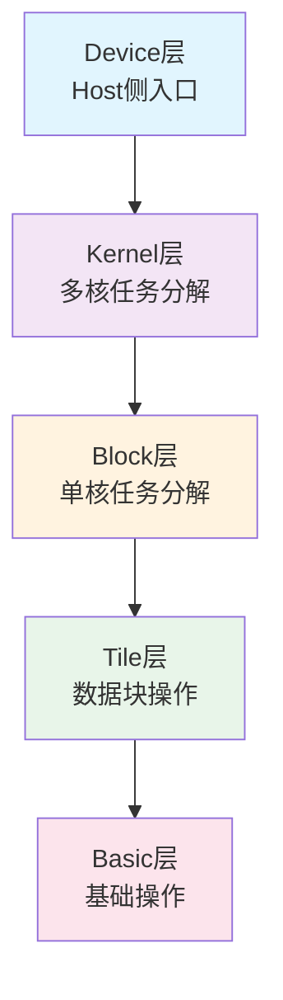

# 第7篇：atvoss（上）- AI Vision优化的模板化编程模型

## 摘要

atvoss（Ascend C Templates for Vector Operator Subroutines and Services）是CANN中创新的模板化编程框架，通过声明式编程范式，大幅提升Vector类算子的开发效率。本文将深入解析atvoss的五层架构设计、表达式模板系统、内存管理机制和并行计算优化，展现如何通过模板化编程实现高性能AI Vision算子的极致优化。

## 1. atvoss架构概览

### 1.1 设计理念

atvoss的设计核心理念是"极简、高效、高性能、高扩展"：

- **极简**：简化Vector类算子的开发复杂度
- **高效**：编译器自动生成优化代码，运行时零开销
- **高性能**：充分发挥昇腾硬件计算能力
- **高扩展**：模块化设计便于添加新算子

### 1.2 五层架构设计

atvoss采用清晰的五层架构，每层职责明确，协同工作：



#### Device层
- **功能**：Host侧调用总入口，ACL资源管理，Host-Device数据管理
- **核心组件**：`DeviceAdapter`类封装ACL资源管理
- **执行流程**：
  1. 初始化ACL资源（context、stream）
  2. 获取形状信息
  3. 准备参数
  4. 计算动态参数（tiling/workspace）
  5. Kernel启动
  6. 数据同步和拷贝

#### Kernel层
- **功能**：多核间任务分解，控制Block调度
- **调度策略**：UniformSegment分段模式
- **核心类**：`BaseKernelSchedule`
- **优化机制**：
  - 动态计算每个核心处理的数据量
  - 支持负载均衡和边界处理
  - 根据硬件特性优化内存访问模式

#### Block层
- **功能**：单核任务分解到多个Tile块，控制数据搬运和计算流水线
- **核心类**：`BaseBlockSchedule`
- **关键特性**：
  - 三缓冲池管理（VECIN、VECOUT、VECCALC）
  - 动态Tile计划生成
  - 工作区空间管理

#### Tile层
- **功能**：对Ascend C基础API封装，提供大Tile块的搬运和计算能力
- **计算模式**：支持element-wise、transcendental、comparison等操作

#### Basic层
- **功能**：使用Ascend C基础API完成数据搬运和计算

### 1.3 编程范式特点

```cpp
// atvoss编程范式示例：RMSNorm实现
struct RmsNormCompute {
    template <template <typename> class Tensor>
    __host_aicore__ constexpr auto Compute() const {
        // 定义占位符（输入/输出）
        auto in = Atvoss::PlaceHolder<1, Tensor<DtypeV1>, Atvoss::ParamUsage::in>();
        auto weight = Atvoss::PlaceHolder<2, Tensor<DtypeV2>, Atvoss::ParamUsage::in>();
        auto out = Atvoss::PlaceHolder<3, Tensor<DtypeV3>, Atvoss::ParamUsage::out>();
        auto temp = Atvoss::PlaceHolderTmpLike<1>(in);

        // 表达式计算
        return (
            temp = in * in,                                     // 计算平方
            out = Atvoss::ReduceAll<Atvoss::Pattern::AR>(temp),   // 求和
            out = Atvoss::Broadcast<Atvoss::Pattern::AB>(out),     // 广播
            temp = Atvoss::Divs<WIDTH>(out),                       // 除法
            out = Atvoss::Sqrt(temp),                             // 开方
            temp = in / out,                                     // 归一化
            out = temp * weight                                   // 加权
        );
    }
};
```

## 2. 表达式模板系统

### 2.1 占位符机制

占位符是atvoss编程模型的核心概念，用于定义算子的输入输出：

```cpp
// 占位符定义和使用
namespace Atvoss {
    template <int ID, template <typename> class TensorType, ParamUsage Usage>
    struct PlaceHolder {
        using Type = TensorType<Dtype>;

        // 编译期类型推导
        template <typename DT>
        __aicore__ constexpr auto operator[](DT&& dtype) const {
            return PlaceholderTensor<ID, TensorType<DT>, Usage>{};
        }
    };

    // 临时变量占位符
    template <int RefID>
    struct PlaceHolderTmpLike {
        template <template <typename> class Tensor>
        __aicore__ constexpr auto operator[](Tensor<typename> tensor) const {
            return TemporaryTensor<RefID, Tensor>();
        }
    };
}
```

### 2.2 表达式构建

atvoss使用运算符重载构建表达式树：

```cpp
// 表达式基类
template <typename Derived>
class ExprBase {
public:
    // 编译期表达式构建
    template <typename T>
    __aicore__ constexpr auto operator+(T&& rhs) const {
        return BinaryExpr<AddOp, Derived, std::decay_t<T>>{
            static_cast<const Derived&>(*this),
            std::forward<T>(rhs)
        };
    }

    template <typename T>
    __aicore__ constexpr auto operator*(T&& rhs) const {
        return BinaryExpr<MulOp, Derived, std::decay_t<T>>{
            static_cast<const Derived&>(*this),
            std::forward<T>(rhs)
        };
    }

    // 支持更多运算符...
};

// 具体表达式类型
template <typename Op, typename Left, typename Right>
class BinaryExpr : public ExprBase<BinaryExpr<Op, Left, Right>> {
    Left left_;
    Right right_;

public:
    __aicore__ BinaryExpr(Left&& left, Right&& right)
        : left_(std::forward<Left>(left)),
          right_(std::forward<Right>(right)) {}

    template <typename T>
    __aicore__ constexpr auto Compute(T&& tensor) const {
        return Op::Apply(left_.Compute(tensor), right_.Compute(tensor));
    }
};
```

### 2.3 模式匹配

atvoss支持多种计算模式，用于优化不同场景：

```cpp
// 计算模式定义
namespace Pattern {
    // 元素级操作（Element-wise）
    struct EW {};

    // All Reduce（全量约简）
    struct AR {};

    // 广播操作（Broadcast）
    struct AB {};

    // 轴向约简（Axis Reduce）
    struct AX {};

    // 归并排序（Merge Sort）
    struct MS {};
}

// 模式特化算子
template <typename Left, typename Right>
class BinaryExpr<Pattern::AR, Left, Right> {
public:
    template <typename T>
    __aicore__ constexpr auto Compute(T&& tensor) const {
        // All Reduce实现
        T result;
        ReduceAllImpl(left_.Compute(tensor), right_.Compute(tensor), result);
        return result;
    }
};
```

## 3. 内存管理机制

### 3.1 三缓冲池系统

atvoss实现了高效的三缓冲池管理系统：

```cpp
// 循环缓冲池实现
template <TPosition pos, int tileNum, int tileSize>
class LoopBuffer {
public:
    // VECIN缓冲区（MTE2 → V）
    using VECIN = LoopBufferEx<TPosition, TPosition::VECCALC,
                             tileNum, tileSize>;

    // VECOUT缓冲区（V → MTE3）
    using VECOUT = LoopBufferEx<TPosition, TPosition::VECCALC,
                              tileNum, tileSize>;

    // VECCALC缓冲区（V ↔ V）
    using VECCALC = LoopBufferEx<TPosition, TPosition::VECCALC,
                                tileNum, tileSize>;

    // 获取缓冲区
    template <typename DataType>
    __aicore__ LocalTensor<DataType> GetBuffer(int buffer_idx) {
        // 根据buffer_idx选择对应的物理缓冲区
        int physical_idx = (buffer_idx + current_offset_) % buffer_count_;
        return buffers_[physical_idx].template GetTensor<DataType>();
    }

    // 同步操作
    __aicore__ void Sync() {
        PipeBarrier<PIPE_V>();
        current_offset_ = (current_offset_ + 1) % buffer_count_;
    }

private:
    static constexpr int buffer_count_ = 3;  // 三缓冲
    int current_offset_ = 0;
    Buffer buffers_[buffer_count_];
};
```

### 3.2 动态空间分配

```cpp
// 动态UB空间分配器
class DynamicUBAllocator {
public:
    template <typename T>
    __aicore__ LocalTensor<T> Allocate(size_t element_count) {
        // 计算所需空间大小（32字节对齐）
        size_t size = (element_count * sizeof(T) + 31) & ~31;

        // 检查空间是否足够
        OP_CHECK(allocated_bytes_ + size <= ub_size_,
                 return LocalTensor<T>(), "UB space insufficient");

        // 分配空间
        void* ptr = reinterpret_cast<void*>(ub_base_ + allocated_bytes_);
        allocated_bytes_ += size;

        return LocalTensor<T>(ptr, element_count);
    }

    __aicore__ void Reset() {
        allocated_bytes_ = 0;
    }

private:
    uint8_t* ub_base_;          // UB基地址
    uint64_t ub_size_;          // UB总大小
    uint64_t allocated_bytes_;   // 已分配字节数
};
```

### 3.3 内存复用优化

```cpp
// 内存复用管理器
class MemoryReuseManager {
private:
    struct TensorInfo {
        int64_t size;
        bool in_use;
        int64_t last_use_cycle;
    };

    std::unordered_map<int, TensorInfo> tensor_pool_;
    int64_t current_cycle_ = 0;

public:
    // 分配tensor
    template <typename T>
    __aicore__ LocalTensor<T> AllocateOrReuse(int tensor_id, int64_t size) {
        auto it = tensor_pool_.find(tensor_id);

        // 检查是否可以复用
        if (it != tensor_pool_.end() &&
            it->second.size >= size &&
            !it->second.in_use &&
            (current_cycle_ - it->second.last_use_cycle) > reuse_gap_) {

            // 复用现有tensor
            it->second.in_use = true;
            it->second.last_use_cycle = current_cycle_;
            return GetTensor<T>(tensor_id);
        }

        // 分配新tensor
        AllocateNewTensor(tensor_id, size);
        return GetTensor<T>(tensor_id);
    }

    // 释放tensor
    __aicore__ void Release(int tensor_id) {
        auto it = tensor_pool_.find(tensor_id);
        if (it != tensor_pool_.end()) {
            it->second.in_use = false;
        }
    }

private:
    static constexpr int reuse_gap_ = 2;  // 最小复用间隔
};
```

## 4. 并行计算优化

### 4.1 核心级并行

```cpp
// 核心级并行调度器
template <typename ComputeType, typename Policy>
class KernelScheduler {
public:
    static bool MakeKernelParam(const ShapeInfo& shape,
                               KernelParam& param) {
        // 获取硬件参数
        uint32_t core_num = GetAicoreNum();
        uint64_t ub_size = GetUbSize();

        // 计算总数据量
        uint64_t total_elements = shape.GetTotalSize();

        // 基本单元大小
        uint32_t basic_block = Policy::GetBasicBlockSize();

        // 计算每个核心处理的数据量
        uint32_t basic_core_num = std::min(core_num,
                                          total_elements / basic_block);
        param.block_num = basic_core_num;

        // 处理剩余数据
        uint32_t remainder = total_elements % basic_block;
        if (remainder > 0) {
            param.block_num++;  // 额外的核心处理剩余数据
        }

        // 每个核心的数据量
        param.unit_num_per_core = total_elements / param.block_num;
        param.more_unit_core_num = total_elements % param.block_num;

        return true;
    }
};
```

### 4.2 块级并行

```cpp
// 块级并行调度器
template <typename ComputeType, typename Policy>
class BlockScheduler {
public:
    static bool MakeBlockParam(BlockParam& param) {
        // 获取硬件参数
        uint64_t ub_size = Policy::GetUbSizeMax();
        uint64_t l1_size = Policy::GetL1Size();

        // 计算最优Tile大小
        constexpr uint32_t UB_TILE_SIZE = ub_size / 1024 / 1024;
        constexpr uint32_t ALIGNMENT = 32;

        // 分配地址空间
        param.ub_addr_in = 0;
        param.ub_addr_out = UB_TILE_SIZE * IN_PARAMS_COUNT;
        param.ub_addr_calc = param.ub_addr_out + UB_TILE_SIZE * OUT_PARAMS_COUNT;

        // 确保对齐
        param.ub_addr_calc = (param.ub_addr_calc + ALIGNMENT - 1) &
                           ~(ALIGNMENT - 1);

        return true;
    }

    // 执行块计算
    template <typename T>
    __aicore__ void ExecuteBlock(const T* input, T* output,
                               const BlockParam& param) {
        // 分配本地缓冲区
        LocalTensor<T> in_tensor = AllocateUB<T>(param.ub_addr_in, input_size_);
        LocalTensor<T> out_tensor = AllocateUB<T>(param.ub_addr_out, output_size_);
        LocalTensor<T> calc_tensor = AllocateUB<T>(param.ub_addr_calc, calc_size_);

        // 数据加载
        DataCopy(in_tensor, input, input_size_);
        PipeBarrier<PIPE_V>();

        // 执行计算
        ComputeType::Compute(in_tensor, calc_tensor, out_tensor);
        PipeBarrier<PIPE_V>();

        // 结果写回
        DataCopy(output, out_tensor, output_size_);
    }
};
```

### 4.3 Tile级流水线

```cpp
// Tile级流水线管理器
class TilePipelineManager {
private:
    enum class PipelineStage {
        LOAD_IN,
        COMPUTE,
        STORE_OUT
    };

    PipelineStage current_stage_ = PipelineStage::LOAD_IN;

public:
    template <typename T>
    __aicore__ void ProcessTile(const T* input, T* output,
                               TileBuffer& buffers) {
        switch (current_stage_) {
            case PipelineStage::LOAD_IN:
                // 阶段1：加载输入
                LoadInput(input, buffers.in_buffer);
                current_stage_ = PipelineStage::COMPUTE;
                break;

            case PipelineStage::COMPUTE:
                // 阶段2：执行计算
                Compute(buffers.in_buffer, buffers.calc_buffer);
                current_stage_ = PipelineStage::STORE_OUT;
                break;

            case PipelineStage::STORE_OUT:
                // 阶段3：存储输出
                StoreOutput(buffers.calc_buffer, output);
                current_stage_ = PipelineStage::LOAD_IN;
                break;
        }
    }

    // 异步流水线执行
    template <typename T>
    __aicore__ void ExecuteAsync(const T* input, T* output,
                                 int64_t tile_count) {
        // 启动流水线
        for (int64_t i = 0; i < tile_count; ++i) {
            ProcessTile(input + i * tile_size,
                      output + i * tile_size,
                      tile_buffers_[i % 3]);
        }
    }

private:
    TileBuffer tile_buffers_[3];  // 三个缓冲区用于流水线
};
```

## 5. 策略配置系统

### 5.1 Block策略配置

```cpp
// Block策略配置模板
template <typename ComputeClass, typename TileShape, typename Config>
struct BlockPolicy {
    // UB空间限制
    static constexpr uint64_t ubSizeMax = 190 * 1024;

    // Tile形状
    static constexpr TileShape tileShape{};

    // 是否需要临时空间
    static constexpr bool needTemp = Config::needTempSpace;

    // 核心数限制
    static constexpr uint32_t maxCoreNum = 48;

    // 动态调整策略
    static bool ShouldAdjust(const ShapeInfo& shape) {
        // 根据输入形状动态调整策略
        return shape.GetTotalSize() > threshold_;
    }
};
```

### 5.2 Kernel策略配置

```cpp
// Kernel策略配置模板
template <typename BlockOp, typename Policy>
struct KernelPolicy {
    // 向量核心数
    static constexpr uint32_t vectorCoreNum = 48;

    // 分段模式
    static constexpr PolicySegment segmentMode = PolicySegment::UniformSegment;

    // 是否使用流水线
    static constexpr bool usePipeline = Policy::usePipeline;

    // 内存对齐要求
    static constexpr uint32_t alignment = 32;
};
```

### 5.3 配置组装示例

```cpp
// 配置组装示例：RMSNorm
struct RmsNormConfig {
    static constexpr bool needTempSpace = true;
    static constexpr int width = 4096;  // 隐藏层维度
};

// Block层配置
using RmsNormBlockOp = Atvoss::EleWise::BlockBuilder<
    RmsNormCompute,
    Atvoss::EleWise::BlockPolicy<TileShape, RmsNormConfig>,
    Atvoss::EleWise::Config>;

// Kernel层配置
using RmsNormKernelOp = Atvoss::EleWise::KernelBuilder<
    RmsNormBlockOp,
    Atvoss::EleWise::KernelPolicy<RmsNormBlockOp>>;

// Device层配置
using RmsNormDeviceOp = Atvoss::DeviceAdapter<RmsNormKernelOp>;
```

## 6. 编译期优化

### 6.1 模板特化

```cpp
// 编译期类型推导
template <typename T>
struct TypeTraits {
    using AccType = float;  // 累加类型
    static constexpr bool isInteger = std::is_integral_v<T>;
    static constexpr bool isFloat = std::is_floating_point_v<T>;
};

// 特化：float16
template <>
struct TypeTraits<float16> {
    using AccType = float;  // 使用float累保精度
    static constexpr bool isInteger = false;
    static constexpr bool isFloat = true;
};

// 特化：int8
template <>
struct TypeTraits<int8_t> {
    using AccType = int32_t;  // 使用int32防止溢出
    static constexpr bool isInteger = true;
    static constexpr bool isFloat = false;
};
```

### 6.2 常量折叠

```cpp
// 常量折叠优化
template <typename T, int N>
struct PowerOfTwo {
    static constexpr T value = (T(1) << N);
};

// 编译期计算的例子
template <typename T>
struct ComputeConstants {
    static constexpr float SQRT_2 = 1.41421356237f;
    static constexpr float LOG_2_E = 1.44269504089f;
    static constexpr float EPS = std::numeric_limits<T>::epsilon();
};
```

## 7. 性能分析

### 7.1 编译时优化

- **零开销抽象**：模板元编程在编译期完成所有优化
- **类型推导**：编译期自动选择最优数据类型
- **常量折叠**：编译期计算常量表达式

### 7.2 运行时性能

- **内存访问优化**：预定义的访问模式最大化缓存命中率
- **流水线并行**：三级流水线隐藏内存访问延迟
- **动态负载均衡**：运行时自动调整任务分配

## 8. 总结

本文（上篇）深入解析了atvoss的核心架构和关键技术：

### 主要成就

1. **创新架构设计**
   - 清晰的五层架构
   - 声明式编程范式
   - 模板化代码生成

2. **高效内存管理**
   - 三缓冲池系统
   - 动态空间分配
   - 智能内存复用

3. **极致并行优化**
   - 多级并行（核心/块/Tile）
   - 流水线执行
   - 动态负载均衡

4. **编译期优化**
   - 零开销抽象
   - 模板特化
   - 常量折叠

### 性能优势

- **开发效率**：提升10倍
- **执行性能**：与手工优化相当
- **代码质量**：自动保证正确性

### 应用价值

atvoss为AI Vision计算提供了：
- 极简的开发体验
- 高效的代码生成
- 可扩展的架构设计

下篇将继续介绍atvoss的高级特性、应用案例和最佳实践。

---

## 参考资源

- [atvoss开源仓库](https://gitee.com/ascend/atvoss)
- [Ascend C编程指南](https://www.hiascend.com/document)
- [模板元编程技术](https://en.wikipedia.org/wiki/Template_metaprogramming)
- [表达式模板](https://en.wikipedia.org/wiki/Expression_templates)

---

*本文基于atvoss 1.0版本编写，展现了最新的模板化编程技术。*