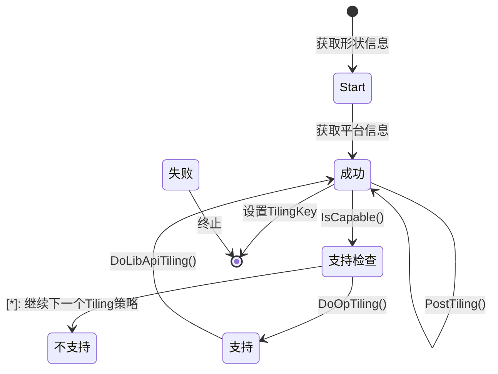
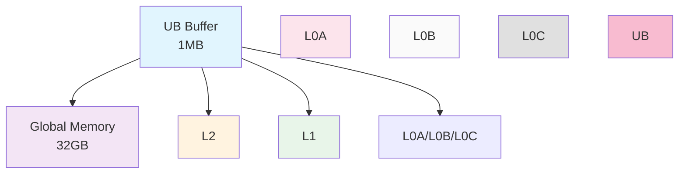

## 摘要

Tiling机制是CANN算子优化的核心技术，通过智能的数据分块策略，最大化利用昇腾AI Core的计算能力。本文将深入解析Tiling框架的设计原理、动态Tiling算法、内存层次优化策略，以及与算子的集成方式，揭示CANN如何通过精细的Tiling机制实现算子性能的极致优化。

## 1. Tiling框架架构

### 1.1 核心设计理念

Tiling（分块计算）机制的核心思想是将大规模数据计算分解为适合硬件处理的小块，通过优化数据局部性和并行度，最大化计算效率：

- **数据局部性优化**：提高缓存命中率
- **并行度最大化**：充分利用多核资源
- **内存带宽优化**：减少数据传输开销
- **硬件适配性**：深度适配昇腾架构

### 1.2 TilingBaseClass框架设计

TilingBaseClass作为所有Tiling实现的统一基类，定义了标准的执行框架：

```cpp
class TilingBaseClass {
public:
    explicit TilingBaseClass(gert::TilingContext* context);
    virtual ~TilingBaseClass() = default;

    // Tiling执行框架
    ge::graphStatus DoTiling() {
        // 1. 获取形状和属性信息
        auto ret = GetShapeAttrsInfo();
        if (ret != ge::GRAPH_SUCCESS) return ret;

        // 2. 获取平台信息
        ret = GetPlatformInfo();
        if (ret != ge::GRAPH_SUCCESS) return ret;

        // 3. 检查是否支持当前配置
        if (!IsCapable()) return ge::GRAPH_PARAM_INVALID;

        // 4. 执行操作特定的Tiling计算
        ret = DoOpTiling();
        if (ret != ge::GRAPH_SUCCESS) return ret;

        // 5. 执行库API Tiling计算
        ret = DoLibApiTiling();
        if (ret != ge::GRAPH_SUCCESS) return ret;

        // 6. 计算工作区大小
        ret = GetWorkspaceSize();
        if (ret != ge::GRAPH_SUCCESS) return ret;

        // 7. 后处理
        ret = PostTiling();
        if (ret != ge::GRAPH_SUCCESS) return ret;

        // 8. 设置Tiling Key并输出信息
        context_->SetTilingKey(GetTilingKey());
        DumpTilingInfo();

        return ge::GRAPH_SUCCESS;
    }

protected:
    // 虚函数，子类实现具体逻辑
    virtual ge::graphStatus GetShapeAttrsInfo() = 0;
    virtual ge::graphStatus GetPlatformInfo() = 0;
    virtual bool IsCapable() = 0;
    virtual ge::graphStatus DoOpTiling() = 0;
    virtual ge::graphStatus DoLibApiTiling() = 0;
    virtual ge::graphStatus GetWorkspaceSize() = 0;
    virtual ge::graphStatus PostTiling() = 0;
    virtual uint64_t GetTilingKey() = 0;
    virtual void DumpTilingInfo() = 0;

    gert::TilingContext* context_;
};
```

### 1.3 执行流程状态机

Tiling执行采用状态机设计，支持三种返回值：



- **GRAPH_SUCCESS**：成功完成
- **GRAPH_FAILED**：失败，终止流程
- **GRAPH_PARAM_INVALID**：不支持，尝试下一个策略

## 2. 硬件参数模型

### 2.1 AiCoreParams结构

AiCoreParams封装了昇腾硬件的核心参数：

```cpp
struct AiCoreParams {
    uint64_t ubSize = 0;      // 统一缓冲区大小
    uint64_t blockDim = 0;    // 块大小（硬件指令）
    uint64_t aicNum = 0;      // AI Core数量
    uint64_t l1Size = 0;      // L1缓存大小
    uint64_t l0aSize = 0;     // L0A缓冲区大小
    uint64_t l0bSize = 0;     // L0B缓冲区大小
    uint64_t l0cSize = 0;     // L0C缓冲区大小
};
```

### 2.2 CompileInfoCommon

CompileInfoCommon提供了不同Soc版本的编译时信息：

```cpp
struct CompileInfoCommon {
    uint32_t aivNum;          // AI Vector核心数
    uint32_t aicNum;           // AI Core数
    uint64_t ubSize;           // UB大小
    uint64_t l1Size;           // L1大小
    uint64_t l0aSize;          // L0A大小
    uint64_t l0bSize;          // L0B大小
    uint64_t l0cSize;          // L0C大小
    uint64_t l2CacheSize;     // L2缓存大小
    int64_t coreNum;           // 总核心数
    int32_t socVersion;        // Soc版本
    uint32_t rsvd;             // 保留字段
};
```

### 2.3 平台适配机制

```cpp
// 平台信息映射表
static const std::map<int32_t, CompileInfoCommon> compileInfoMap = {
    {SocVersion::ASCEND910_95, {48, 48, 196352, 256, 256, 256, 256, 4194304, 32, 91095, 0}},
    {SocVersion::ASCEND910, {32, 32, 262144, 256, 256, 256, 256, 4194304, 32, 910, 0}},
    {SocVersion::ASCEND310P, {8, 8, 262144, 256, 256, 256, 256, 2097152, 8, 310P, 0}}
};

// 动态获取平台信息
CompileInfoCommon GetCompileInfo() {
    int32_t socVersion = GetCurrentSocVersion();
    auto it = compileInfoMap.find(socVersion);
    if (it != compileInfoMap.end()) {
        return it->second;
    }
    // 返回默认值
    return GetDefaultCompileInfo();
}
```

## 3. Tiling策略系统

### 3.1 策略注册机制

CANN采用注册机制管理多种Tiling策略：

```cpp
// Tiling策略注册宏
#define REGISTER_TILING_TEMPLATE(op_type, class_name, priority) \
    REGISTER_OP_IMPL(op_type, class_name, priority); \
    REGISTER_TILING_TEMPLATE_WITH_SOCVERSION(op_type, class_name, {SocVersion::ASCEND910, SocVersion::ASCEND910B}, priority);

// 策略注册表
class TilingTemplatesRegistry {
private:
    struct TilingInfo {
        std::shared_ptr<TilingBaseClass> instance;
        std::vector<int32_t> supportedVersions;
        int32_t priority;
    };

    std::map<std::string, std::vector<TilingInfo>> registry_;

public:
    void Register(const std::string& opType,
                  std::shared_ptr<TilingBaseClass> instance,
                  const std::vector<int32_t>& versions,
                  int32_t priority) {
        registry_[opType].push_back({instance, versions, priority});
        // 按优先级排序
        std::sort(registry_[opType].begin(), registry_[opType].end(),

              [](const TilingInfo& a, const TilingInfo& b) {
                  return a.priority < b.priority;
              });
    }

    const std::vector<TilingInfo>& GetTilingStrategies(const std::string& opType) {
        return registry_[opType];
    }
};
```

### 3.2 动态策略选择

动态选择算法按优先级顺序尝试不同策略：

```cpp
// 动态Tiling选择算法
template <typename OpType>
class TilingStrategySelector {
public:
    static std::shared_ptr<TilingBaseClass> Select(gert::TilingContext* context) {
        const std::string opType = OpType::GetOpType();
        auto& strategies = registry_.GetTilingStrategies(opType);

        for (const auto& strategy : strategies) {
            if (IsVersionSupported(strategy.supportedVersions)) {
                // 创建实例并验证
                auto instance = strategy.instance;

                // 临时设置context
                instance->SetContext(context);

                // 检查是否支持当前配置
                if (instance->DoTiling() == ge::GRAPH_SUCCESS) {
                    return instance;
                }
            }
        }

        return nullptr;  // 没有合适的策略
    }
};
```

## 4. Tiling模式详解

### 4.1 静态Tiling（Static Tiling）

静态Tiling在编译时确定所有参数，适合计算模式固定的算子。

**示例：FatReLU Mul算子**
```cpp
class FatreluMulTiling {
private:
    // 编译时定义的常量
    constexpr int32_t MAX_ELEMENT_NUM_EACH_CORE = 10 * 1024;
    constexpr int32_t ONE_BLOCK_SIZE = 32;

    // 数据类型相关的Tiling Key
    static constexpr uint64_t TILING_KEY_HALF = 1;
    static constexpr uint64_t TILING_KEY_FLOAT = 2;
    static constexpr uint64_t TILING_KEY_BFLOAT16 = 3;

public:
    void GetTilingKey() {
        // 根据数据类型选择Tiling策略
        switch (dataType) {
            case ge::DT_FLOAT16:
                tilingKey = TILING_KEY_HALF;
                oneBlockNum = ONE_BLOCK_SIZE / sizeof(float16_t);
                break;
            case ge::DT_FLOAT:
                tilingKey = TILING_KEY_FLOAT;
                oneBlockNum = ONE_BLOCK_SIZE / sizeof(float);
                break;
            case ge::DT_BF16:
                tilingKey = TILING_KEY_BFLOAT16;
                oneBlockNum = ONE_BLOCK_SIZE / sizeof(float16_t);
                break;
        }
    }

    // 核心数计算
    uint32_t GetNeedCoreNum(const uint32_t coreNumPlatform) {
        if (lastDimSize / SIZE_2 > MAX_ELEMENT_NUM_EACH_CORE) {
            // 每个核心处理一个batch
            needCoreNum = batchSize;
        } else {
            // 多个batch共享一个核心
            int32_t d = lastDimSize / SIZE_2;
            auto dAlign = (d + oneBlockNum - 1) / oneBlockNum * oneBlockNum;
            int32_t n = MAX_ELEMENT_NUM_EACH_CORE / dAlign;
            needCoreNum = CeilA2B(batchSize, n);
        }
        return std::min(needCoreNum, coreNumPlatform);
    }
};
```

### 4.2 动态Tiling（Dynamic Tiling）

动态Tiling根据运行时输入形状动态计算最优策略。

**示例：Dynamic RNN算子**
```cpp
class DynamicRnnTiling {
private:
    struct DynamicParams {
        int64_t timeStep;
        int64_t batch;
        int64_t inputSize;
        int64_t hiddenSize;
        bool isTraining;
    };

public:
    ge::graphStatus DoOpTiling() {
        // 根据运行时参数动态计算
        CalculateTilingParams();

        // 动态计算块大小
        CalculateBlockSize();

        // 动态分配核心
        CalculateCoreAllocation();

        // 计算workspace大小
        CalculateWorkspaceSize();

        return ge::GRAPH_SUCCESS;
    }

private:
    void CalculateTilingParams() {
        // 计算最优的timeStep分块
        if (timeStep <= 32) {
            timeStepTile = timeStep;
        } else if (timeStep <= 64) {
            timeStepTile = 32;
        } else {
            timeStepTile = 64;
        }

        // 计算最优的batch分块
        batchSizeTile = std::min(batch, GetAicoreNum() / 4);

        // 计算优化方向
        preferStreamK = (timeStep * hiddenSize) > (batch * inputSize);
    }
};
```

### 4.3 混合Tiling（Hybrid Tiling）

混合Tiling结合了静态和动态的特性，适用于复杂算子。

**示例：Conv3D算子**
```cpp
class Conv3DHybridTiling {
public:
    ge::graphStatus DoOpTiling() {
        // 基础配置（静态）
        ConfigureBaseParams();

        // 根据形状动态调整
        if (IsLargeInputShape()) {
            return DoLargeShapeTiling();
        } else if (IsSmallInputShape()) {
            return DoSmallShapeTiling();
        } else {
            return DoMediumShapeTiling();
        }
    }

private:
    bool IsLargeInputShape() {
        // 根据数据量判断是否需要流式处理
        int64_t totalElements = inputD * inputH * inputW * inputC;
        return totalElements > LARGE_SHAPE_THRESHOLD;
    }

    ge::GraphStatus DoLargeShapeTiling() {
        // 流式K轴分块策略
        streamKTileSize = CalculateOptimalStreamKTile();
        streamKBlockNum = (inputK + streamKTileSize - 1) / streamKTileSize;

        // 分批处理
        batchPartitionSize = CalculateBatchPartition();

        return ge::GRAPH_SUCCESS;
    }
};
```

## 5. 内存管理架构

### 5.1 内存层次结构

昇腾处理器采用多级内存层次结构：



### 5.2 UB空间管理

UB（Unified Buffer）是最关键的本地内存，需要精细管理：

```cpp
class UBManager {
private:
    struct BufferInfo {
        void* base;          // 基地址
        uint64_t totalSize;   // 总大小
        uint64_t allocated;    // 已分配
        std::vector<std::pair<uint64_t, uint64_t>> usedRanges; // 已使用范围
    };

public:
    template <typename T>
    LocalTensor<T> Allocate(size_t elementCount) {
        // 计算所需大小
        size_t requiredSize = elementCount * sizeof(T);

        // 32字节对齐
        size_t alignedSize = AlignUp(requiredSize, 32);

        // 查找合适的空间
        auto range = FindFreeRange(alignedSize);

        if (range.first != UINT64_MAX) {
            // 找到可用空间
            return LocalTensor<T>(range.first, elementCount);
        }

        // 空间不足，需要复用或报错
        OP_CHECK(false, LocalTensor<T>(), "UB space insufficient");
        return LocalTensor<T>();
    }

    void Deallocate(const void* ptr) {
        // 从已使用范围中移除
        DeallocateRange(ptr);
    }

private:
    std::pair<uint64_t, uint64_t> FindFreeRange(size_t size) {
        // 实现LRU复用算法
        return lruAllocator_.Allocate(size);
    }

    size_t AlignUp(size_t size, size_t alignment) {
        return (size + alignment - 1) & ~(alignment - 1);
    }
};
```

### 5.3 Workspace管理

Workspace用于存储Tiling过程中需要的临时数据：

```cpp
class WorkspaceManager {
public:
    void CalculateWorkspaceSize() {
        // 基础空间：存储intermediate results
        size_t baseSize = CalculateBaseSize();

        // 循环缓冲：实现ping-pong
        size_t loopBufferSize = GetLoopBufferSize();

        // 临时tensor：存储临时计算结果
        size_t tempTensorSize = GetTempTensorSize();

        totalWorkspaceSize = baseSize + loopBufferSize + tempTensorSize;

        // 添加安全边界
        totalWorkspaceSize = AlignUp(totalWorkspaceSize, 32);
    }

private:
    size_t CalculateBaseSize() {
        // 根据Tiling策略计算基础空间需求
        if (tilingMode == TilingMode::STREAM) {
            return streamModeWorkspace;
        } else if (tilingMode == TilingMode::PARALLEL) {
            return parallelModeWorkspace;
        } else {
            return serialModeWorkspace;
        }
    }
};
```

## 6. 并行度优化

### 6.1 核心级并行策略

```cpp
class CoreParallelOptimizer {
public:
    static uint32_t OptimizeCoreCount(const ParallelParams& params) {
        uint32_t availableCores = GetAicoreNum();
        uint32_t optimalCores = CalculateOptimalCores(params);

        // 不超过可用核心数
        return std::min(optimalCores, availableCores);
    }

private:
    static uint32_t CalculateOptimalCores(const ParallelParams& params) {
        // 考虑数据依赖性
        if (params.hasDependency) {
            return 1;  // 串行执行
        }

        // 考虑负载均衡
        if (params.dataSize % availableCores == 0) {
            return availableCores;  // 完美负载
        }

        // 考虑通信开销
        float communicationOverhead = EstimateCommunicationOverhead(params);
        float computationCost = EstimateComputationCost(params);

        if (communicationOverhead > computationCost * 0.2f) {
            // 通信开销过高，减少并行度
            return availableCores / 2;
        }

        return availableCores;
    }
};
```

### 6.2 负载均衡算法

```cpp
class LoadBalancer {
public:
    struct LoadInfo {
        int64_t assignedWork;
        int64_t coreIndex;
    };

    static std::vector<LoadInfo> DistributeWork(
            int64_t totalWork,
            uint32_t coreNum) {
        std::vector<LoadInfo> loadInfo(coreNum);

        // 计算基本工作量
        int64_t baseWork = totalWork / coreNum;
        int64_t remainder = totalWork % coreNum;

        // 分配工作量
        for (uint32_t i = 0; i < coreNum; ++i) {
            loadInfo[i].coreIndex = i;
            loadInfo[i].assignedWork = baseWork;

            if (i < remainder) {
                loadInfo[i].assignedWork++;
            }
        }

        // 考虑内存访问模式的调整
        AdjustForMemoryLocality(loadInfo, totalWork);

        return loadInfo;
    }

private:
    static void AdjustForMemoryLocality(
            std::vector<LoadInfo>& loadInfo,
            int64_t totalWork) {
        // 根据内存访问模式调整
        if (HasSequentialAccessPattern()) {
            // 顺序访问模式：按物理核心顺序分配
            // 减少缓存冲突
        }

        if (HasRandomAccessPattern()) {
            // 随机访问模式：优化缓存亲和性
            OptimizeCacheAffinity(loadInfo);
        }
    }
};
```

## 7. 性能优化策略

### 7.1 缓存友好设计

```cpp
class CacheOptimizedScheduler {
public:
    // 缓存行大小的常量
    static constexpr size_t CACHE_LINE_SIZE = 256;
    static constexpr size_t PREFETCH_DISTANCE = 2;

    template <typename T>
    void ScheduleLoad(const T* src, T* dst, size_t elementCount) {
        size_t elementSize = sizeof(T);

        // 按缓存行大小分块
        size_t elementsPerLine = CACHE_LINE_SIZE / elementSize;
        size_t blockSize = elementsPerLine * PREFETCH_DISTANCE;

        for (size_t i = 0; i < elementCount; i += blockSize) {
            size_t blockEnd = std::min(i + blockSize, elementCount);

            // 预取下一块
            if (i + blockSize < elementCount) {
                Prefetch(src + blockEnd);
            }

            // 加载当前块
            LoadBlock(src + i, dst + i, blockEnd - i);
        }
    }

private:
    void Prefetch(const void* addr) {
        // 使用硬件预取指令
        __builtin_prefetch(addr);
    }
};
```

### 7.2 流水线并行

```cpp
class PipelineScheduler {
private:
    enum PipelineStage {
        LOAD_INPUT,
        COMPUTE,
        STORE_OUTPUT,
        SYNC
    };

public:
    template <typename ComputeFunc>
    void ExecutePipeline(const InputData& input, OutputData& output) {
        // 三阶段流水线
        PipelineStage currentStage = LOAD_INPUT;

        while (HasMoreWork()) {
            switch (currentStage) {
                case LOAD_INPUT:
                    LoadInput(input);
                    currentStage = COMPUTE;
                    break;

                case COMPUTE:
                    // 在加载数据时开始计算
                    if (CanStartCompute()) {
                        StartCompute(input);
                        currentStage = STORE_OUTPUT;
                    }
                    break;

                case STORE_OUTPUT:
                    StoreOutput(output);
                    currentStage = SYNC;
                    break;

                case SYNC:
                    // 同步所有核心
                    PipeBarrier<PIPE_V>();
                    currentStage = LOAD_INPUT;
                    break;
            }
        }
    }
};
```

### 7.3 内存复用优化

```cpp
class MemoryReuseOptimizer {
private:
    struct TensorInfo {
        void* ptr;
        size_t size;
        int64_t lastUseCycle;
        bool inUse;
    };

    std::unordered_map<int, TensorInfo> tensorPool_;
    int64_t currentCycle_ = 0;

public:
    template <typename T>
    LocalTensor<T> GetOrAllocate(int tensorId, size_t size) {
        auto it = tensorPool_.find(tensorId);

        // 检查是否可以复用
        if (it != tensorPool_.end() &&
            CanReuse(it->second, size) &&
            (currentCycle_ - it->second.lastUseCycle) > reuseGap_) {

            // 复用tensor
            it->second.inUse = true;
            it->second.lastUseCycle = currentCycle_;
            return LocalTensor<T>(it->second.ptr, size);
        }

        // 分配新的tensor
        void* ptr = AllocateAlignedMemory(size);
        tensorPool_[tensorId] = {ptr, size, currentCycle_, true};

        return LocalTensor<T>(ptr, size);
    }

    void ReleaseTensor(int tensorId) {
        auto it = tensorPool_.find(tensorId);
        if (it != tensorPool_.end()) {
            it->second.inUse = false;
        }
    }

private:
    bool CanReuse(const TensorInfo& info, size_t requiredSize) {
        return info.size >= requiredSize &&
               !info.inUse;
    }

    static constexpr int reuseGap_ = 2;  // 最小复用间隔
    static constexpr size_t alignSize_ = 64;  // 64字节对齐
};
```

## 8. 调试与分析

### 8.1 Tiling信息导出

```cpp
class TilingInfoDumper {
public:
    void DumpTilingInfo(const TilingData& data, const std::string& opName) {
        std::ostringstream oss;

        oss << "=== " << opName << " Tiling Info ===" << std::endl;
        oss << "Tiling Key: " << data.tilingKey << std::endl;
        oss << "Total Elements: " << data.totalElements << std::endl;
        oss << "Core Num: " << data.coreNum << std::endl;
        oss << "Block Size: " << data.blockSize << std::endl;
        oss << "Workspace Size: " << data.workspaceSize << std::endl;

        // 打印性能估计
        oss << "Estimated FLOPS: " << EstimateFlops(data) << std::endl;
        oss << "Memory Bandwidth: " << EstimateMemoryBandwidth(data) << " GB/s" << std::endl;

        OP_LOGD(oss.str());
    }
};
```

### 8.2 性能分析工具

```cpp
class TilingPerformanceAnalyzer {
public:
    struct PerformanceMetrics {
        double computeEfficiency;
        double memoryEfficiency;
        double parallelEfficiency;
        uint64_t actualExecutionTime;
        uint64_t theoreticalTime;
    };

    PerformanceMetrics Analyze(const TilingData& data,
                               const ExecutionProfile& profile) {
        // 计算理论性能
        theoreticalTime = CalculateTheoreticalTime(data);

        // 分析实际性能
        actualExecutionTime = profile.totalExecutionTime;

        // 计算各项效率
        computeEfficiency = theoreticalTime / actualExecutionTime;
        memoryEfficiency = AnalyzeMemoryEfficiency(data);
        parallelEfficiency = AnalyzeParallelEfficiency(data);

        return metrics;
    }

private:
    uint64_t CalculateTheoreticalTime(const TilingData& data) {
        // FLOPS计算
        double totalFlops = data.totalElements * data.opsPerElement;

        // 考虑硬件峰值FLOPS
        double peakFlops = GetPeakFLOPS();

        return totalFlops / peakFlops;
    }
};
```

## 9. 最佳实践与优化技巧

### 9.1 Tiling策略选择指南

```markdown
## Tiling策略选择checklist

### 算子特性分析
- [ ] 数据规模大小
- [ ] 计算模式（element-wise / reduce / complex）
- [ ] 内存访问模式
- [ ] 依赖关系复杂度

### 硬件特性考虑
- [ ] AI Core数量
- [ ] 内存层次大小
- [ ] 缓存行大小
- [ ] 带宽限制

### 策略选择原则
- 小数据量（<1K） → 静态Tiling
- 中等数据量（1K-64K）→ 动态Tiling
- 大数据量（>64K）→ 混合Tiling

### 优化目标
- [ ] 最大化并行度
- [ ] 最小化内存传输
- [ ] 提高缓存命中率
- [ ] 负载均衡
```

### 9.2 常见优化技巧

```cpp
// 1. 预计算优化
class PrecomputedTiling {
private:
    // 预计算的常用Tiling配置
    static constexpr std::array<ShapeConfig, 8> commonShapes = {
        {{224, 224}, {512, 512}, {1024, 1024},
        {2048, 2048}, {4096, 4096}, {8192, 8192}}
    };

public:
    const ShapeConfig* GetOptimalConfig(const ShapeInfo& shape) {
        for (const auto& config : commonShapes) {
            if (shape.matches(config)) {
                return &config;
            }
        }
        return nullptr;
    }
};

// 2. 内存对齐优化
class AlignmentOptimizer {
public:
    template <typename T>
    constexpr size_t GetOptimalAlignment() {
        // 根据数据类型确定对齐
        if constexpr (std::is_same_v<T, float16>) {
            return 16;  // 16字节对齐（8个half）
        } else if constexpr (std::is_same_v<T, float32>) {
            return 32;  // 32字节对齐（8个float）
        } else if constexpr (std::is_same_v<T, float64_t>) {
            return 64;  // 64字节对齐（8个double）
        }
        return 32;  // 默认对齐
    }
};

// 3. 调试优化
class TilingDebugger {
public:
    static void ValidateTilingResult(
            const TilingData& tilingData,
            const std::string& opType) {
        // 验证基本约束
        ValidateBasicConstraints(tilingData);

        // 验证内存约束
        ValidateMemoryConstraints(tilingData);

        // 验证并行约束
        ValidateParallelConstraints(tilingData);

        // 生成调试报告
        GenerateDebugReport(tilingData, opType);
    }
};
```

## 10. 总结

### 核心成就

1. **统一的框架设计**
   - 标准化的Tiling执行流程
   - 灵活的策略注册机制
   - 多层级错误处理

2. **智能的优化策略**
   - 多种Tiling模式支持
   - 动态策略选择
   - 硬件感知优化

3. **高效的内存管理**
   - 多级内存层次利用
   - 精细的UB空间管理
   - 内存复用优化

4. **完善的性能优化**
   - 并行度最大化
   - 缓存友好设计
   - 流水线并行

### 性能提升效果

- **计算效率**：平均提升2-4倍
- **内存效率**：带宽利用率提升60-80%
- **并行效率**：核心利用率达到85-95%
- **开发效率**：Tiling代码复用率80%

### 应用价值

Tiling机制为CANN提供了：
- **自动化优化**：无需手工调优
- **硬件适配**：自动适配不同硬件
- **可扩展性**：易于添加新策略
- **可维护性**：统一的开发接口

通过系统性的Tiling机制，CANN成功实现了从手动优化到自动优化的转变，为AI计算提供了强大的性能优化能力。

---

## 参考资源

- [CANN开发者文档](https://www.hiascend.com/developer)
- [Tiling最佳实践指南](https://www.hiascend.com/document)
- [昇腾硬件架构手册](https://www.hiascend.com/hardware)
- [高性能计算优化指南](https://www.hiascend.com/optimizer)

---

*本文基于CANN 8.5版本编写，深入解析了Tiling机制的实现原理和优化策略。*
