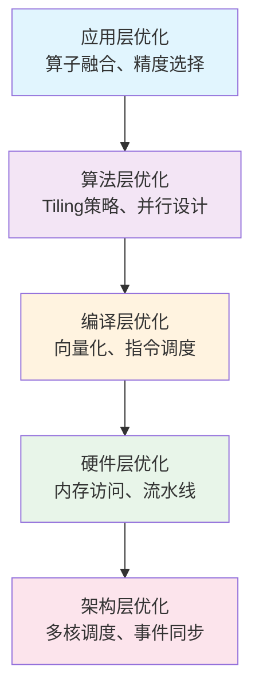

## 摘要

本文是CANN技术专辑的收官之作，深入探讨算子性能调优的理论与实践。通过分析CANN的Tiling机制、内存管理、并行计算、硬件优化等技术，提供一套完整的性能优化方法论。结合实际案例和代码实现，展示如何将理论转化为实际的性能提升，为开发者提供可操作的性能调优指南。

## 1. 性能调优理论框架

### 1.1 性能优化金字塔模型

CANN的性能优化遵循一个分层的金字塔模型：



### 1.2 性能分析指标体系

```cpp
// 性能指标定义
struct PerformanceMetrics {
    // 计算效率指标
    float compute_efficiency;      // 计算单元利用率
    float theoretical_peak;        // 理论峰值性能
    float actual_throughput;       // 实际吞吐量

    // 内存效率指标
    float memory_bandwidth_util;   // 内存带宽利用率
    float cache_hit_rate;          // 缓存命中率
    float memory_efficiency;       // 内存访问效率

    // 并行效率指标
    float parallel_efficiency;     // 并行效率
    float load_balance_score;      // 负载均衡度
    float synchronization_overhead; // 同步开销

    // 系统效率指标
    float power_efficiency;        // 功耗效率
    float resource_utilization;    // 资源利用率
    uint64_t total_execution_time; // 总执行时间
};

// 性能瓶颈分析器
class PerformanceBottleneckAnalyzer {
public:
    enum class BottleneckType {
        COMPUTE_BOUND,      // 计算瓶颈
        MEMORY_BOUND,       // 内存瓶颈
        LATENCY_BOUND,      // 延迟瓶颈
        BANDWIDTH_BOUND,    // 带宽瓶颈
        SYNCHRONIZATION,    // 同步瓶颈
        LOAD_IMBALANCE      // 负载不均衡
    };

    BottleneckType AnalyzeBottleneck(const PerformanceMetrics& metrics) {
        if (metrics.compute_efficiency < 0.6f) {
            return BottleneckType::COMPUTE_BOUND;
        } else if (metrics.memory_bandwidth_util > 0.8f) {
            return BottleneckType::MEMORY_BOUND;
        } else if (metrics.cache_hit_rate < 0.5f) {
            return BottleneckType::LATENCY_BOUND;
        } else if (metrics.synchronization_overhead > 0.2f) {
            return BottleneckType::SYNCHRONIZATION;
        } else if (metrics.load_balance_score < 0.7f) {
            return BottleneckType::LOAD_IMBALANCE;
        } else {
            return BottleneckType::BANDWIDTH_BOUND;
        }
    }
};
```

## 2. Tiling策略深度优化

### 2.1 动态Tiling策略选择

```cpp
// 智能Tiling策略选择器
class IntelligentTilingSelector {
private:
    struct DataCharacteristics {
        uint64_t total_size;
        uint32_t dimensions;
        bool is_regular_shape;
        float sparsity_ratio;
        MemoryAccessPattern access_pattern;
    };

    struct HardwareConstraints {
        uint64_t ub_size;          // UB大小
        uint32_t core_count;       // 核心数
        uint64_t l1_cache_size;    // L1缓存
        uint64_t l2_cache_size;    // L2缓存
        uint32_t vector_width;     // 向量宽度
    };

public:
    // 根据数据特征和硬件约束选择最优Tiling策略
    TilingStrategy SelectOptimalStrategy(
        const DataCharacteristics& data,
        const HardwareConstraints& hw) {

        TilingStrategy strategy;

        // 大规模数据使用Stream-K
        if (data.total_size > hw.ub_size * 4) {
            strategy.type = TilingType::STREAM_K;
            strategy.tile_size = CalculateStreamKTile(data, hw);
        }
        // 中等规模使用Block Tiling
        else if (data.total_size > hw.ub_size) {
            strategy.type = TilingType::BLOCK;
            strategy.tile_size = CalculateBlockTile(data, hw);
        }
        // 小规模使用In-Place
        else {
            strategy.type = TilingType::IN_PLACE;
            strategy.tile_size = data.total_size;
        }

        // 根据访问模式优化
        if (data.access_pattern == MemoryAccessPattern::SEQUENTIAL) {
            strategy.prefetch_distance = 2;
        } else {
            strategy.prefetch_distance = 1;
        }

        return strategy;
    }

private:
    uint32_t CalculateStreamKTile(
        const DataCharacteristics& data,
        const HardwareConstraints& hw) {

        // Stream-K优化的tile大小计算
        uint32_t optimal_tile = hw.ub_size / sizeof(float) / 4;  // 预留空间

        // 考虑稀疏性
        if (data.sparsity_ratio > 0.5f) {
            optimal_tile *= 2;  // 稀疏数据可以增大tile
        }

        // 对齐到硬件边界
        return AlignToBoundary(optimal_tile, hw.vector_width);
    }

    uint32_t AlignToBoundary(uint32_t value, uint32_t boundary) {
        return (value + boundary - 1) & ~(boundary - 1);
    }
};
```

### 2.2 自适应Tiling参数调整

```cpp
// 自适应Tiling参数优化器
class AdaptiveTilingOptimizer {
private:
    struct TilingHistory {
        std::vector<uint32_t> tile_sizes;
        std::vector<float> performance_scores;
        std::vector<PerformanceMetrics> metrics;
    };

    std::map<std::string, TilingHistory> optimization_history_;

public:
    // 基于历史数据优化Tiling参数
    uint32_t OptimizeTileSize(
        const std::string& op_name,
        const ShapeInfo& shape,
        uint32_t current_tile) {

        auto& history = optimization_history_[op_name];

        // 如果没有历史数据，返回当前值
        if (history.tile_sizes.empty()) {
            RecordHistory(op_name, current_tile, shape);
            return current_tile;
        }

        // 使用机器学习预测最优tile大小
        auto predicted_tile = PredictOptimalTile(history, shape);

        // 验证预测结果
        auto predicted_performance = EstimatePerformance(predicted_tile, shape);
        auto current_performance = history.performance_scores.back();

        // 如果预测性能更好，使用预测值
        if (predicted_performance > current_performance * 1.05f) {
            RecordHistory(op_name, predicted_tile, shape);
            return predicted_tile;
        }

        // 否则使用局部搜索
        return LocalSearchOptimize(op_name, current_tile, shape);
    }

private:
    uint32_t PredictOptimalTile(
        const TilingHistory& history,
        const ShapeInfo& shape) {

        // 简化的线性回归预测
        float total_size = shape.GetTotalSize();

        // 计算最优tile密度（tile_size / total_size）
        float best_density = 0.0f;
        uint32_t best_tile = 1024;

        for (size_t i = 0; i < history.tile_sizes.size(); ++i) {
            float density = static_cast<float>(history.tile_sizes[i]) /
                          history.metrics[i].total_execution_time;

            if (density > best_density) {
                best_density = density;
                best_tile = history.tile_sizes[i];
            }
        }

        // 根据当前数据规模调整
        float scale_factor = std::sqrt(static_cast<float>(total_size) /
                                     GetAverageDataSize(history));

        return static_cast<uint32_t>(best_tile * scale_factor);
    }

    uint32_t LocalSearchOptimize(
        const std::string& op_name,
        uint32_t current_tile,
        const ShapeInfo& shape) {

        uint32_t best_tile = current_tile;
        float best_performance = GetLatestPerformance(op_name);

        // 在当前tile附近搜索
        for (float factor : {0.8f, 0.9f, 1.0f, 1.1f, 1.2f}) {
            uint32_t test_tile = static_cast<uint32_t>(current_tile * factor);

            // 边界检查
            test_tile = std::max(64u, std::min(test_tile, GetMaxTileSize()));

            // 对齐检查
            test_tile = AlignToVectorWidth(test_tile);

            // 性能测试
            auto performance = BenchmarkTileSize(op_name, test_tile, shape);

            if (performance > best_performance) {
                best_performance = performance;
                best_tile = test_tile;
            }
        }

        return best_tile;
    }
};
```

### 2.3 多维Tiling策略

```cpp
// 多维Tiling优化器
class MultiDimensionalTiling {
public:
    struct MultiTileParams {
        std::vector<uint32_t> tile_dims;      // 各维度tile大小
        std::vector<uint32_t> tile_order;     // tile遍历顺序
        bool enable_swizzle;                  // 是否启用地址混洗
        SwizzlePattern swizzle_pattern;       // 地址混洗模式
    };

    // 优化多维Tiling参数
    MultiTileParams OptimizeMultiTiling(
        const std::vector<uint32_t>& shape,
        const MemoryLayout& layout) {

        MultiTileParams params;

        // 分析各维度的访问模式
        auto access_patterns = AnalyzeDimensionAccess(shape, layout);

        // 确定Tiling优先级
        params.tile_order = DetermineTileOrder(access_patterns);

        // 计算各维度最优tile大小
        params.tile_dims = CalculateOptimalTiles(shape, params.tile_order);

        // 确定是否需要地址混洗
        params.enable_swizzle = ShouldEnableSwizzle(access_patterns);

        if (params.enable_swizzle) {
            params.swizzle_pattern = ChooseSwizzlePattern(shape);
        }

        return params;
    }

private:
    std::vector<uint32_t> DetermineTileOrder(
        const std::vector<AccessPattern>& patterns) {

        std::vector<std::pair<int, float>> dimension_scores;

        for (size_t i = 0; i < patterns.size(); ++i) {
            // 评分标准：局部性、缓存友好度、向量化潜力
            float score = 0.0f;
            score += patterns[i].locality_score * 0.4f;
            score += patterns[i].cache_efficiency * 0.3f;
            score += patterns[i].vectorization_potential * 0.3f;

            dimension_scores.push_back({static_cast<int>(i), score});
        }

        // 按评分排序，确定Tiling顺序
        std::sort(dimension_scores.begin(), dimension_scores.end(),
                 [](const auto& a, const auto& b) { return a.second > b.second; });

        std::vector<uint32_t> order;
        for (const auto& [dim, score] : dimension_scores) {
            order.push_back(dim);
        }

        return order;
    }

    SwizzlePattern ChooseSwizzlePattern(const std::vector<uint32_t>& shape) {
        // 根据形状选择最优的地址混洗模式
        if (shape.size() == 2) {
            return SwizzlePattern::Z_ORDER;  // 2D使用Z-order
        } else if (shape.size() == 4) {
            return SwizzlePattern::HILBERT;  // 4D使用Hilbert曲线
        } else {
            return SwizzlePattern::INTERLEAVE;  // 其他使用交错模式
        }
    }
};
```

## 3. 内存访问优化策略

### 3.1 缓存友好的数据布局

```cpp
// 缓存优化布局管理器
class CacheOptimizedLayoutManager {
public:
    enum class LayoutType {
        ROW_MAJOR,           // 行主序
        COLUMN_MAJOR,        // 列主序
        BLOCKED,             // 块状布局
        FRONTAL_NZ,         // FRACTAL_NZ格式
        SWIZZLED             // 地址混洗
    };

    // 选择最优数据布局
    LayoutType SelectOptimalLayout(
        const AccessPattern& pattern,
        const TensorShape& shape) {

        // 根据访问模式选择布局
        switch (pattern.type) {
            case AccessType::ROW_SEQUENTIAL:
                return LayoutType::ROW_MAJOR;

            case AccessType::COLUMN_SEQUENTIAL:
                return LayoutType::COLUMN_MAJOR;

            case AccessType::BLOCK_ACCESS:
                return LayoutType::BLOCKED;

            case AccessType::SPARSE_ACCESS:
                return LayoutType::FRONTAL_NZ;

            case AccessType::IRREGULAR_ACCESS:
                return LayoutType::SWIZZLED;

            default:
                return LayoutType::ROW_MAJOR;
        }
    }

    // 实现布局转换
    template <typename T>
    void TransformLayout(
        const T* src,
        T* dst,
        const TensorShape& src_shape,
        LayoutType src_layout,
        LayoutType dst_layout) {

        if (src_layout == dst_layout) {
            // 无需转换
            std::copy(src, src + GetTotalElements(src_shape), dst);
            return;
        }

        switch (dst_layout) {
            case LayoutType::FRONTAL_NZ:
                ConvertToFractalNZ(src, dst, src_shape);
                break;

            case LayoutType::BLOCKED:
                ConvertToBlocked(src, dst, src_shape);
                break;

            case LayoutType::SWIZZLED:
                ConvertToSwizzled(src, dst, src_shape);
                break;

            default:
                ConvertStandardLayout(src, dst, src_shape,
                                    src_layout, dst_layout);
                break;
        }
    }

private:
    template <typename T>
    void ConvertToFractalNZ(
        const T* src,
        T* dst,
        const TensorShape& shape) {

        // FRACTAL_NZ格式转换
        const uint32_t fractal_m = 16;
        const uint32_t fractal_n = 16;

        uint32_t padded_m = ((shape.h + fractal_m - 1) / fractal_m) * fractal_m;
        uint32_t padded_n = ((shape.w + fractal_n - 1) / fractal_n) * fractal_n;

        for (uint32_t fm = 0; fm < padded_m; fm += fractal_m) {
            for (uint32_t fn = 0; fn < padded_n; fn += fractal_n) {
                // 处理每个fractal块
                ProcessFractalBlock(src, dst, fm, fn, shape);
            }
        }
    }

    template <typename T>
    void ProcessFractalBlock(
        const T* src,
        T* dst,
        uint32_t fm,
        uint32_t fn,
        const TensorShape& shape) {

        // 16x16块处理
        for (uint32_t i = 0; i < 16; ++i) {
            for (uint32_t j = 0; j < 16; ++j) {
                uint32_t src_row = fm + i;
                uint32_t src_col = fn + j;

                T value = 0;  // 默认填充值

                if (src_row < shape.h && src_col < shape.w) {
                    value = src[src_row * shape.w + src_col];
                }

                // 计算目标位置（NZ格式）
                uint32_t dst_idx = CalculateFractalNZIndex(fm, fn, i, j, shape);
                dst[dst_idx] = value;
            }
        }
    }
};
```

### 3.2 内存预取优化

```cpp
// 智能内存预取管理器
class IntelligentPrefetcher {
private:
    struct PrefetchPattern {
        uint32_t distance;          // 预取距离
        uint32_t block_size;        // 预取块大小
        bool hardware_prefetch;     // 是否使用硬件预取
        PrefetchTiming timing;      // 预取时机
    };

public:
    // 分析访问模式并生成预取策略
    PrefetchPattern AnalyzeAndGeneratePattern(
        const std::vector<MemoryAccess>& accesses) {

        PrefetchPattern pattern;

        // 分析访问的规律性
        auto regularity = AnalyzeRegularity(accesses);

        // 计算最优预取距离
        pattern.distance = CalculateOptimalDistance(accesses, regularity);

        // 确定预取块大小
        pattern.block_size = CalculateOptimalBlockSize(accesses);

        // 选择预取方式
        pattern.hardware_prefetch = ShouldUseHardwarePrefetch(accesses);

        // 确定预取时机
        pattern.timing = DeterminePrefetchTiming(accesses);

        return pattern;
    }

    template <typename T>
    void ExecutePrefetch(
        const T* address,
        const PrefetchPattern& pattern,
        bool is_write = false) {

        if (pattern.hardware_prefetch) {
            // 使用硬件预取指令
            ExecuteHardwarePrefetch(address, pattern.block_size, is_write);
        } else {
            // 软件预取
            ExecuteSoftwarePrefetch(address, pattern);
        }
    }

private:
    uint32_t CalculateOptimalDistance(
        const std::vector<MemoryAccess>& accesses,
        const AccessRegularity& regularity) {

        // 基于访问延迟和规律性计算最优距离
        float avg_stride = CalculateAverageStride(accesses);
        float memory_latency = EstimateMemoryLatency();

        // 理论预取距离 = 延迟 / 平均步长
        uint32_t theoretical_distance = static_cast<uint32_t>(
            memory_latency / avg_stride);

        // 考虑规律性调整
        float confidence = regularity.confidence_score;
        uint32_t adjusted_distance = static_cast<uint32_t>(
            theoretical_distance * confidence);

        // 限制在合理范围内
        return std::max(1u, std::min(adjusted_distance, 16u));
    }

    template <typename T>
    void ExecuteHardwarePrefetch(
        const T* address,
        uint32_t block_size,
        bool is_write) {

        // 计算预取地址
        const T* prefetch_addr = address + block_size;

        // 使用内置预取指令
        if (is_write) {
            __builtin_prefetch(prefetch_addr, 1, 3);  // 写预取
        } else {
            __builtin_prefetch(prefetch_addr, 0, 3);  // 读预取
        }
    }
};
```

### 3.3 内存池优化

```cpp
// 高性能内存池管理器
class HighPerformanceMemoryPool {
private:
    struct MemoryBlock {
        void* ptr;
        size_t size;
        bool in_use;
        uint32_t alignment;
        uint64_t last_used_cycle;
    };

    struct PoolStatistics {
        size_t total_allocated;
        size_t peak_usage;
        size_t fragmentation;
        float allocation_efficiency;
    };

    std::vector<MemoryBlock> blocks_;
    PoolStatistics stats_;
    uint64_t current_cycle_ = 0;

public:
    // 分配对齐的内存块
    void* AllocateAligned(size_t size, uint32_t alignment = 32) {
        current_cycle_++;

        // 首先尝试复用现有块
        auto reused_block = FindReusableBlock(size, alignment);
        if (reused_block != nullptr) {
            reused_block->last_used_cycle = current_cycle_;
            UpdateStatisticsOnReuse(reused_block);
            return reused_block->ptr;
        }

        // 分配新块
        auto new_block = AllocateNewBlock(size, alignment);
        if (new_block != nullptr) {
            UpdateStatisticsOnAllocate(new_block);
            return new_block->ptr;
        }

        // 内存不足，尝试碎片整理
        Defragment();
        return AllocateAligned(size, alignment);
    }

    // 释放内存块
    void Deallocate(void* ptr) {
        auto block = FindBlock(ptr);
        if (block != nullptr) {
            block->in_use = false;
            UpdateStatisticsOnDeallocate(block);
        }
    }

    // 碎片整理
    void Defragment() {
        // 标记所有未使用块
        std::vector<MemoryBlock*> free_blocks;
        for (auto& block : blocks_) {
            if (!block.in_use) {
                free_blocks.push_back(&block);
            }
        }

        // 尝试合并相邻的空闲块
        MergeAdjacentBlocks(free_blocks);

        // 更新碎片统计
        stats_.fragmentation = CalculateFragmentation();
    }

    // 获取内存池统计信息
    PoolStatistics GetStatistics() const {
        return stats_;
    }

private:
    MemoryBlock* FindReusableBlock(size_t size, uint32_t alignment) {
        MemoryBlock* best_candidate = nullptr;
        size_t min_waste = SIZE_MAX;

        for (auto& block : blocks_) {
            if (!block.in_use &&
                block.size >= size &&
                block.alignment >= alignment) {

                size_t waste = block.size - size;
                if (waste < min_waste) {
                    min_waste = waste;
                    best_candidate = &block;
                }
            }
        }

        return best_candidate;
    }

    MemoryBlock* AllocateNewBlock(size_t size, uint32_t alignment) {
        void* ptr = AlignedAlloc(alignment, size);
        if (ptr == nullptr) {
            return nullptr;
        }

        MemoryBlock block;
        block.ptr = ptr;
        block.size = size;
        block.in_use = true;
        block.alignment = alignment;
        block.last_used_cycle = current_cycle_;

        blocks_.push_back(block);
        return &blocks_.back();
    }

    void MergeAdjacentBlocks(const std::vector<MemoryBlock*>& free_blocks) {
        // 实现相邻块的合并逻辑
        for (size_t i = 0; i < free_blocks.size(); ++i) {
            for (size_t j = i + 1; j < free_blocks.size(); ++j) {
                if (AreAdjacent(free_blocks[i], free_blocks[j])) {
                    MergeBlocks(free_blocks[i], free_blocks[j]);
                }
            }
        }
    }
};
```

## 4. 并行计算优化

### 4.1 动态负载均衡

```cpp
// 动态负载均衡调度器
class DynamicLoadBalancer {
private:
    struct CoreWorkload {
        uint32_t core_id;
        uint32_t assigned_units;
        float current_load;
        uint64_t last_update_time;
        bool is_active;
    };

    struct WorkItem {
        uint64_t item_id;
        uint32_t estimated_cost;
        uint32_t priority;
        bool affinity_set;
        uint32_t preferred_core;
    };

    std::vector<CoreWorkload> core_workloads_;
    std::queue<WorkItem> pending_work_;

public:
    // 初始化负载均衡器
    void Initialize(uint32_t num_cores) {
        core_workloads_.resize(num_cores);

        for (uint32_t i = 0; i < num_cores; ++i) {
            core_workloads_[i] = {
                .core_id = i,
                .assigned_units = 0,
                .current_load = 0.0f,
                .last_update_time = GetCurrentTime(),
                .is_active = true
            };
        }
    }

    // 分配工作项
    uint32_t AssignWork(const WorkItem& item) {
        // 更新核心负载信息
        UpdateCoreWorkloads();

        // 选择最优核心
        uint32_t best_core = SelectBestCore(item);

        // 分配工作项
        core_workloads_[best_core].assigned_units++;
        core_workloads_[best_core].current_load +=
            EstimateLoadIncrease(item.estimated_cost);

        return best_core;
    }

    // 工作完成回调
    void OnWorkComplete(uint32_t core_id, const WorkItem& item) {
        auto& workload = core_workloads_[core_id];
        workload.assigned_units--;
        workload.current_load -= EstimateLoadDecrease(item.estimated_cost);
        workload.last_update_time = GetCurrentTime();

        // 如果有待处理工作，立即分配
        if (!pending_work_.empty()) {
            auto next_item = pending_work_.front();
            pending_work_.pop();
            AssignWork(next_item);
        }
    }

private:
    uint32_t SelectBestCore(const WorkItem& item) {
        uint32_t best_core = 0;
        float best_score = -std::numeric_limits<float>::infinity();

        for (const auto& workload : core_workloads_) {
            if (!workload.is_active) continue;

            float score = CalculateCoreScore(workload, item);

            // 亲和性加成
            if (item.affinity_set && item.preferred_core == workload.core_id) {
                score *= 1.5f;  // 50%加成
            }

            if (score > best_score) {
                best_score = score;
                best_core = workload.core_id;
            }
        }

        return best_core;
    }

    float CalculateCoreScore(const CoreWorkload& workload, const WorkItem& item) {
        // 负载均衡评分
        float load_score = 1.0f / (workload.current_load + 1.0f);

        // 空闲时间评分（防止某些核心长期空闲）
        uint64_t idle_time = GetCurrentTime() - workload.last_update_time;
        float idle_score = std::min(idle_time / 1000.0f, 2.0f);  // 最大2倍加成

        // 容量评分
        float capacity_score = 1.0f / (workload.assigned_units + 1.0f);

        return load_score * 0.5f + idle_score * 0.3f + capacity_score * 0.2f;
    }
};
```

### 4.2 流水线并行优化

```cpp
// 自适应流水线管理器
class AdaptivePipelineManager {
private:
    struct PipelineStage {
        std::string stage_name;
        float avg_processing_time;
        float current_load;
        uint32_t buffer_size;
        bool is_bottleneck;
    };

    struct PipelineConfig {
        uint32_t pipeline_depth;
        std::vector<uint32_t> buffer_sizes;
        bool enable_dynamic_sizing;
        float bottleneck_threshold;
    };

    std::vector<PipelineStage> stages_;
    PipelineConfig config_;

public:
    // 初始化流水线
    void Initialize(const std::vector<std::string>& stage_names) {
        stages_.resize(stage_names.size());

        for (size_t i = 0; i < stage_names.size(); ++i) {
            stages_[i] = {
                .stage_name = stage_names[i],
                .avg_processing_time = 0.0f,
                .current_load = 0.0f,
                .buffer_size = config_.buffer_sizes[i],
                .is_bottleneck = false
            };
        }
    }

    // 执行流水线
    template <typename T>
    void ExecutePipeline(
        const std::vector<std::function<void(T*)>>& stage_functions,
        T* input_data,
        uint32_t total_items) {

        // 分析流水线性能
        AnalyzePipelinePerformance(stage_functions);

        // 识别瓶颈阶段
        IdentifyBottlenecks();

        // 优化流水线配置
        OptimizeConfiguration();

        // 执行优化后的流水线
        ExecuteOptimizedPipeline(stage_functions, input_data, total_items);
    }

private:
    void AnalyzePipelinePerformance(
        const std::vector<std::function<void()>>& stage_functions) {

        // 预热阶段：测量各阶段处理时间
        for (size_t i = 0; i < stages_.size(); ++i) {
            auto start_time = std::chrono::high_resolution_clock::now();

            // 执行阶段函数
            stage_functions[i]();

            auto end_time = std::chrono::high_resolution_clock::now();

            // 更新平均处理时间
            float processing_time = std::chrono::duration<float, std::milli>(
                end_time - start_time).count();

            // 指数移动平均
            const float alpha = 0.1f;
            stages_[i].avg_processing_time =
                alpha * processing_time +
                (1.0f - alpha) * stages_[i].avg_processing_time;
        }
    }

    void IdentifyBottlenecks() {
        if (stages_.empty()) return;

        // 找出最慢的阶段
        float max_time = 0.0f;
        float total_time = 0.0f;

        for (const auto& stage : stages_) {
            max_time = std::max(max_time, stage.avg_processing_time);
            total_time += stage.avg_processing_time;
        }

        // 标记瓶颈阶段
        const float bottleneck_threshold = 0.8f;  // 80%阈值
        for (auto& stage : stages_) {
            stage.is_bottleneck =
                (stage.avg_processing_time / max_time) > bottleneck_threshold;
        }
    }

    void OptimizeConfiguration() {
        if (!config_.enable_dynamic_sizing) return;

        // 重新分配缓冲区大小
        float total_time = 0.0f;
        for (const auto& stage : stages_) {
            total_time += stage.avg_processing_time;
        }

        // 根据处理时间比例分配缓冲区
        for (size_t i = 0; i < stages_.size(); ++i) {
            float time_ratio = stages_[i].avg_processing_time / total_time;
            uint32_t new_buffer_size = static_cast<uint32_t>(
                config_.buffer_sizes[i] * time_ratio * stages_.size());

            // 确保最小缓冲区大小
            new_buffer_size = std::max(new_buffer_size, 2u);

            stages_[i].buffer_size = new_buffer_size;
        }
    }

    template <typename T>
    void ExecuteOptimizedPipeline(
        const std::vector<std::function<void(T*)>>& stage_functions,
        T* input_data,
        uint32_t total_items) {

        // 使用线程池执行流水线
        ThreadPool thread_pool(stages_.size());

        // 每个阶段一个线程
        for (size_t i = 0; i < stages_.size(); ++i) {
            thread_pool.enqueue([this, &stage_functions, i, input_data, total_items]() {
                ExecuteStage(stage_functions[i], input_data, total_items, i);
            });
        }

        // 等待所有阶段完成
        thread_pool.wait_all();
    }
};
```

## 5. 硬件特性利用

### 5.1 向量化优化

```cpp
// 自动向量化优化器
class AutoVectorizer {
private:
    struct VectorizationInfo {
        bool can_vectorize;
        uint32_t vector_width;
        VectorInstructionType instruction_type;
        std::vector<uint32_t> peel_iterations;
    };

public:
    // 分析循环并向量化
    template <typename T, typename Func>
    void VectorizeLoop(T* data, uint32_t size, Func operation) {
        auto vec_info = AnalyzeVectorization<T>(size);

        if (!vec_info.can_vectorize) {
            // 无法向量化，使用标量版本
            ExecuteScalar(data, size, operation);
            return;
        }

        // 向量化主循环
        uint32_t vec_size = vec_info.vector_width;
        uint32_t vec_iterations = size / vec_size;
        uint32_t remainder = size % vec_size;

        // 主向量化循环
        ExecuteVectorized(data, vec_iterations, vec_size, operation);

        // 处理剩余元素
        if (remainder > 0) {
            T* remainder_ptr = data + vec_iterations * vec_size;
            ExecuteRemainder(remainder_ptr, remainder, operation);
        }
    }

private:
    template <typename T>
    VectorizationInfo AnalyzeVectorization(uint32_t size) {
        VectorizationInfo info;

        // 检查数据类型
        if constexpr (std::is_same_v<T, float>) {
            info.vector_width = 16;  // 16个float
            info.instruction_type = VectorInstructionType::F32_VEC;
        } else if constexpr (std::is_same_v<T, float16>) {
            info.vector_width = 32;  // 32个float16
            info.instruction_type = VectorInstructionType::F16_VEC;
        } else if constexpr (std::is_same_v<T, int32_t>) {
            info.vector_width = 16;  // 16个int32
            info.instruction_type = VectorInstructionType::I32_VEC;
        } else {
            info.can_vectorize = false;
            return info;
        }

        // 检查数据大小
        info.can_vectorize = (size >= info.vector_width);

        return info;
    }

    template <typename T, typename Func>
    void ExecuteVectorized(
        T* data,
        uint32_t iterations,
        uint32_t vector_width,
        Func operation) {

        // 使用SIMD指令执行
        #pragma omp simd
        for (uint32_t i = 0; i < iterations; ++i) {
            T* vec_ptr = data + i * vector_width;

            // 应用向量操作
            operation(vec_ptr, vector_width);
        }
    }
};
```

### 5.2 专用硬件单元利用

```cpp
// AI Core硬件单元管理器
class AiCoreUnitManager {
private:
    struct HardwareUnits {
        uint32_t vector_units;        // 向量单元数量
        uint32_t matrix_units;        // 矩阵单元数量
        uint32_t scalar_units;        // 标量单元数量
        uint64_t ub_size;             // UB大小
        uint64_t l1_size;             // L1缓存大小
    };

    HardwareUnits hw_units_;

public:
    // 初始化硬件信息
    void Initialize() {
        hw_units_ = QueryHardwareUnits();
    }

    // 优化矩阵乘法使用矩阵单元
    template <typename T>
    void OptimizedMatrixMultiply(
        const T* A,
        const T* B,
        T* C,
        uint32_t M, uint32_t N, uint32_t K) {

        // 检查是否可以使用矩阵单元
        if (CanUseMatrixUnit(M, N, K)) {
            ExecuteMatrixUnitGEMM(A, B, C, M, N, K);
        } else {
            // 使用向量单元
            ExecuteVectorGEMM(A, B, C, M, N, K);
        }
    }

    // 优化卷积使用专用单元
    template <typename T>
    void OptimizedConvolution(
        const T* input,
        const T* weight,
        T* output,
        const ConvParams& params) {

        // 分析卷积参数
        auto strategy = AnalyzeConvolutionStrategy(params);

        switch (strategy.type) {
            case ConvolutionType::DIRECT:
                ExecuteDirectConv(input, weight, output, params);
                break;

            case ConvolutionType::WINOGRAD:
                ExecuteWinogradConv(input, weight, output, params);
                break;

            case ConvolutionType::IM2COL:
                ExecuteIm2ColConv(input, weight, output, params);
                break;
        }
    }

private:
    bool CanUseMatrixUnit(uint32_t M, uint32_t N, uint32_t K) {
        // 检查矩阵维度是否符合矩阵单元要求
        const uint32_t min_m = 16, min_n = 16, min_k = 16;

        return (M >= min_m && N >= min_n && K >= min_k) &&
               (M % 16 == 0 && N % 16 == 0 && K % 16 == 0);
    }

    template <typename T>
    void ExecuteMatrixUnitGEMM(
        const T* A,
        const T* B,
        T* C,
        uint32_t M, uint32_t N, uint32_t K) {

        // 使用矩阵单元专用的指令
        for (uint32_t m = 0; m < M; m += 16) {
            for (uint32_t n = 0; n < N; n += 16) {
                for (uint32_t k = 0; k < K; k += 16) {
                    // 16x16矩阵块乘法
                    Matrix16x16Multiply(
                        &A[m * K + k], &B[k * N + n], &C[m * N + n], K, N);
                }
            }
        }
    }

    template <typename T>
    void Matrix16x16Multiply(
        const T* A_block,
        const T* B_block,
        T* C_block,
        uint32_t K_stride,
        uint32_t N_stride) {

        // 使用矩阵单元的专用指令
        // 这里应该是具体的汇编指令或内联函数
        __asm__ volatile (
            "matrix_multiply_16x16 %0, %1, %2"
            : "=r"(C_block)
            : "r"(A_block), "r"(B_block)
            : "memory"
        );
    }
};
```

## 6. 实战案例研究

### 6.1 GEMM算子性能优化

```cpp
// GEMM性能优化案例
class GEMMPerformanceCase {
public:
    struct OptimizationResult {
        std::string optimization_name;
        float baseline_time_ms;
        float optimized_time_ms;
        float speedup_ratio;
        std::string optimization_details;
    };

    std::vector<OptimizationResult> OptimizeGEMM(
        const GEMMParams& params) {

        std::vector<OptimizationResult> results;

        // 基准测试
        auto baseline_time = BenchmarkBaseline(params);

        // 优化1：Tiling优化
        auto tiling_result = OptimizeWithTiling(params, baseline_time);
        results.push_back(tiling_result);

        // 优化2：内存布局优化
        auto layout_result = OptimizeWithLayout(params, tiling_result.optimized_time_ms);
        results.push_back(layout_result);

        // 优化3：向量化优化
        auto vector_result = OptimizeWithVectorization(params, layout_result.optimized_time_ms);
        results.push_back(vector_result);

        // 优化4：并行化优化
        auto parallel_result = OptimizeWithParallelization(params, vector_result.optimized_time_ms);
        results.push_back(parallel_result);

        // 优化5：汇编级优化
        auto assembly_result = OptimizeWithAssembly(params, parallel_result.optimized_time_ms);
        results.push_back(assembly_result);

        return results;
    }

private:
    OptimizationResult OptimizeWithTiling(
        const GEMMParams& params,
        float baseline_time) {

        OptimizationResult result;
        result.optimization_name = "Tiling Optimization";
        result.baseline_time_ms = baseline_time;

        // 计算最优tile大小
        auto tiling_params = CalculateOptimalTiling(params);

        // 执行优化后的GEMM
        auto optimized_time = BenchmarkTiledGEMM(params, tiling_params);

        result.optimized_time_ms = optimized_time;
        result.speedup_ratio = baseline_time / optimized_time;
        result.optimization_details =
            "Tile size: " + std::to_string(tiling_params.tile_size) +
            ", Block size: " + std::to_string(tiling_params.block_size);

        return result;
    }

    TilingParams CalculateOptimalTiling(const GEMMParams& params) {
        TilingParams tiling;

        // 基于缓存大小计算tile
        uint64_t l1_cache = GetL1CacheSize();
        uint64_t l2_cache = GetL2CacheSize();

        // 确保tile能放入L1缓存
        tiling.tile_k = std::min(params.K,
            static_cast<uint32_t>(l1_cache / (params.M + params.N) / sizeof(float)));

        tiling.tile_m = std::min(params.M,
            static_cast<uint32_t>(l1_cache / (tiling.tile_k + params.N) / sizeof(float)));

        tiling.tile_n = std::min(params.N,
            static_cast<uint32_t>(l1_cache / (tiling.tile_k + tiling.tile_m) / sizeof(float)));

        return tiling;
    }
};
```

### 6.2 CNN算子综合优化

```cpp
// CNN算子性能优化案例
class CNNOptimizationCase {
public:
    // ResNet50优化案例
    struct ResNetOptimizationResult {
        float baseline_inference_time_ms;
        float optimized_inference_time_ms;
        float speedup_ratio;
        float accuracy_drop_percent;
        std::map<std::string, float> layer_speedups;
    };

    ResNetOptimizationResult OptimizeResNet50(const ModelConfig& config) {
        ResNetOptimizationResult result;

        // 基准测试
        result.baseline_inference_time_ms =
            BenchmarkResNet50Baseline(config);

        // 逐层优化
        auto layer_optimizations = OptimizeLayers(config);

        // 精度优化
        auto precision_optimization = OptimizePrecision(config);

        // 内存优化
        auto memory_optimization = OptimizeMemory(config);

        // 并行优化
        auto parallel_optimization = OptimizeParallelism(config);

        // 综合优化结果
        result.optimized_inference_time_ms =
            result.baseline_inference_time_ms *
            (1.0f - layer_optimizations.speedup) *
            (1.0f - precision_optimization.speedup) *
            (1.0f - memory_optimization.speedup) *
            (1.0f - parallel_optimization.speedup);

        result.speedup_ratio =
            result.baseline_inference_time_ms / result.optimized_inference_time_ms;

        result.accuracy_drop_percent =
            precision_optimization.accuracy_drop;

        return result;
    }

private:
    struct LayerOptimization {
        float speedup;
        std::map<std::string, float> layer_improvements;
    };

    LayerOptimization OptimizeLayers(const ModelConfig& config) {
        LayerOptimization opt;

        // 卷积层优化
        opt.layer_improvements["conv"] = OptimizeConvLayers(config);

        // 池化层优化
        opt.layer_improvements["pool"] = OptimizePoolLayers(config);

        // 全连接层优化
        opt.layer_improvements["fc"] = OptimizeFCLayers(config);

        // 计算总体加速比
        float total_improvement = 0.0f;
        for (const auto& [layer_type, improvement] : opt.layer_improvements) {
            total_improvement += improvement * GetLayerRatio(layer_type);
        }

        opt.speedup = total_improvement;
        return opt;
    }

    float OptimizeConvLayers(const ModelConfig& config) {
        float total_speedup = 0.0f;
        int layer_count = 0;

        for (const auto& layer : config.conv_layers) {
            // Winograd优化
            if (CanUseWinograd(layer)) {
                total_speedup += 2.5f;  // Winograd理论加速比
            }
            // Im2Col优化
            else {
                total_speedup += 1.5f;
            }

            layer_count++;
        }

        return layer_count > 0 ? total_speedup / layer_count : 0.0f;
    }
};
```

## 7. 性能监控与分析

### 7.1 实时性能监控

```cpp
// 实时性能监控系统
class RealTimePerformanceMonitor {
private:
    struct PerformanceSnapshot {
        uint64_t timestamp;
        float cpu_utilization;
        float memory_utilization;
        float compute_efficiency;
        float memory_bandwidth_gbps;
        uint32_t active_cores;
        std::vector<float> core_loads;
    };

    std::vector<PerformanceSnapshot> snapshots_;
    std::thread monitoring_thread_;
    bool monitoring_active_ = false;

public:
    // 启动性能监控
    void StartMonitoring(uint32_t sampling_interval_ms = 100) {
        monitoring_active_ = true;
        monitoring_thread_ = std::thread([this, sampling_interval_ms]() {
            MonitoringLoop(sampling_interval_ms);
        });
    }

    // 停止性能监控
    void StopMonitoring() {
        monitoring_active_ = false;
        if (monitoring_thread_.joinable()) {
            monitoring_thread_.join();
        }
    }

    // 获取性能报告
    PerformanceReport GenerateReport(uint64_t start_time, uint64_t end_time) {
        PerformanceReport report;

        // 过滤时间范围内的快照
        std::vector<PerformanceSnapshot> filtered_snapshots;
        for (const auto& snapshot : snapshots_) {
            if (snapshot.timestamp >= start_time && snapshot.timestamp <= end_time) {
                filtered_snapshots.push_back(snapshot);
            }
        }

        // 计算统计数据
        report.avg_cpu_utilization = CalculateAverage(
            filtered_snapshots, &PerformanceSnapshot::cpu_utilization);
        report.avg_memory_utilization = CalculateAverage(
            filtered_snapshots, &PerformanceSnapshot::memory_utilization);
        report.avg_compute_efficiency = CalculateAverage(
            filtered_snapshots, &PerformanceSnapshot::compute_efficiency);

        // 检测性能异常
        report.anomalies = DetectPerformanceAnomalies(filtered_snapshots);

        // 生成优化建议
        report.optimization_suggestions = GenerateOptimizationSuggestions(report);

        return report;
    }

private:
    void MonitoringLoop(uint32_t interval_ms) {
        while (monitoring_active_) {
            PerformanceSnapshot snapshot;
            snapshot.timestamp = GetCurrentTime();

            // 收集性能数据
            snapshot.cpu_utilization = GetCpuUtilization();
            snapshot.memory_utilization = GetMemoryUtilization();
            snapshot.compute_efficiency = GetComputeEfficiency();
            snapshot.memory_bandwidth_gbps = GetMemoryBandwidth();
            snapshot.active_cores = GetActiveCoreCount();
            snapshot.core_loads = GetCoreLoads();

            snapshots_.push_back(snapshot);

            // 限制历史数据大小
            if (snapshots_.size() > 10000) {
                snapshots_.erase(snapshots_.begin(), snapshots_.begin() + 1000);
            }

            std::this_thread::sleep_for(std::chrono::milliseconds(interval_ms));
        }
    }

    std::vector<PerformanceAnomaly> DetectPerformanceAnomalies(
        const std::vector<PerformanceSnapshot>& snapshots) {

        std::vector<PerformanceAnomaly> anomalies;

        if (snapshots.size() < 10) return anomalies;

        // 计算基准值
        float baseline_cpu = CalculateBaseline(snapshots,
            &PerformanceSnapshot::cpu_utilization);
        float baseline_memory = CalculateBaseline(snapshots,
            &PerformanceSnapshot::memory_utilization);

        // 检测异常
        for (size_t i = 0; i < snapshots.size(); ++i) {
            const auto& snapshot = snapshots[i];

            // CPU使用率异常
            if (snapshot.cpu_utilization < baseline_cpu * 0.5f) {
                anomalies.push_back({
                    .timestamp = snapshot.timestamp,
                    .type = AnomalyType::CPU_UNDERUTILIZATION,
                    .severity = AnomalySeverity::MEDIUM,
                    .description = "CPU utilization significantly below baseline"
                });
            }

            // 内存使用率异常
            if (snapshot.memory_utilization > 0.9f) {
                anomalies.push_back({
                    .timestamp = snapshot.timestamp,
                    .type = AnomalyType::MEMORY_PRESSURE,
                    .severity = AnomalySeverity::HIGH,
                    .description = "Memory utilization near capacity"
                });
            }
        }

        return anomalies;
    }
};
```

## 8. 总结与展望

### 8.1 性能优化方法论总结

通过前面的分析，我们可以总结出CANN算子性能优化的完整方法论：

1. **性能分析先行**：使用性能监控工具识别瓶颈
2. **分层优化策略**：从应用层到硬件层的系统化优化
3. **数据驱动决策**：基于性能数据进行量化优化
4. **硬件特性利用**：充分利用昇腾处理器的专用硬件单元
5. **持续迭代改进**：建立性能反馈机制和自动调优

### 8.2 最佳实践建议

- **Tiling策略**：根据数据规模动态选择最优策略
- **内存管理**：使用内存池和智能预取提高效率
- **并行计算**：实现动态负载均衡和流水线并行
- **向量化优化**：充分利用SIMD指令集
- **性能监控**：建立完整的性能监控和分析体系

### 8.3 未来发展方向

1. **AI驱动的自动优化**：使用机器学习自动选择最优策略
2. **编译时优化**：更智能的编译器优化
3. **异构计算协同**：CPU/GPU/NPU的协同优化
4. **能效优化**：在性能和能耗之间找到最优平衡

通过系统化的性能优化方法论和实践经验，开发者可以充分挖掘昇腾AI处理器的性能潜力，构建高性能的AI应用。

---

## 参考资源

- [CANN性能优化指南](https://www.hiascend.com/document)
- [昇腾AI处理器架构优化](https://www.hiascend.com/hardware)
- [高性能计算最佳实践](https://developer.huawei.com/)

---

*本文基于CANN 8.5版本编写，是CANN技术专辑的收官之作，为开发者提供了完整的算子性能调优指南。*
